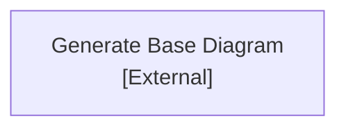

# Unnamed CodeViz Diagram

```mermaid
graph TD

    begin-diagram-generation["Generate Base Diagram<br>[External]"]

```
# Unnamed CodeViz Diagram

```mermaid
graph TD

    high_level_architecture.cv::begin-diagram-generation["**Generate Base Diagram**<br>[External]"]
    high_level_architecture.cv::user["**External User**<br>[External]"]
    subgraph high_level_architecture.cv::siga_project["**SIGA Project**<br>[External]"]
        high_level_architecture.cv::agent_service["**Agent Service**<br>services/agent/src `main`, services/agent/build.gradle.kts `agent`"]
        high_level_architecture.cv::auth_service["**Auth Service**<br>services/auth/src `main`, services/auth/build.gradle.kts `auth`"]
        high_level_architecture.cv::billing_service["**Billing Service**<br>services/billing/src `main`, services/billing/build.gradle.kts `billing`"]
        high_level_architecture.cv::gateway_service["**Gateway Service**<br>services/gateway/src `main`, services/gateway/build.gradle.kts `gateway`"]
        high_level_architecture.cv::inventory_service["**Inventory Service**<br>services/inventory/src `main`, services/inventory/build.gradle.kts `inventory`"]
        high_level_architecture.cv::sales_service["**Sales Service**<br>services/sales/src `main`, services/sales/build.gradle.kts `sales`"]
        high_level_architecture.cv::common_module["**Common Module**<br>services/common/src `common`, services/common/build.gradle.kts `common`"]
        subgraph high_level_architecture.cv::registry_service["**Registry Service**<br>[External]"]
            high_level_architecture.cv::registry_eureka_server["**Eureka Server**<br>services/registry/build.gradle.kts `spring-cloud-starter-netflix-eureka-server`, services/registry/Dockerfile `FROM eclipse-temurin:21-jre-focal`, services/registry/src `main`"]
        end
        %% Edges at this level (grouped by source)
        high_level_architecture.cv::gateway_service["**Gateway Service**<br>services/gateway/src `main`, services/gateway/build.gradle.kts `gateway`"] -->|"Routes requests to"| high_level_architecture.cv::agent_service["**Agent Service**<br>services/agent/src `main`, services/agent/build.gradle.kts `agent`"]
        high_level_architecture.cv::gateway_service["**Gateway Service**<br>services/gateway/src `main`, services/gateway/build.gradle.kts `gateway`"] -->|"Routes requests to"| high_level_architecture.cv::auth_service["**Auth Service**<br>services/auth/src `main`, services/auth/build.gradle.kts `auth`"]
        high_level_architecture.cv::gateway_service["**Gateway Service**<br>services/gateway/src `main`, services/gateway/build.gradle.kts `gateway`"] -->|"Routes requests to"| high_level_architecture.cv::billing_service["**Billing Service**<br>services/billing/src `main`, services/billing/build.gradle.kts `billing`"]
        high_level_architecture.cv::gateway_service["**Gateway Service**<br>services/gateway/src `main`, services/gateway/build.gradle.kts `gateway`"] -->|"Routes requests to"| high_level_architecture.cv::inventory_service["**Inventory Service**<br>services/inventory/src `main`, services/inventory/build.gradle.kts `inventory`"]
        high_level_architecture.cv::gateway_service["**Gateway Service**<br>services/gateway/src `main`, services/gateway/build.gradle.kts `gateway`"] -->|"Routes requests to"| high_level_architecture.cv::sales_service["**Sales Service**<br>services/sales/src `main`, services/sales/build.gradle.kts `sales`"]
        high_level_architecture.cv::gateway_service["**Gateway Service**<br>services/gateway/src `main`, services/gateway/build.gradle.kts `gateway`"] -->|"Registers with and discovers"| high_level_architecture.cv::registry_eureka_server["**Eureka Server**<br>services/registry/build.gradle.kts `spring-cloud-starter-netflix-eureka-server`, services/registry/Dockerfile `FROM eclipse-temurin:21-jre-focal`, services/registry/src `main`"]
        high_level_architecture.cv::auth_service["**Auth Service**<br>services/auth/src `main`, services/auth/build.gradle.kts `auth`"] -->|"Uses shared code from"| high_level_architecture.cv::common_module["**Common Module**<br>services/common/src `common`, services/common/build.gradle.kts `common`"]
        high_level_architecture.cv::auth_service["**Auth Service**<br>services/auth/src `main`, services/auth/build.gradle.kts `auth`"] -->|"Registers with and discovers"| high_level_architecture.cv::registry_eureka_server["**Eureka Server**<br>services/registry/build.gradle.kts `spring-cloud-starter-netflix-eureka-server`, services/registry/Dockerfile `FROM eclipse-temurin:21-jre-focal`, services/registry/src `main`"]
        high_level_architecture.cv::billing_service["**Billing Service**<br>services/billing/src `main`, services/billing/build.gradle.kts `billing`"] -->|"Uses shared code from"| high_level_architecture.cv::common_module["**Common Module**<br>services/common/src `common`, services/common/build.gradle.kts `common`"]
        high_level_architecture.cv::billing_service["**Billing Service**<br>services/billing/src `main`, services/billing/build.gradle.kts `billing`"] -->|"Registers with and discovers"| high_level_architecture.cv::registry_eureka_server["**Eureka Server**<br>services/registry/build.gradle.kts `spring-cloud-starter-netflix-eureka-server`, services/registry/Dockerfile `FROM eclipse-temurin:21-jre-focal`, services/registry/src `main`"]
        high_level_architecture.cv::inventory_service["**Inventory Service**<br>services/inventory/src `main`, services/inventory/build.gradle.kts `inventory`"] -->|"Uses shared code from"| high_level_architecture.cv::common_module["**Common Module**<br>services/common/src `common`, services/common/build.gradle.kts `common`"]
        high_level_architecture.cv::inventory_service["**Inventory Service**<br>services/inventory/src `main`, services/inventory/build.gradle.kts `inventory`"] -->|"Registers with and discovers"| high_level_architecture.cv::registry_eureka_server["**Eureka Server**<br>services/registry/build.gradle.kts `spring-cloud-starter-netflix-eureka-server`, services/registry/Dockerfile `FROM eclipse-temurin:21-jre-focal`, services/registry/src `main`"]
        high_level_architecture.cv::sales_service["**Sales Service**<br>services/sales/src `main`, services/sales/build.gradle.kts `sales`"] -->|"Uses shared code from"| high_level_architecture.cv::common_module["**Common Module**<br>services/common/src `common`, services/common/build.gradle.kts `common`"]
        high_level_architecture.cv::sales_service["**Sales Service**<br>services/sales/src `main`, services/sales/build.gradle.kts `sales`"] -->|"Registers with and discovers"| high_level_architecture.cv::registry_eureka_server["**Eureka Server**<br>services/registry/build.gradle.kts `spring-cloud-starter-netflix-eureka-server`, services/registry/Dockerfile `FROM eclipse-temurin:21-jre-focal`, services/registry/src `main`"]
        high_level_architecture.cv::agent_service["**Agent Service**<br>services/agent/src `main`, services/agent/build.gradle.kts `agent`"] -->|"Registers with and discovers"| high_level_architecture.cv::registry_eureka_server["**Eureka Server**<br>services/registry/build.gradle.kts `spring-cloud-starter-netflix-eureka-server`, services/registry/Dockerfile `FROM eclipse-temurin:21-jre-focal`, services/registry/src `main`"]
    end
    %% Edges at this level (grouped by source)
    high_level_architecture.cv::user["**External User**<br>[External]"] -->|"Uses"| high_level_architecture.cv::gateway_service["**Gateway Service**<br>services/gateway/src `main`, services/gateway/build.gradle.kts `gateway`"]

```
---
*Generated by [CodeViz.ai](https://codeviz.ai) on 30/5/2026, 9:49:24 a.m.*
