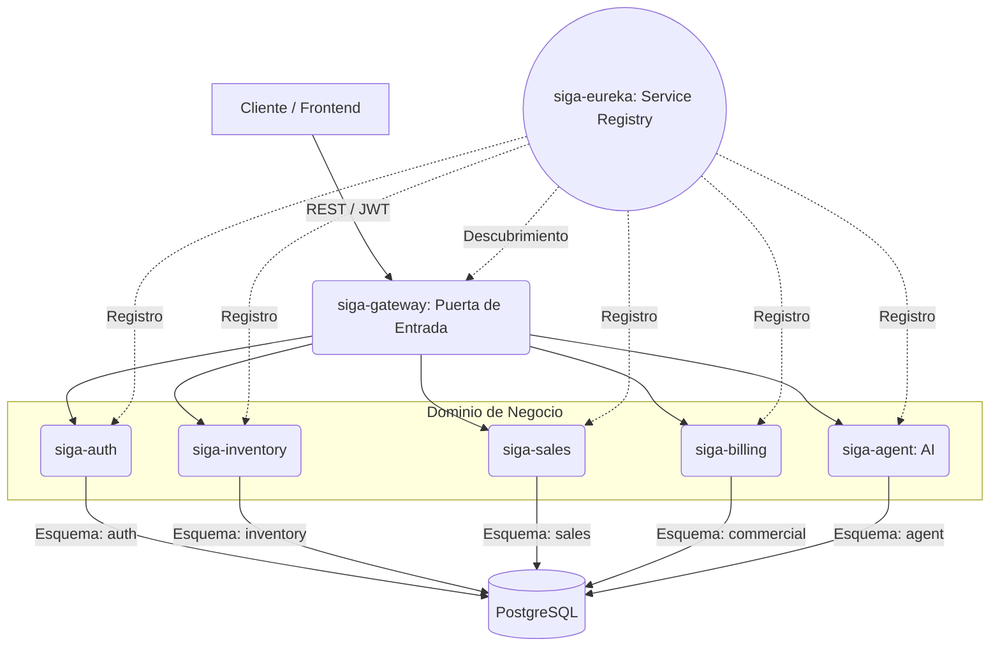
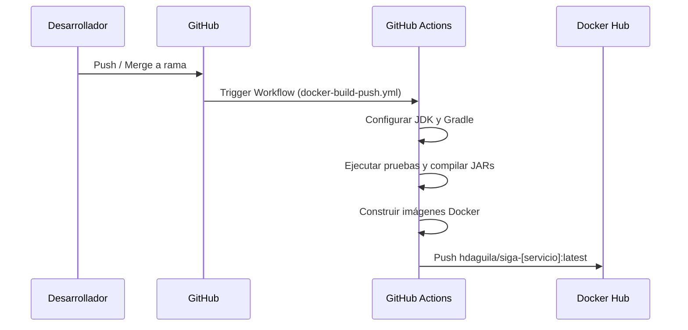

# Manual Docente y Arquitectura del Sistema (SIGA)

Este documento detalla las decisiones técnicas, la justificación arquitectónica y el flujo de trabajo del proyecto SIGA. Está diseñado para ofrecer una comprensión técnica y académica de alto nivel del sistema.

## 1. Justificación Arquitectónica: Microservicios en Monorepo

El proyecto está estructurado bajo un enfoque de **Microservicios alojados en un Monorepo**.

### ¿Por qué un Monorepo?
Para un desarrollador solitario asistido por agentes de Inteligencia Artificial, un Monorepo centralizado ofrece ventajas críticas:
- **Visibilidad Total:** Permite que los agentes de IA (como Antigravity/Engram) tengan contexto del ecosistema completo. No hay necesidad de saltar entre repositorios.
- **Cambios Atómicos:** Un refactor que cruza las fronteras de los servicios (por ejemplo, actualizar una entidad y su contrato en el Gateway) se puede agrupar en un solo *Pull Request*.
- **Gestión Simplificada de Dependencias:** Todos los servicios comparten las mismas herramientas de construcción (Gradle) y se orquestan bajo el mismo `docker-compose.yml`.

### ¿Por qué Microservicios?
El enfoque orientado a servicios desacoplados asegura la escalabilidad bajo el modelo SaaS (Software as a Service) multi-tenant:
- Cada servicio posee su propio esquema de base de datos (`database-per-service`), lo que elimina acoplamientos espurios y fugas de datos entre dominios.
- Facilidad de escalado independiente (ej. el servicio de Ventas puede requerir más réplicas en horario pico que el servicio de Facturación).

## 2. Arquitectura Hexagonal (Puertos y Adaptadores)

Dentro de cada microservicio, el código sigue el patrón de Arquitectura Hexagonal.

### Estructura de Capas
La premisa de esta arquitectura es **aislar la lógica de dominio** de los detalles de infraestructura o de entrada/salida.

1. **Dominio (Domain):** Entidades de negocio puras y reglas del sistema. No conoce a la base de datos ni a Spring Boot.
2. **Aplicación (Application):** Casos de uso. Orquesta el flujo de negocio llamando a las entidades y utilizando los Puertos.
3. **Puertos (Ports):** Interfaces que definen cómo el sistema se comunica con el exterior (Entrada/Input y Salida/Output).
4. **Adaptadores (Adapters):** Implementaciones tecnológicas de los puertos.
   - *Adaptadores de Entrada:* Controladores REST (Spring Web).
   - *Adaptadores de Salida:* Repositorios de base de datos (Spring Data JPA) o clientes REST a otros microservicios.

## 3. Módulo de Kernel Compartido (siga-common)

El módulo `services/common` actúa como el *Shared Kernel* del sistema.
Su propósito es manejar problemas transversales (cross-cutting concerns) sin acoplar los dominios. Actualmente, encapsula el motor de **Auditoría**.

- Está construido como un **Spring Boot AutoConfiguration Starter**.
- Los microservicios lo importan como dependencia en Gradle (`project(":services:common")`).
- Intercepta las solicitudes HTTP mediante filtros de Servlet y registra eventos sin que el desarrollador del microservicio tenga que escribir código de auditoría repetitivo.
- Este patrón centralizado cumple con las exigencias de privacidad de la **Ley Chilena 21.719**.

## 4. Diagramas de Arquitectura

### Topología del Sistema
El siguiente diagrama muestra el flujo de comunicación y el aislamiento de datos.

## 5. Integración y Despliegue Continuo (CI/CD)

### GitHub Actions
El proyecto utiliza GitHub Actions como orquestador de CI/CD por dos razones fundamentales:
1. **Automatización Determinista:** Garantiza que el código en el repositorio es siempre compilable y pasa las reglas de seguridad.
2. **Delegación de Cómputo (Offloading):** Traslada la carga pesada de construcción de imágenes y ejecución de pruebas de la máquina local a la infraestructura en la nube.

### Flujo CI/CD

## 6. Despliegue Local (Docker Compose)

El archivo `docker-compose.yml` permite levantar una réplica exacta del ecosistema en cualquier dispositivo de desarrollo.
Descarga automáticamente las imágenes publicadas desde Docker Hub, inyecta las credenciales por variables de entorno y ejecuta una única base de datos PostgreSQL particionada lógicamente en esquemas.

## 7. Privacidad y Cumplimiento Legal (Ley 21.719)

SIGA se posiciona como una plataforma SaaS alineada con el nuevo marco legal de ciberseguridad en Chile:
- **Privacidad desde el Diseño:** El aislamiento por esquemas y la arquitectura Zero-Trust no son accidentales, sino una respuesta técnica directa al **Art. 14 quáter** de la Ley 21.719.
- **Seudonimización por Defecto:** La migración de IDs secuenciales (`Long`) a **UUID v4** garantiza que la exposición accidental de una clave primaria no revele el volumen de datos ni permita el escaneo (crawling) de registros de clientes, cumpliendo con el **Art. 14 quinquies**.
- **Gobernanza del Agente IA:** El sistema garantiza que la IA herede los permisos del usuario, asegurando que las decisiones automatizadas respeten el marco de seguridad humana.

## 8. El Estándar del "Espejo Semántico"

La documentación técnica de SIGA sigue una regla de **Simetría Total** para evitar la deuda técnica informativa:
- **Consistencia Idiomática:** Los archivos en los directorios de idioma deben tener nombres y contenidos coherentes con su lengua (ej: `REGLAS_NEGOCIO_CORE.md` en `/es/`). Esto reduce la carga cognitiva para desarrolladores bilingües.
- **Robustez de Diagramas:** Se ha estandarizado el uso de formas de **Estadio (`([])`)** para etiquetas complejas en Mermaid, garantizando que los diagramas C4 se rendericen sin fallos de parseo en cualquier motor de visualización (VS Code, GitHub, Navegador).
- **Contratos de Datos en Testing:** Las colecciones de Postman actúan como el primer punto de validación del contrato de datos, utilizando UUIDs reales para asegurar que los Mocks sean 100% compatibles con la persistencia distribuida.

---
> Un Soñador con poca RAM 🧑‍💻
