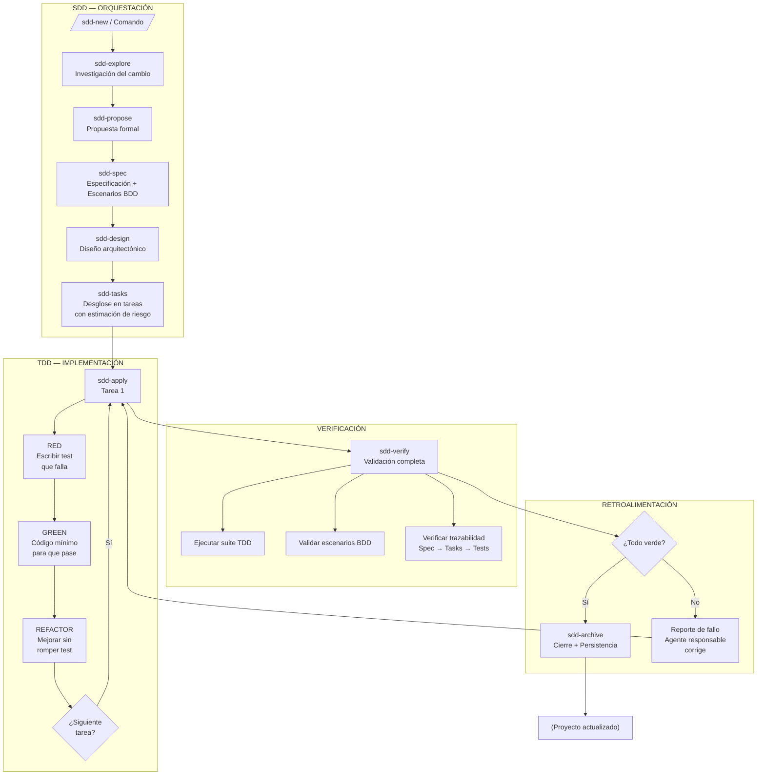
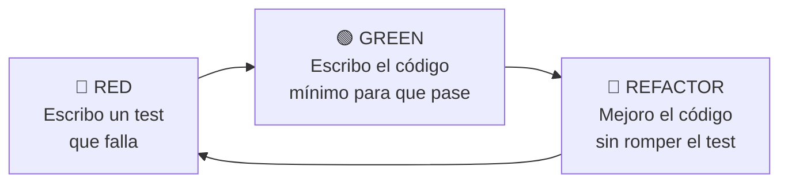
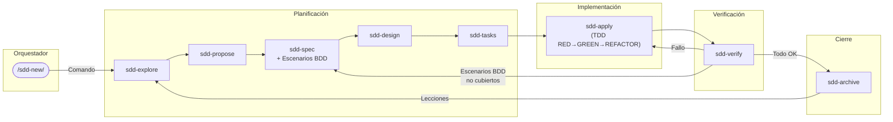

# TDD + BDD + SDD — Integration Guide

> **Especificación → Comportamiento → Diseño → Código → Verificación**
> El pipeline completo de calidad para desarrollo asistido por IA.

---

## Índice

1. [Visión General](#1-visión-general)
2. [El Problema que Resuelve](#2-el-problema-que-resuelve)
3. [Mapa del Pipeline](#3-mapa-del-pipeline)
4. [Metodología Detallada](#4-metodología-detallada)
   - [4.1 SDD — Spec-Driven Development (Orquestador)](#41-sdd--spec-driven-development-orquestador)
   - [4.2 BDD — Behavior-Driven Development (Especificación)](#42-bdd--behavior-driven-development-especificación)
   - [4.3 TDD — Test-Driven Development (Implementación)](#43-tdd--test-driven-development-implementación)
5. [Ciclo de Retroalimentación entre Agentes](#5-ciclo-de-retroalimentación-entre-agentes)
6. [Glosario de Artefactos](#6-glosario-de-artefactos)
7. [Integración con Desarrollo Asistido por IA](#7-integración-con-desarrollo-asistido-por-ia)
8. [Checklist de Implementación para un Proyecto Nuevo](#8-checklist-de-implementación-para-un-proyecto-nuevo)
9. [Errores Comunes y Antipatrones](#9-errores-comunes-y-antipatrones)
10. [Ejemplo Práctico: Feature "Carrito de Compras"](#10-ejemplo-práctico-feature-carrito-de-compras)

---

## 1. Visión General

**TDD + BDD + SDD** no son metodologías en competencia ni fases separadas. Son **tres niveles de especificación** que operan juntos en un pipeline único:

| Metodología | Responde a | Se aplica en | Rol en el pipeline |
|-------------|------------|--------------|--------------------|
| **SDD** | ¿Qué cambio necesito y por qué? | Planificación del cambio | Orquestador — define el QUÉ y el POR QUÉ |
| **BDD** | ¿Qué comportamiento se espera? | Especificación | Especificación — define el CÓMO SE COMPORTA |
| **TDD** | ¿Cómo lo implemento correctamente? | Implementación | Diseño — define el CÓMO SE CONSTRUYE |

El pipeline completo asegura que:

1. **No se escribe código sin especificación** (SDD evita over-engineering)
2. **No se implementa sin definir el comportamiento esperado** (BDD evita ambigüedad)
3. **No se pasa a la siguiente funcionalidad sin tests verdes** (TDD evita deuda técnica)

---

## 2. El Problema que Resuelve

En desarrollo asistido por IA (agentes como los que usamos), los problemas típicos son:

| Problema | Causa | Solución con el pipeline |
|----------|-------|-------------------------|
| 🔴 El agente alucina features que no pediste | SDD ausente | SDD force al agente a especificar antes de codificar |
| 🔴 El código no refleja el comportamiento esperado | BDD ausente | BDD fuerza escenarios concretos antes de implementar |
| 🔴 Cambios rompen funcionalidad existente sin detección | TDD ausente | TDD da la red de seguridad que detecta regresiones |
| 🔴 Iteraciones infinitas por falta de criterio de éxito | Sin feedback loop | El pipeline exige "verde" para considerar completo |
| 🔴 El agente pierde el contexto del proyecto | Sin memoria estructurada | Los artefactos SDD + engram preservan el contexto |

---

## 3. Mapa del Pipeline



### Flujo en lenguaje natural

```
Una idea de cambio entra por SDD →
  Se explora, se propone, se especifica (con escenarios BDD) →
    Se diseñan las tareas →
      Cada tarea se implementa con TDD (RED → GREEN → REFACTOR) →
        Se verifica todo: tests TDD + escenarios BDD + trazabilidad →
          Si está verde → se archiva →
            Si no → el agente responsable vuelve a su fase
```

---

## 4. Metodología Detallada

### 4.1 SDD — Spec-Driven Development (Orquestador)

**Propósito**: Garantizar que cada cambio de código tenga una especificación previa trazable.

**No es** "documentación pesada". Es **el mínimo necesario** para que un agente (o humano) entienda QUÉ hay que hacer y POR QUÉ.

#### Fases de SDD

| Fase | Artefacto | Contenido mínimo | Quién lo ejecuta |
|------|-----------|------------------|-----------------|
| `explore` | Exploración | Contexto del problema, enfoques posibles, riesgos | Agente explorador |
| `propose` | Propuesta | Intención, alcance, enfoque seleccionado, impacto | Agente propositivo |
| `spec` | Especificación | Requisitos funcionales, escenarios BDD (GWT), criterios de aceptación | Agente especificador |
| `design` | Diseño técnico | Arquitectura, patrones, archivos a modificar/crear, impacto en el modelo de datos | Agente diseñador |
| `tasks` | Tareas | Desglose granular, dependencias, riesgo de cada tarea, estimación de líneas | Agente planificador |
| `apply` | Implementación | Código + tests (TDD) | Agente implementador |
| `verify` | Verificación | Resultados de tests, validación contra spec, reporte | Agente verificador |
| `archive` | Archivo | Delta de especificación, lecciones aprendidas, estado final | Agente archivador |

#### Artefacto Store

SDD puede persistir artefactos en:

- **Engram**: Memoria persistente del agente. Rápido, sin archivos.
- **Openspec**: Archivos markdown en el repositorio. Compartible, trazable.
- **Hybrid**: Ambos. Lo recomendado para equipos.
- **None**: Solo en memoria de la sesión. No recomendado.

#### Regla de Oro de SDD

> **Si no hay spec, no hay código.**  
> Cualquier comando que intente implementar sin especificación previa debe ser interceptado por el orquestador.

---

### 4.2 BDD — Behavior-Driven Development (Especificación)

**Propósito**: Definir el **comportamiento esperado** del sistema en lenguaje natural antes de escribir una línea de código.

**No es** "tests funcionales". Es **especificación ejecutable**.

#### Estructura Given-When-Then

```
Escenario: <Nombre descriptivo>
  Dado <contexto inicial>
  Cuando <evento/acción>
  Entonces <resultado esperado>
```

#### ¿Dónde vive BDD en el pipeline?

```
sdd-spec (escribe escenarios) → sdd-apply (implementa) → sdd-verify (valida)
```

Los escenarios BDD se escriben en la fase `sdd-spec` y se validan en `sdd-verify`.

#### Niveles de Escenarios BDD

| Nivel | Alcance | Ejemplo |
|-------|---------|---------|
| **Feature** | Funcionalidad completa de cara al usuario | "El usuario puede agregar productos al carrito" |
| **Acceptance** | Criterio de aceptación de una historia | "El carrito recalcula el total al agregar un ítem" |
| **Unit** | Comportamiento de una unidad de código | "Al llamar addItem() con un producto válido, el total se incrementa" |

#### Formato Recomendado para Spec

````markdown
## Escenarios BDD

### Feature: Gestión de Carrito

#### Escenario: Agregar producto al carrito
```gherkin
Scenario: Agregar producto válido al carrito
  Given un carrito vacío
  When agrego el producto "Laptop" con precio 1000 y cantidad 1
  Then el carrito tiene 1 ítem
  And el total es 1000
```

#### Escenario: Producto sin stock
```gherkin
Scenario: Agregar producto sin stock
  Given un carrito vacío
  And el producto "Laptop" tiene stock 0
  When intento agregar el producto "Laptop"
  Then el sistema rechaza la operación
  And el carrito sigue vacío
```
````

#### Regla de Oro de BDD

> **Los escenarios BDD NO son tests. Son especificación.**  
> Se escriben ANTES de la implementación y definen el "contrato" que el código debe cumplir. Un escenario BDD describe QUÉ debe pasar, no CÓMO implementarlo.

---

### 4.3 TDD — Test-Driven Development (Implementación)

**Propósito**: Usar tests como herramienta de **diseño** para construir código correcto desde el primer intento.

**No es** "escribir tests". Es un **ciclo de diseño** de tres pasos:

#### Ciclo TDD: RED → GREEN → REFACTOR



| Paso | Regla | Qué mide |
|------|-------|----------|
| **RED** | No escribas código de producción sin un test que falle primero | El test define el comportamiento deseado |
| **GREEN** | Escribí el código mínimo indispensable para que el test pase | El código satisface el test, nada más |
| **REFACTOR** | Mejorá el código sin agregar funcionalidad nueva | Las reglas de diseño limpio (DRY, SOLID, etc.) |

#### ¿Dónde vive TDD en el pipeline?

```
sdd-tasks (define qué testear) → sdd-apply (RED→GREEN→REFACTOR) → sdd-verify (ejecuta todo)
```

TDD se ejecuta en la fase `sdd-apply`. **Cada tarea** definida en `sdd-tasks` se implementa con su propio ciclo TDD.

#### Tipos de Tests en TDD

| Tipo | Qué prueba | Velocidad | Cuántos deberías tener |
|------|------------|-----------|----------------------|
| **Unitarios** | Una unidad de código (función, clase, use case) | ⚡ Muy rápidos | 80%+ de la pirámide |
| **Integración** | Interacción entre capas (DB, API, Kafka) | 🐢 Lentos | ~15% |
| **E2E** | Flujo completo del sistema | 🐌 Muy lentos | ~5% |

#### Regla de Oro de TDD

> **No escribas código de producción sin un test rojo primero.**  
> Si el test ya pasa antes de escribir el código, no estás haciendo TDD. Estás escribiendo tests después del hecho (que es mejor que nada, pero no es TDD).

---

## 5. Ciclo de Retroalimentación entre Agentes

El poder real de esta integración está en que los agentes se **retroalimentan automáticamente**:



### Reglas de Retroalimentación

| Evento | Acción | Agente responsable |
|--------|--------|-------------------|
| Test TDD falla | El implementador **no puede avanzar** hasta que esté en verde | `sdd-apply` |
| Escenario BDD no cubierto por tests | El verificador informa y el implementador agrega el test faltante | `sdd-verify` → `sdd-apply` |
| Spec no trazable a código | El verificador rechaza y el orquestador revisa la especificación | `sdd-verify` → `sdd-spec` |
| Riesgo alto detectado en tasks | El orquestador detiene el avance y pide autorización | `sdd-tasks` → orquestador |
| Cambio completado con éxito | Se archiva y las lecciones retroalimentan futuras exploraciones | `sdd-archive` |

### Principio Fundamental

> **Cada fase solo puede avanzar si la anterior está completa y validada.**  
> El orquestador es el guardián de este flujo. Ningún agente salta una fase.

---

## 6. Glosario de Artefactos

| Artefacto | Fase | Propósito | Persistencia recomendada |
|-----------|------|-----------|--------------------------|
| `explore` | Exploración | Contexto, alternativas, riesgos | Engram |
| `proposal` | Propuesta | Intención, alcance, enfoque | Engram + Openspec |
| `spec` | Especificación | Requisitos + escenarios BDD | Engram + Openspec |
| `design` | Diseño | Arquitectura, patrones, impacto | Engram + Openspec |
| `tasks` | Planificación | Desglose + dependencias + riesgo | Engram |
| `apply-progress` | Implementación | Progreso de implementación por tarea | Engram |
| `verify-report` | Verificación | Resultados de tests, trazabilidad | Engram |
| `archive-report` | Cierre | Delta, lecciones, estado final | Engram + Openspec |

---

## 7. Integración con Desarrollo Asistido por IA

Cuando trabajás con agentes de IA (como los de esta sesión), el pipeline se vuelve **obligatorio** para mantener la calidad. Esto es lo que cambia:

### Sin el pipeline
```
Usuario: "Agrega un carrito de compras"
Agente: *escribe 500 líneas de código en 3 archivos diferentes*
Usuario: "Esto no es lo que pedí"
Agente: *reescribe TODO*
→ 2 iteraciones, 1000 líneas, frustración
```

### Con el pipeline
```
Usuario: "/sdd-new Agregar carrito de compras"
Orquestador: "Voy a explorar, proponer, especificar..."
Agente: sdd-propose → "Esto es lo que propongo, ¿te parece?"
Usuario: "Sí, pero agrega descuentos por volumen"
Agente: sdd-spec (con escenarios BDD) → "Estos son los comportamientos"
Usuario: "OK"
Agente: sdd-apply (TDD) → Código con tests
Agente: sdd-verify → Tests pasan, escenarios cubiertos
→ 1 iteración, código correcto desde el principio
```

### ¿Por qué funciona con IA?

| Característica de la IA | Problema sin pipeline | Solución con pipeline |
|------------------------|----------------------|----------------------|
| Alucina especificaciones | Implementa lo que no pediste | SDD forza especificación explícita |
| Contexto limitado | Pierde el hilo del proyecto | Artefactos preservan contexto en engram |
| Confirma sin entender | Dice "entendido" pero hace otra cosa | BDD escenarios verificables |
| Sobre-ingenea | Crea abstracciones innecesarias | TDD fuerza código mínimo |
| No recuerda errores pasados | Repite los mismos errores | Archive persiste lecciones aprendidas |

---

## 8. Checklist de Implementación para un Proyecto Nuevo

- [ ] **Skill Registry**: Crear o adaptar skills para el proyecto (SDD phases, TDD, BDD)
- [ ] **Engram inicializado**: `sdd-init` para detectar stack y configurar persistencia
- [ ] **Skills de prueba**: Verificar que existan skills para:
  - [ ] `sdd-init` — Bootstrap del contexto
  - [ ] `sdd-spec` — Que incluya generación de escenarios BDD
  - [ ] `sdd-apply` — Que incluya ciclo TDD (RED→GREEN→REFACTOR)
  - [ ] `sdd-verify` — Que ejecute tests y valide escenarios BDD
- [ ] **Script de test**: Identificar o crear el comando de test del proyecto
- [ ] **Pipeline documentado**: Este documento como referencia
- [ ] **Prueba de humo**: Ejecutar un `/sdd-new` con un cambio pequeño y verificar el ciclo completo
- [ ] **Ajustes**: Corregir lo que no funcione en el primer ciclo de prueba

---

## 9. Errores Comunes y Antipatrones

### ❌ "BDD es solo para frontend"
BDD describe comportamiento, no UI. Un microservicio también tiene comportamiento: "Cuando recibo un evento Kafka, entonces persisto una factura". BDD funciona en cualquier capa.

### ❌ "TDD hace perder tiempo"
TDD no es más lento. Es más rápido a largo plazo porque:
- El diseño emerge del test, no de suposiciones
- No perdés horas debuggeando código que nunca debió escribirse
- Las regresiones se detectan al instante

### ❌ "SDD es over-engineering para proyectos chicos"
SDD se adapta al tamaño del cambio. Un cambio de 1 línea no necesita una spec de 10 páginas. El orquestador evalúa el riesgo y ajusta la profundidad.

### ❌ "Los tres juntos son demasiado proceso"
No son tres procesos. Es **un proceso con tres niveles de especificación**. Cada nivel protege contra un tipo de error diferente:

| Error | Lo previene |
|-------|-------------|
| Hacer lo incorrecto | SDD (exploración + propuesta) |
| Hacerlo con comportamiento incorrecto | BDD (escenarios) |
| Hacerlo incorrectamente | TDD (tests primero) |

---

## 10. Ejemplo Práctico: Feature "Carrito de Compras"

### Fase SDD: Spec

```markdown
## Spec: Carrito de Compras
**Feature**: Como usuario quiero un carrito de compras para poder revisar y confirmar mi pedido.

### Escenarios BDD

```gherkin
Feature: Carrito de Compras
  As a: Comprador
  I want: Gestionar un carrito de compras
  So that: Pueda revisar y confirmar mi pedido antes de pagar

  Scenario: Agregar producto al carrito vacío
    Given un carrito vacío
    When agrego "Laptop" con precio 1000 y cantidad 1
    Then el carrito contiene 1 ítem
    And el total del carrito es 1000

  Scenario: Agregar producto duplicado incrementa cantidad
    Given un carrito con 1 "Laptop" (precio 1000)
    When agrego "Laptop" con precio 1000 y cantidad 1
    Then el carrito contiene 1 ítem
    And la cantidad de "Laptop" es 2
    And el total del carrito es 2000

  Scenario: Eliminar producto del carrito
    Given un carrito con 1 "Laptop" (precio 1000)
    When elimino "Laptop"
    Then el carrito está vacío
    And el total del carrito es 0

  Scenario: Producto con stock insuficiente
    Given un carrito vacío
    And el producto "Laptop" tiene stock 0
    When intento agregar "Laptop" con cantidad 1
    Then el sistema rechaza la operación
    And se muestra el error "Stock insuficiente"
    And el carrito permanece vacío
```
```

### Fase TDD: Implementación de `addItem()`

```
🔴 RED: Escribo el test
  test("agregar producto a carrito vacío incrementa total")
    → carrito = new Carrito()
    → carrito.agregar("Laptop", 1000, 1)
    → assertThat(carrito.total()).isEqualTo(1000)

🟢 GREEN: Código mínimo
  function agregar(producto, precio, cantidad) {
    this.items.push({ producto, precio, cantidad });
    this.total = this.items.reduce((sum, i) => sum + i.precio * i.cantidad, 0);
  }

🔵 REFACTOR: Mejorar
  - Extraer método calcularTotal()
  - Validar cantidad > 0
  - Manejar producto duplicado (incrementar cantidad)
```

### Fase Verify

```
✅ Tests TDD: 12/12 pasan
✅ Escenarios BDD: 4/4 cubiertos por tests
✅ Trazabilidad: Spec → Tasks → Tests → OK
✅ Riesgo: Bajo (cambio acotado a dominio Carrito)
```

---

> **"La calidad no es un acto, es un hábito."**  
> — Aristóteles (parafraseado por programadores desde los 70)
