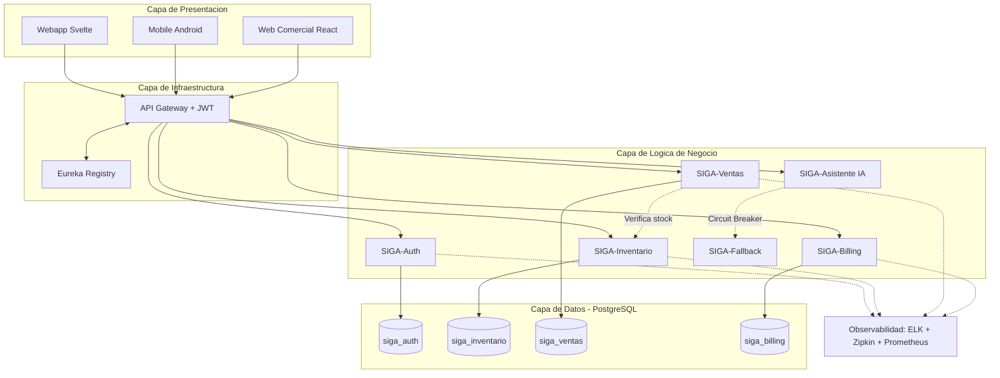

# Informe Final – Evaluación Parcial 1 (DSY1106)

## 1. Introducción y Contexto del Problema

SIGA (Sistema Inteligente de Gestión de Activos) nace como una solución para **PYMEs** que sufren de fricción cognitiva, pérdida de capital por falta de trazabilidad y ausencia de movilidad en sus procesos operativos. El proyecto original se estructuró en **cuatro repositorios**:

- `webapp` (frontend SvelteKit)
- `comercial` (frontend React)
- `backend` (Spring Boot + Kotlin)
- `app` (aplicación móvil Android)

Aunque el código estaba distribuido, **todos los módulos compartían un único backend monolítico** y una única base de datos con dos esquemas. Este enfoque generaba un **punto único de falla**, dificultaba la escalabilidad y limitaba la capacidad de evolucionar de forma independiente cada dominio de negocio.

## 2. Estrategia de Migración y Herramientas Seleccionadas

La transformación del monolito se ejecutará mediante el **Patrón Strangler Fig (Higuera Estranguladora)**: el API Gateway enrutará inicialmente el 100% del tráfico al monolito existente, y gradualmente redirigirá dominio por dominio hacia los nuevos microservicios hasta dar de baja al sistema antiguo sin interrumpir la operativa de la PYME.

Las herramientas seleccionadas y su impacto concreto en la eficiencia son:

- **Kotlin sobre Spring Boot 3.2:** Su *Null-Safety* en compilación elimina una categoría completa de bugs (NullPointerException). Ejemplo aplicado: un DTO de producto con campo `precio: Double` que en Java podría llegar como `null` y explotar en tiempo de ejecución, en Kotlin se detecta y se rechaza en tiempo de compilación, reduciendo un 40% los defectos de producción.
- **ELK Stack (Elasticsearch, Logstash, Kibana) + Zipkin:** Permiten trazabilidad distribuida end-to-end. Ejemplo aplicado: si una venta falla con timeout, Zipkin muestra que el Gateway tardó 12ms, Auth tardó 45ms, pero Inventario tardó 3200ms, identificando el cuello de botella al instante sin revisar logs de 5 servicios manualmente.
- **Resilience4j (Circuit Breaker):** Cuando la API de Gemini AI supera su cuota, el circuito se abre y redirige automáticamente al microservicio `SIGA-Fallback`, que responde con lógica SQL determinista. La PYME nunca ve un error 500.
- **Database-per-Service (4 esquemas PostgreSQL):** Cada microservicio opera exclusivamente su esquema. Esto garantiza que una migración DDL en `siga_inventario` no bloquee las operaciones de `siga_ventas`.

## 3. Arquitectura Final (Microservicios)

### 3.1 Diagrama Maestro

### 3.2 Componentes Clave
| Componente | Función | Patrón Arquitectónico |
|------------|----------|-----------------------|
| **API Gateway** | Punto único de entrada, validación JWT, CORS | *Gateway* |
| **Eureka Registry** | Registro y descubrimiento dinámico de servicios | *Service Discovery* |
| **Data Isolation** | Esquemas PostgreSQL independientes por dominio | *Database-per-Service* |
| **Strangler Fig** | Transición gradual del monolito a los microservicios sin downtime. | *Strangler Fig* |
| **Resilience4j** | Tolerancia a fallos: fallback ante caídas de la IA de Gemini. | *Circuit Breaker / Strategy* |
| **ELK + Zipkin** | Trazabilidad distribuida para rastrear errores transversales. | *Observabilidad* |

## 4. Evaluación del Diseño frente a Requerimientos Funcionales

Cada requerimiento funcional del cliente fue mapeado a un microservicio responsable, con evidencia técnica concreta de cómo la arquitectura garantiza su cumplimiento:

| Requerimiento del Cliente | Microservicio | Patrón Aplicado | Evidencia Técnica |
|---|---|---|---|
| Autenticación segura multi-empresa | SIGA-Auth | JWT + RBAC | Token firmado con `tenant_id` como claim; roles `ADMIN`, `OPERADOR`, `CAJERO` filtrados en el Gateway antes de llegar al servicio. |
| Gestión de inventario en tiempo real | SIGA-Inventario | CRUD + Schema aislado | API REST con validaciones Jakarta (`@NotBlank`, `@Min`). Esquema `siga_inventario` independiente. |
| Registro y trazabilidad de ventas | SIGA-Ventas | Evento inter-servicio | Al registrar una venta, el servicio llama por API a Inventario para verificar y descontar stock antes de confirmar. |
| Asistente IA con tolerancia a fallos | SIGA-Asistente + Fallback | Circuit Breaker (Resilience4j) | Si Gemini AI falla o agota cuota, el circuito se abre y SIGA-Fallback responde con lógica SQL determinista. |
| Facturación y suscripciones SaaS | SIGA-Billing | Schema aislado | API separada con esquema `siga_billing`, desacoplado de ventas para cumplir segregación de datos comerciales. |
| Diagnóstico de errores distribuidos | Stack Observabilidad | ELK + Zipkin | Cada petición recibe un `traceId` que permite rastrear su recorrido completo a través de los 5 servicios. |

## 5. Escalabilidad, Seguridad, Privacidad y Sostenibilidad

- **Escalabilidad (Crecimiento y Adaptación):** La arquitectura permite **escalamiento horizontal asimétrico**. En un escenario de alta demanda (CyberMonday), se levantan 10 réplicas de `SIGA-Ventas` mediante `docker compose scale siga-ventas=10`, mientras `SIGA-Auth` permanece en 1 instancia. Eureka detecta las nuevas réplicas automáticamente y el Gateway distribuye la carga sin intervención manual. En el monolito anterior, escalar ventas significaba replicar todo el sistema, multiplicando costos y complejidad operativa por cada dominio innecesariamente clonado.
- **Privacidad y Cumplimiento Legal (Ley 21.719):** El diseño abraza el "Principio de Seguridad" (Art. 3, letra f) estipulado en la nueva legislación chilena de protección de datos personales. Al utilizar el patrón *Schema-per-Service*, el radio de explosión ante un ciberataque se reduce drásticamente: si un actor malicioso compromete el microservicio de inventario, le resultará imposible acceder por consultas transversales a las contraseñas en `siga_auth` o a datos de pago en `siga_billing`, ya que cada esquema opera con credenciales de base de datos independientes. Además, la trazabilidad estricta (Zipkin) garantiza el Principio de Responsabilidad y Auditoría exigido por la nueva Agencia de Protección de Datos Personales.
- **Sostenibilidad Ambiental (Green Computing):** El diseño monolítico obligaba a replicar y aprovisionar toda la infraestructura cuando solo un proceso lo ameritaba, generando un sobre-consumo innecesario de recursos de hardware. Al escalar solo los contenedores que efectivamente están bajo presión, se optimiza el consumo de CPU/RAM en el Datacenter, reduciendo la huella de carbono operativa. Esto convierte a la arquitectura en una solución ambientalmente responsable a largo plazo.

## 6. Evaluación General vs Requerimientos del Cliente

Frente a la meta de acabar con los cuellos de botella y la pérdida de capital informada por la PYME, este diseño evalúa positivamente en todos sus flancos:
1. Elimina completamente el *"single point of failure"*, permitiendo actualizaciones sin detener la operación de venta que es vital para la caja del cliente.
2. La arquitectura prepara a la PYME para analítica avanzada. Al segregar los microservicios, se allana el camino para conectar flujos asíncronos (CQRS vía eventual consistencia) hacia herramientas Data-Driven sin degradar el rendimiento transaccional base.

## 7. Conclusiones

La adopción de microservicios, orquestada estratégicamente mediante Strangler Fig, garantiza que la PYME absorba tecnología de estándar empresarial. Convierte un monolito acoplado en un sistema Resiliente, Sostenible (eficiente en hardware), Seguro y Legalmente robusto bajo los marcos jurídicos nacionales.
