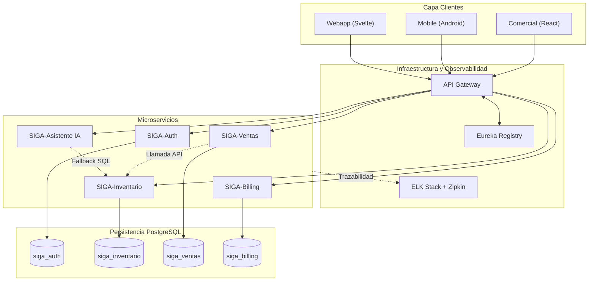

# Informe Final – Evaluación Parcial 1 (DSY1106)

## 1. Introducción y Contexto del Problema

SIGA (Sistema Inteligente de Gestión de Activos) nace como una solución para **PYMEs** que sufren de fricción cognitiva, pérdida de capital por falta de trazabilidad y ausencia de movilidad en sus procesos operativos. El proyecto original se estructuró en **cuatro repositorios**:

- `webapp` (frontend SvelteKit)
- `comercial` (frontend React)
- `backend` (Spring Boot + Kotlin)
- `app` (aplicación móvil Android)

Aunque el código estaba distribuido, **todos los módulos compartían un único backend monolítico** y una única base de datos con dos esquemas. Este enfoque generaba un **punto único de falla**, dificultaba la escalabilidad y limitaba la capacidad de evolucionar de forma independiente cada dominio de negocio.

## 2. Objetivo de la Migración

Transformar el monolito en una **arquitectura de microservicios** adoptando el **Patrón Strangler Fig (Higuera Estranguladora)**. Esta estrategia evitará un despliegue estilo "Big Bang" que pueda interrumpir la operativa, enrutando primero el tráfico a través de un API Gateway y migrando progresivamente el tráfico hacia los nuevos servicios hasta dar de baja al monolito.

Los objetivos clave son:
- Escalado horizontal por dominio (inventario, ventas, autenticación, facturación, asistente IA).
- Aislamiento logico de datos mediante **Database-per-Service** (esquemas independientes).
- Resiliencia mediante **Service Discovery (Eureka)** y **API Gateway**.
- Cumplimiento de normativas de protección de datos (Ley 21.719).

## 3. Arquitectura Final (Microservicios)

### 3.1 Diagrama Maestro



### 3.2 Componentes Clave
| Componente | Función | Patrón Arquitectónico |
|------------|----------|-----------------------|
| **API Gateway** | Punto único de entrada, validación JWT, CORS | *Gateway* |
| **Eureka Registry** | Registro y descubrimiento dinámico de servicios | *Service Discovery* |
| **Data Isolation** | Esquemas PostgreSQL independientes por dominio | *Database-per-Service* |
| **Strangler Fig** | Transición gradual del monolito a los microservicios sin downtime. | *Strangler Fig* |
| **Resilience4j** | Tolerancia a fallos: fallback ante caídas de la IA de Gemini. | *Circuit Breaker / Strategy* |
| **ELK + Zipkin** | Trazabilidad distribuida para rastrear errores transversales. | *Observabilidad* |

## 4. Detalle de los Endpoints (Ejemplos GET/POST)

### 4.1 Creación de Producto (POST)
```http
POST /api/inventario/productos
Headers: Authorization: Bearer <jwt>
Body (JSON):
{
  "nombre": "Cámara DSLR",
  "sku": "CAM-001",
  "stock": 15,
  "precio": 1250.00
}
```
- **Flujo:** Gateway intercepta y valida JWT. Extrae el `tenant_id` y enruta mediante Eureka a `SIGA-Inventario`, inyectando el tenant a nivel de contexto (Row-Level Security) antes de persistir en `siga_inventario`.

### 4.2 Consulta de Stock (GET)
```http
GET /api/inventario/stock?sku=CAM-001
Headers: Authorization: Bearer <jwt>
```
- **Respuesta:** `{ "sku": "CAM-001", "stock": 12 }`

## 5. Diseño Ético: Seguridad, Privacidad y Sostenibilidad Ambiental

- **Privacidad y Cumplimiento Legal (Ley 21.719):** El diseño abraza el "Principio de Seguridad" estipulado en la nueva legislación chilena. Al utilizar el patrón *Schema-per-Service*, el radio de explosión ante un cibertaque se reduce drásticamente. Si un actor malicioso compromete el microservicio de inventario, le resultará imposible acceder por consultas transversales a las contraseñas en `siga_auth` o tarjetas bancarias en `siga_billing`. Además, la trazabilidad estricta (Zipkin) garantiza el Principio de Responsabilidad y Auditoría exigido por la Agencia de Protección de Datos Personales.
- **Sostenibilidad Ambiental (Green Computing):** El diseño monolítico obligaba a replicar y aprovisionar toda la infraestructura cuando solo un proceso lo ameritaba, generando un sobre-consumo innecesario de recursos. Esta arquitectura permite el **Escalamiento Asimétrico**: podemos levantar 10 réplicas de `SIGA-Ventas` en CyberMonday manteniendo 1 sola de `SIGA-Billing`, optimizando la huella de carbono y el consumo de CPU/RAM en el Datacenter, haciendo del sistema una solución responsable con el entorno a largo plazo.

## 6. Evaluación General vs Requerimientos del Cliente

Frente a la meta de acabar con los cuellos de botella y la pérdida de capital informada por la PYME, este diseño evalúa positivamente en todos sus flancos:
1. Elimina completamente el *"single point of failure"*, permitiendo actualizaciones sin detener la operación de venta que es vital para la caja del cliente.
2. La arquitectura prepara a la PYME para analítica avanzada. Al segregar los microservicios, se allana el camino para conectar flujos asíncronos (CQRS vía eventual consistencia) hacia herramientas Data-Driven sin degradar el rendimiento transaccional base.

## 7. Conclusiones

La adopción de microservicios, orquestada estratégicamente mediante Strangler Fig, garantiza que la PYME absorba tecnología de estándar empresarial. Convierte un monolito acoplado en un sistema Resiliente, Sostenible (eficiente en hardware), Seguro y Legalmente robusto bajo los marcos jurídicos nacionales.
