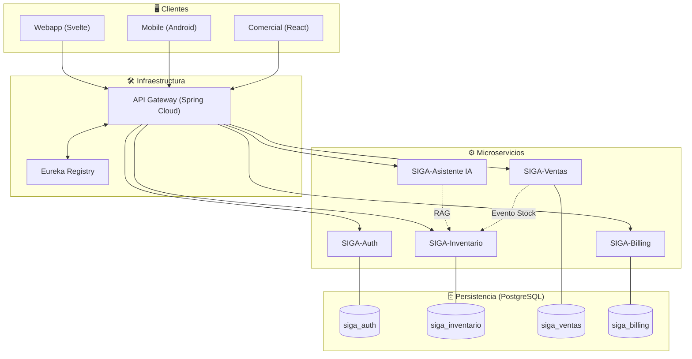

# Informe Final – Evaluación Parcial 1 (DSY1106)

## 1. Introducción y Contexto del Problema

SIGA (Sistema Inteligente de Gestión de Activos) nace como una solución para **PYMEs** que sufren de fricción cognitiva, pérdida de capital por falta de trazabilidad y ausencia de movilidad en sus procesos operativos. El proyecto original se estructuró en **cuatro repositorios**:

- `webapp` (frontend SvelteKit)
- `comercial` (frontend React)
- `backend` (Spring Boot + Kotlin)
- `app` (aplicación móvil Android)

Aunque el código estaba distribuido, **todos los módulos compartían un único backend monolítico** y una única base de datos con dos esquemas (`siga_comercial` y `siga_saas`). Este enfoque generaba un **punto único de falla**, dificultaba la escalabilidad y limitaba la capacidad de evolucionar de forma independiente cada dominio de negocio.

## 2. Objetivo de la Migración

Transformar el monolito en una **arquitectura de microservicios** que permita:

- Escalado horizontal por dominio (inventario, ventas, autenticación, facturación, asistente IA).
- Aislamiento de datos mediante **Database‑per‑Service** (esquemas separados).
- Resiliencia mediante **Service Discovery (Eureka)** y **API Gateway**.
- Documentación viva con **Swagger/OpenAPI**.
- Validación estricta de entradas y pruebas automatizadas.

Esta migración constituye el **trabajo de ingeniería** que se presentará como **proyecto de emprendimiento real**, no como un caso ficticio.

## 3. Arquitectura Final (Microservicios)

### 3.1 Diagrama Maestro (v2.3)


### 3.2 Componentes Clave
| Componente | Función | Patrón Arquitectónico |
|------------|----------|-----------------------|
| **API Gateway** | Punto único de entrada, validación JWT, CORS, rate‑limiting | *Gateway* |
| **Eureka Registry** | Registro y descubrimiento dinámico de servicios | *Service Discovery* |
| **Database‑per‑Service** | Esquemas aislados por dominio | *Database per Service* |
| **Strategy Pattern (Fallback IA)** | Si la API de Gemini falla, responde con lógica SQL determinista | *Strategy* |
| **Swagger / OpenAPI** | Documentación automática de todos los endpoints (GET, POST, PUT, DELETE) | *Documentation* |
| **Jakarta Validation** | Validaciones de DTO (`@NotNull`, `@Email`, `@Min`) | *Validation* |
| **JUnit 5 + Mockito** | Pruebas unitarias y de integración | *Testing* |

## 4. Detalle de los Endpoints (Ejemplos GET/POST)

### 4.1 Creación de Producto (POST)
```
POST /api/inventario/productos
Headers: Authorization: Bearer <jwt>
Body (JSON):
{
  "nombre": "Cámara DSLR",
  "sku": "CAM-001",
  "stock": 15,
  "precio": 1250.00,
  "tenant_id": "empresa-xyz"
}
```
- **Validaciones**: `@NotBlank` para `nombre`, `@Min(0)` para `stock` y `precio`.
- **Flujo**: Gateway → Eureka localiza `SIGA‑Inventario` → Servicio persiste en esquema `siga_inventario`.

### 4.2 Consulta de Stock (GET)
```
GET /api/inventario/stock?sku=CAM-001&tenant_id=empresa-xyz
Headers: Authorization: Bearer <jwt>
```
- **Respuesta**: `{ "sku": "CAM-001", "stock": 12 }`
- **Uso interno**: El asistente IA llama a este endpoint para obtener datos actuales antes de generar una respuesta al usuario.

## 5. Seguridad, Privacidad y Sostenibilidad

- **Seguridad**: JWT con claim `tenant_id`; RBAC con roles `ADMIN`, `OPERADOR`, `CAJERO`.
- **Privacidad**: Multi‑tenancy garantiza que cada empresa solo vea sus datos; cumplimiento implícito de la Ley 21.719 de protección de datos.
- **Sostenibilidad**: Cada microservicio es independiente, permite despliegues graduales, reduce deuda técnica y facilita la incorporación de nuevas funcionalidades sin romper el sistema existente.

## 6. Evaluación Técnica vs Requerimientos

| Requerimiento | Microservicio Responsable | Evidencia en la Arquitectura |
|---------------|---------------------------|------------------------------|
| Autenticación y autorización | SIGA‑Auth | JWT, RBAC, filtro en Gateway |
| Gestión de inventario | SIGA‑Inventario | API CRUD, esquema propio |
| Registro de ventas | SIGA‑Ventas | Evento `stock‑update` vía LISTEN/NOTIFY |
| Asistente IA con fallback | SIGA‑Asistente | Strategy Pattern, fallback SQL |
| Facturación y suscripciones | SIGA‑Billing | API separada, esquema aislado |

## 7. Conclusiones

La migración de **monolito polirepo** a **microservicios** ha permitido:
- Eliminar el punto único de falla.
- Escalar de forma independiente cada dominio de negocio.
- Garantizar la **seguridad y privacidad** requerida por la normativa chilena.
- Presentar un **proyecto real de emprendimiento**, listo para ser validado por el docente y potencialmente comercializado.

---

*Este documento será formateado en la herramienta de ofimática que el estudiante utilice (fuentes, tamaños, márgenes) antes de la entrega.*
