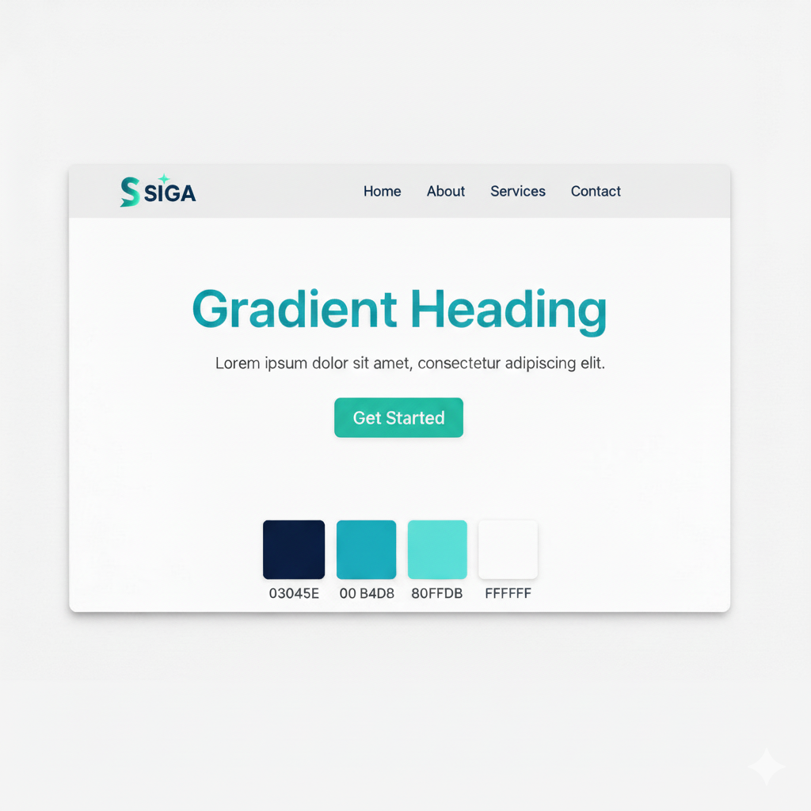

# SIGA (Sistema Inteligente de Gestión de Activos)
> Para que nunca te detengas. • No gestiones tu Inventario, Gestiona tu Tiempo.

<!-- Badges de estado y colores -->

  
  
  

  
  
  
  

---

### 🚦 Estado del Proyecto: Diseño Finalizado. Listo para Desarrollar.

Este documento es la fuente central de verdad. Si te sumas (colaborador, docente o inversor), aquí está el corazón, la visión y el plan de acción.

---

### 📖 Tabla de Contenidos
- [SIGA (Sistema Inteligente de Gestión de Activos)](#siga-sistema-inteligente-de-gestión-de-activos)
    - [🚦 Estado del Proyecto: Diseño Finalizado. Listo para Desarrollar.](#-estado-del-proyecto-diseño-finalizado-listo-para-desarrollar)
    - [📖 Tabla de Contenidos](#-tabla-de-contenidos)
  - [Carta del Fundador (1 min)](#carta-del-fundador-1-min)
  - [La Problemática](#la-problemática)
  - [La Solución](#la-solución)
  - [Propuesta de Valor](#propuesta-de-valor)
  - [Identidad de Marca y Sistema de Diseño](#identidad-de-marca-y-sistema-de-diseño)
    - [Logotipo](#logotipo)
    - [Paleta de Colores](#paleta-de-colores)
    - [Tipografía](#tipografía)
  - [Visión de la Arquitectura](#visión-de-la-arquitectura)
    - [Clientes: Web y Apps Nativas](#clientes-web-y-apps-nativas)
    - [¿Por qué Kotlin?](#por-qué-kotlin)
  - [Stack Tecnológico](#stack-tecnológico)
  - [Modelo de datos inicial (v1)](#modelo-de-datos-inicial-v1)
  - [Guía rápida para devs (TL;DR)](#guía-rápida-para-devs-tldr)
  - [Flujo de trabajo con GitHub (equipo)](#flujo-de-trabajo-con-github-equipo)
  - [Plan de Desarrollo (Gatear → Caminar → Correr)](#plan-de-desarrollo-gatear--caminar--correr)
  - [Recursos de Marca (logos y colores)](#recursos-de-marca-logos-y-colores)
  - [FAQ y Troubleshooting](#faq-y-troubleshooting)
  - [Documentación Detallada](#documentación-detallada)
  - [Únete a la Visión](#únete-a-la-visión)

---

## Carta del Fundador (1 min)
Esta idea no nació en un aula: nació en la cabina de una camioneta. Mi mayor frustración era una sola palabra: detenerme. Detenerme a contar, a cuadrar, a pelear con planillas mientras el negocio seguía sin mí. Me quitó el sueño; más de una vez lo soñé.

SIGA nace para que el emprendedor no se detenga. Una herramienta que hace el trabajo pesado y devuelve minutos reales. El tiempo es la moneda.

Más contexto humano y técnico: [Corazón de SIGA](docs/SIGA.md)

---

## La Problemática
Para muchas PYMES, la gestión de activos es parálisis operativa: sistemas complejos, planillas frágiles, fricción constante. Resultado: quiebres, mermas y pérdida de tiempo, el recurso más valioso.

---

## La Solución
SIGA es un asistente de operaciones proactivo con tres pilares:
1) Asistente Conversacional: actualizar, consultar y reportar en lenguaje natural.
2) Inteligencia Proactiva: anticipa quiebres y sugiere acciones.
3) Simplicidad Radical: interfaz clara y reportes accionables.

---

## Propuesta de Valor
No vendemos software; vendemos tiempo y tranquilidad.

---

## Identidad de Marca y Sistema de Diseño

### Logotipo
Cuatro variantes: Primary (gradient), Solid, Monochrome y Reversed (blanco).

### Paleta de Colores
- Azul marino #03045E (principal)
- Cian #00B4D8 (acento)
- Cian claro #80FFDB (acento secundario)
- Blanco #FFFFFF (neutro)

### Tipografía
Inter: Headings en Bold, cuerpo en Regular.

---

## Visión de la Arquitectura
- siga.com: marketing y conversión.
- app.siga.com: aplicación SaaS (usuarios y lógica de negocio).
- Flujo: interfaz (móvil/PC) → API (Ktor) → PostgreSQL → respuesta a la interfaz.
- Offline cuando haga falta: si no hay internet, guardar acciones localmente y sincronizar al volver (se implementa por etapas si aporta valor).
- Documentos técnicos (modelo 4+1 y ER) en /docs.

### Clientes: Web y Apps Nativas
- Web App (app.siga.com): responsive.
- Android (nativa): Kotlin + Jetpack Compose.
- iOS (nativa): núcleo compartido con Kotlin Multiplatform (KMM) + UI SwiftUI.
- Asistente conversacional integrado en móviles (texto primero; voz más adelante).

### ¿Por qué Kotlin?
- Unifica backend (Ktor) y lógica móvil compartida (KMM) → menos duplicación y mayor velocidad.
- Android moderno con Compose; en iOS reutilizamos el core KMM y construimos UI nativa.

---

## Stack Tecnológico
| Capa | Tecnología | Justificación |
| :--- | :--- | :--- |
| Frontend Web | Svelte + Bulma | UX fluida y simple. |
| Mobile (Android) | Kotlin + Jetpack Compose | Nativo y moderno. |
| Mobile (iOS) | KMM (core) + SwiftUI | Compartir lógica; UI nativa. |
| Backend | Kotlin (Ktor) | API robusta. |
| Base de Datos | PostgreSQL | Fiable y escalable. |
| IA & ML | LLMs / Python (server) | Chat/insights y predicciones. |

---

## Modelo de datos inicial (v1)
Tablas mínimas para el primer slice:
- productos: id, sku (único), nombre, stock_actual, created_at, updated_at.
- movimientos: id, producto_id (FK), usuario_id (FK opcional), tipo (ENTRADA|SALIDA), cantidad, nota, created_at.
- usuarios: id, nombre, rol (DUEÑO|ENCARGADO|VENDEDOR), email, created_at.

Reglas:
- cantidad > 0; stock_actual ≥ 0.
- El descuento de stock se aplica en la API (sin triggers por ahora).
- Índices por producto y fecha para consultas rápidas.

Cuando agreguemos infra, versionaremos el esquema con migraciones SQL (ej.: infra/migrations/V1__init.sql).

---

## Guía rápida para devs (TL;DR)
TL;DR = resumen para empezar rápido.
- Requisitos (macOS): Git, Docker Desktop, Node LTS, Java 21, VS Code.
- Variables: copia .env.example a .env (cuando esté disponible).
- Base local: cd infra && docker compose up -d (cuando exista /infra).
- Ejecutar (cuando existan apps):
  - API (Ktor): ./gradlew run
  - Web (SvelteKit): npm install && npm run dev

---

## Flujo de trabajo con GitHub (equipo)
- Ramas: main (protegida), dev (integración), feature/<tarea>.
- Flujo: crear feature → PR a dev → revisión → merge. De dev a main en releases.
- Commits (simple): feat / fix / docs / chore / refactor / test / build
- Comandos (Mac):
  - git checkout -b feature/registrar-salida
  - git add . && git commit -m "feat: registrar salida"
  - git push -u origin feature/registrar-salida
  - Abrir PR hacia dev en GitHub

---

## Plan de Desarrollo (Gatear → Caminar → Correr)
- Gatear (slice inicial):
  - Modelo de datos v1 y migraciones SQL listas.
  - API: POST /productos, POST /salidas, GET /salidas?hoy=true
  - Regla: no stock negativo; errores claros.
  - Web app móvil simple: seleccionar producto, cantidad, confirmar.
  - App Android (mínima): asistente (chat) + registrar salidas; core compartido KMM.
  - Offline básico: cola local de salidas; sincroniza al volver la conexión.
- Caminar:
  - Costos y rentabilidad básica; alertas mejoradas.
  - App iOS mínima: reutiliza core KMM + UI SwiftUI; paridad de flujo principal.
  - Asistente mejorado: atajos y respuestas a preguntas del negocio.
- Correr:
  - POS completo y facturación.
  - Integraciones externas.
  - Modo voz en móviles (dictado y lectura).

---

## Recursos de Marca (logos y colores)
- Carpeta: /docs/brand
  - logo-primary.(png|svg)
  - logo-solid.(png|svg)
  - logo-monochrome.(png|svg)
  - logo-reversed.(png|svg)
  - preview-colores.png (mock/captura de la paleta en UI)
- Vista previa de colores (si ya subiste la imagen):

- Favicons (cuando exista la web):
  - Generar desde SVG/PNG grande (512px+).
  - Ej.: npx favicons ./docs/brand/logo.svg -o ./apps/web/static

---

## FAQ y Troubleshooting
- ¿Qué significa TL;DR? Un resumen para empezar sin leer todo.
- ¿Puedo reportar bugs? Aún no: no hay código ejecutable. Por ahora usa Issues/Discussions para preguntas y sugerencias.
- Docker no levanta (más adelante): abre Docker Desktop y ejecuta docker compose up -d; verifica puerto 5432 libre.
- ¿Qué es “offline”? Guardar acciones localmente cuando no hay internet y sincronizar después.

---

## Documentación Detallada
La ingeniería del software está definida en los siguientes documentos dentro de la carpeta /docs:
- [Corazón de SIGA](/docs/SIGA.md)
- [Requisitos e Historias de Usuario](/docs/requisitos_y_historias.md)
- [Diagramas de Arquitectura (Modelo 4+1)](/docs/diagrams/)
- [Modelo Entidad-Relación (Base de Datos)](/docs/diagrams/images/entidad_relacion.svg)

---

## Únete a la Visión
SIGA es más que un proyecto; es el inicio de una startup sencilla pero bien estructurada. Buscamos personas que compartan nuestra pasión por resolver problemas reales con tecnología.
- Docentes guía y mentores: experiencia en SaaS, logística o IA.
- Colaboradores: desarrolladores, diseñadores y expertos en negocios con propósito.

Si esto resuena contigo, abre un Issue para conversar o contáctanos.