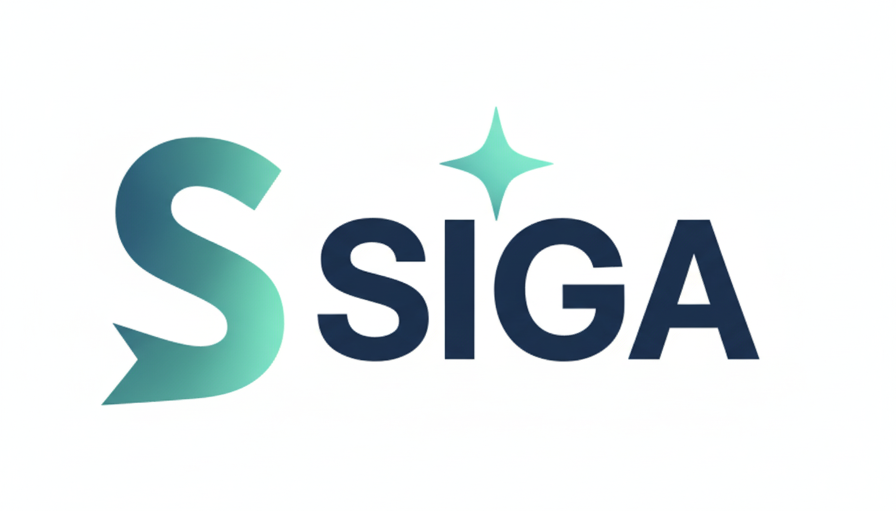

  

---

# Rama: Organización Documental

Este espacio de trabajo está dedicado exclusivamente al saneamiento, auditoría y reestructuración de la base de conocimiento de SIGA.

## Objetivos de esta fase

1.  **Saneamiento de Servicios**: Eliminación de residuos técnicos y carpetas heredadas de la etapa de repositorios independientes (ej. `.github`, `arquitectura-agentica` local de cada servicio).
2.  **Centralización de la Verdad**: Movimiento de documentación operativa a la raíz y preservación de documentación histórica en `docs/origen/`.
3.  **Estandarización Estética**: Aplicación de un estilo profesional y sobrio en toda la documentación del monorepo.

## Estado de la Auditoría

Los detalles de los archivos marcados para eliminación o movimiento se encuentran en:
**[AUDITORIA_LIMPIEZA.md](file:///c:/Users/hdagu/Desktop/SIGA/arquitectura-agentica/AUDITORIA_LIMPIEZA.md)**

---
*Esta rama se fusionará con main una vez finalizada la limpieza total.*

---
> Un Soñador con Poca RAM  & Misael
