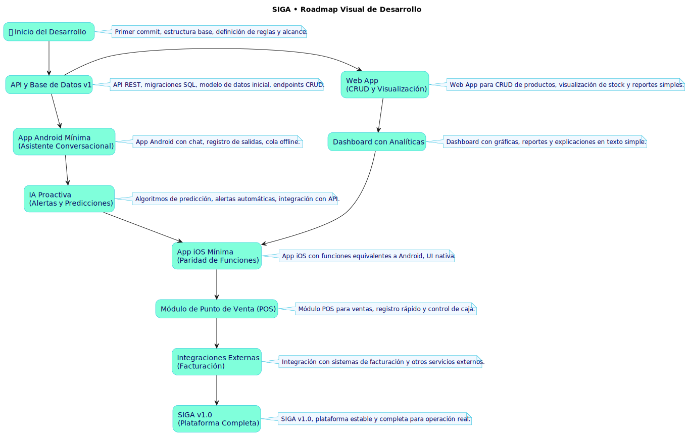

# SIGA (Sistema Inteligente de Gestión de Activos)
> Para que nunca te detengas. • No gestiones tu Inventario, Gestiona tu Tiempo.

<!-- Badges de estado y colores -->

  
  
  

  
  
  
  

---

### 🚦 Estado del Proyecto: Diseño Finalizado. Listo para Desarrollar.

Este documento es la fuente central de verdad. Si te sumas (colaborador, docente o inversor), aquí está el corazón, la visión y el plan de acción.

---

### 📖 Tabla de Contenidos
- [SIGA (Sistema Inteligente de Gestión de Activos)](#siga-sistema-inteligente-de-gestión-de-activos)
    - [🚦 Estado del Proyecto: Diseño Finalizado. Listo para Desarrollar.](#-estado-del-proyecto-diseño-finalizado-listo-para-desarrollar)
    - [📖 Tabla de Contenidos](#-tabla-de-contenidos)
  - [Carta del Fundador (1 min)](#carta-del-fundador-1-min)
  - [La Problemática](#la-problemática)
  - [La Solución](#la-solución)
  - [Propuesta de Valor](#propuesta-de-valor)
  - [Identidad de Marca y Sistema de Diseño](#identidad-de-marca-y-sistema-de-diseño)
    - [Logotipo](#logotipo)
    - [Paleta de Colores](#paleta-de-colores)
    - [Tipografía](#tipografía)
  - [Visión de la Arquitectura](#visión-de-la-arquitectura)
    - [Clientes: Web y Apps Nativas](#clientes-web-y-apps-nativas)
    - [¿Por qué Kotlin?](#por-qué-kotlin)
  - [Stack Tecnológico](#stack-tecnológico)
  - [Modelo de datos inicial (v1)](#modelo-de-datos-inicial-v1)
  - [Guía rápida para devs (TL;DR)](#guía-rápida-para-devs-tldr)
  - [Flujo de trabajo con GitHub (equipo)](#flujo-de-trabajo-con-github-equipo)
  - [Plan de Desarrollo (Gatear → Caminar → Correr)](#plan-de-desarrollo-gatear--caminar--correr)
  - [Documentación Detallada](#documentación-detallada)
  - [Únete a la Visión](#únete-a-la-visión)

---

## Carta del Fundador (1 min)
Esta idea no nació en un aula: nació en la cabina de una camioneta. Mi mayor frustración era una sola palabra: detenerme. Detenerme a contar, a cuadrar, a pelear con planillas mientras el negocio seguía sin mí. Me quitó el sueño; más de una vez lo soñé.

SIGA nace para que el emprendedor no se detenga. Una herramienta que hace el trabajo pesado y devuelve minutos reales. El tiempo es la moneda.

Más contexto humano y técnico: [Corazón de SIGA](docs/SIGA.md)

---

## La Problemática
Para muchas PYMES, la gestión de activos es parálisis operativa: sistemas complejos, planillas frágiles, fricción constante. Resultado: quiebres, mermas y pérdida de tiempo, el recurso más valioso.

---

## La Solución
SIGA es un asistente de operaciones proactivo con tres pilares:
1) **Asistente Conversacional:** Actualizar, consultar y reportar en lenguaje natural.
2) **Inteligencia Proactiva:** Anticipa quiebres y sugiere acciones con IA.
3) **Simplicidad Radical:** Interfaz clara y reportes accionables que se explican solos.

---

## Propuesta de Valor
No vendemos software; vendemos tiempo y tranquilidad.

---

## Identidad de Marca y Sistema de Diseño

### Logotipo
Cuatro variantes disponibles en `/docs/brand`: Primary (gradient), Solid, Monochrome y Reversed (blanco).

### Paleta de Colores
- Azul marino `#03045E` (principal)
- Cian `#00B4D8` (acento)
- Cian claro `#80FFDB` (acento secundario)
- Blanco `#FFFFFF` (neutro)

### Tipografía
Inter: Headings en Bold, cuerpo en Regular.

---

## Visión de la Arquitectura
- `siga.com`: Marketing y conversión.
- `app.siga.com`: Aplicación SaaS (lógica de negocio).
- **Flujo:** Interfaz (móvil/PC) → API (Ktor) → PostgreSQL → Respuesta.
- **Offline-first:** Las acciones se guardan localmente y se sincronizan al recuperar la conexión.
- Documentos técnicos (modelo 4+1 y ER) en `/docs`.

### Clientes: Web y Apps Nativas
- **Web App:** `app.siga.com`, responsive y funcional.
- **Android (Nativa):** Kotlin + Jetpack Compose.
- **iOS (Nativa):** Lógica compartida con Kotlin Multiplatform (KMM) + UI nativa en SwiftUI.
- El Asistente Conversacional será el núcleo de la experiencia móvil.

### ¿Por qué Kotlin?
Unifica el backend (Ktor) y la lógica móvil compartida (KMM), reduciendo la duplicación de código y acelerando el desarrollo.

---

## Stack Tecnológico
| Capa | Tecnología | Justificación |
| :--- | :--- | :--- |
| Frontend Web | Svelte + Bulma | UX fluida y simple. |
| Mobile (Android) | Kotlin + Jetpack Compose | Nativo y moderno. |
| Mobile (iOS) | KMM (core) + SwiftUI | Lógica compartida, UI nativa. |
| Backend | Kotlin (Ktor) | API robusta y de alto rendimiento. |
| Base de Datos | PostgreSQL | Fiable y escalable. |
| IA | APIs de LLMs / Python | Chatbots, insights y predicciones. |

---

## Modelo de datos inicial (v1)
El diseño de la base de datos está pensado para ser robusto y escalable, con convenciones claras (español, mayúsculas). Las entidades principales son:

- **Entidades de Catálogo:** `USUARIOS`, `PRODUCTOS`, `CATEGORIAS`, `LOCALES`.
- **Entidades Operacionales:** `STOCK`, `VENTAS`, `DETALLES_VENTA`, `MOVIMIENTOS`, `ALERTAS`.

**Principios Clave:**
- **Stock por Local:** El stock no es un atributo del producto, sino una entidad separada (`STOCK`) que relaciona un `PRODUCTO` con un `LOCAL` y una `cantidad`.
- **Trazabilidad Total:** La tabla `MOVIMIENTOS` registra cada entrada, venta, merma o ajuste, creando un historial completo para cada producto.
- **Roles:** El sistema diferencia entre roles (`ADMINISTRADOR`, `VENDEDOR`) para una gestión de permisos segura.

Para ver el diseño detallado, el Modelo Entidad-Relación y el script DDL completo, consulta la documentación en la carpeta `/docs`.

---

## Guía rápida para devs (TL;DR)
- **Requisitos:** Git, Docker Desktop, Node LTS, Java 21, VS Code.
- **Variables:** Copia `.env.example` a `.env` (cuando esté disponible).
- **Base local:** `cd infra && docker compose up -d` (cuando exista `/infra`).
- **Ejecutar API:** `./gradlew run`
- **Ejecutar Web:** `npm install && npm run dev`

---

## Flujo de trabajo con GitHub (equipo)
- **Ramas:** `main` (protegida), `dev` (integración), `feature/<tarea>`.
- **Flujo:** Crear `feature` → PR a `dev` → Revisión → Merge.
- **Commits:** `feat`, `fix`, `docs`, `chore`, `refactor`, `test`, `build`.

---

## Plan de Desarrollo (Gatear → Caminar → Correr)
A continuación se presenta el plan de desarrollo visualizado del proyecto.

---

## Documentación Detallada
La ingeniería del software está definida en los siguientes documentos dentro de la carpeta `/docs`:
- [Corazón de SIGA](/docs/SIGA.md)
- [Requisitos e Historias de Usuario](/docs/requisitos_y_historias.md)
- [Diagramas de Arquitectura (Modelo 4+1)](/docs/diagrams/)
- [Modelo Entidad-Relación (Base de Datos)](/docs/diagrams/images/entidad_relacion.svg)

---

## Únete a la Visión
SIGA es más que un proyecto; es el inicio de una startup sencilla pero bien estructurada. Buscamos personas que compartan nuestra pasión por resolver problemas reales con tecnología.
- **Docentes guía y mentores:** Experiencia en SaaS, logística o IA.
- **Colaboradores:** Desarrolladores, diseñadores y expertos en negocios con propósito.

Si esto resuena contigo, abre un **Issue** para conversar o contáctanos.