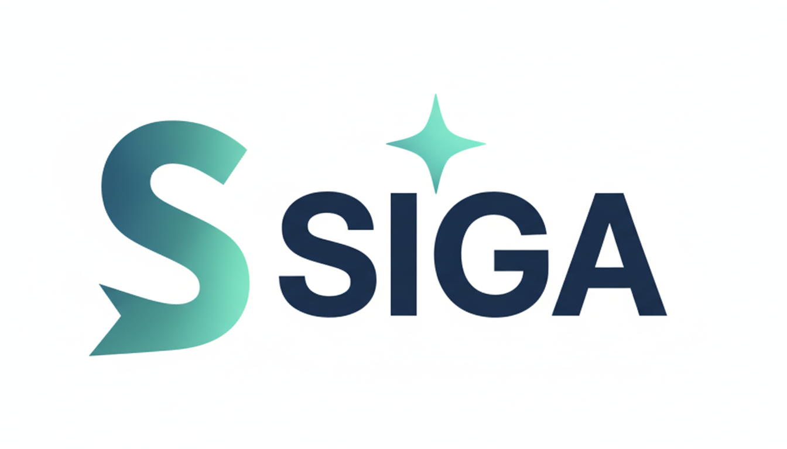

  

<<<<<<< HEAD

# SIGA: Sistema Inteligente de Gestión de Activos

Bienvenido al monorepo de **SIGA**, un ecosistema de software profesional diseñado para la gestión integral, la movilidad y la integración de IA.

## 📂 Estructura del Proyecto

Este monorepo unifica los componentes críticos del sistema para facilitar el desarrollo y la coherencia arquitectónica:

### 🚀 Servicios (`/services`)
- **[backend](file:///c:/Users/hdagu/Desktop/SIGA/services/backend)**: El motor principal (Kotlin + Spring Boot 3.2).
- **[webapp](file:///c:/Users/hdagu/Desktop/SIGA/services/webapp)**: Panel administrativo para dueños (SvelteKit / Svelte 5).
- **[mobile](file:///c:/Users/hdagu/Desktop/SIGA/services/mobile)**: Aplicación móvil para operación en terreno (Android / Jetpack Compose).
- **[comercial](file:///c:/Users/hdagu/Desktop/SIGA/services/comercial)**: Portal de ventas y landing page (React + Vite).

### 🧠 Inteligencia y Documentación
- **[arquitectura-agentica](file:///c:/Users/hdagu/Desktop/SIGA/arquitectura-agentica)**: El centro de conocimiento para agentes de IA y planificación de specs (SDD).
- **[docs](file:///c:/Users/hdagu/Desktop/SIGA/docs)**: Historia evolutiva del proyecto y diagramas fundacionales.
- **[skills](file:///c:/Users/hdagu/Desktop/SIGA/skills)**: Módulos de capacidad extendida para la IA.

## 🛠️ Cómo Empezar

Para una experiencia de desarrollo óptima, te recomendamos abrir el archivo **[SIGA.code-workspace](file:///c:/Users/hdagu/Desktop/SIGA/SIGA.code-workspace)** en VS Code. Esto configurará automáticamente los "roots" con sus respectivos iconos y ocultará archivos redundantes.

## 🤝 Contribución y Gobernanza

Este proyecto sigue normas estrictas para asegurar la calidad y el aprendizaje:
- **Commits**: Siempre en español.
- **Aprobación**: Se requiere autorización explícita antes de cualquier `push`.
- **Transparencia**: Cada paso técnico debe ser explicado y justificado previamente.

Para más detalles, consulta las **[Reglas de Oro de Colaboración](file:///c:/Users/hdagu/Desktop/SIGA/arquitectura-agentica/REGLAS_DE_ORO.md)**.
=======
>>>>>>> main

---

# Rama: Organización Documental

Este espacio de trabajo está dedicado exclusivamente al saneamiento, auditoría y reestructuración de la base de conocimiento de SIGA.

## Objetivos de esta fase

1.  **Saneamiento de Servicios**: Eliminación de residuos técnicos y carpetas heredadas de la etapa de repositorios independientes (ej. `.github`, `arquitectura-agentica` local de cada servicio).
2.  **Centralización de la Verdad**: Movimiento de documentación operativa a la raíz y preservación de documentación histórica en `docs/origen/`.
3.  **Estandarización Estética**: Aplicación de un estilo profesional y sobrio en toda la documentación del monorepo.

## Estado de la Auditoría

Los detalles de los archivos marcados para eliminación o movimiento se encuentran en:
**[AUDITORIA_LIMPIEZA.md](file:///c:/Users/hdagu/Desktop/SIGA/arquitectura-agentica/AUDITORIA_LIMPIEZA.md)**

---
*Esta rama se fusionará con main una vez finalizada la limpieza total.*

---
> Un Soñador con Poca RAM  & Misael
