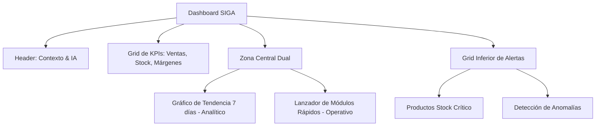

# Propuesta de Rediseño y Evaluación del Dashboard — SIGA

Este documento contiene la evaluación técnica y de experiencia de usuario (UX) basada en el dashboard de **Defontana** (analizando su captura de pantalla y estructura de código fuente) y presenta una propuesta adaptada para el nuevo dashboard de **SIGA**.

---

## 1. Evaluación del Código Fuente (`defontanadash.html`)

Tu sospecha es **totalmente correcta**. El archivo HTML traído no contiene estructura de layout ni contenido visual directo por una razón técnica fundamental: **es un bootstrap (cargador) compilado de una Single Page Application (SPA) construida en Angular**.

### Detalles Técnicos del HTML:
* **Framework y Estilo:** Utiliza **Angular** con **Angular Material** y **Material Design Components (MDC)**. Esto se evidencia por la inmensa cantidad de variables CSS personalizadas que comienzan con `--mat-` y `--mdc-` (como `--mat-sys-on-surface`, `--mdc-outlined-card-outline-color`, etc.).
* **Tipografía:** Importa las fuentes **Roboto** y **Source Sans Pro** desde Google Fonts.
* **Punto de Montaje:** Todo el contenido se inyecta dinámicamente en la etiqueta `<app-root></app-root>` (línea 17).
* **Carga de Scripts:** Los archivos de lógica y vistas están minificados y precargados al final del documento (como `main-YDWFFGRD.js` y varios chunks de JS).

> [!NOTE]
> **Conclusión del HTML:** No tiene utilidad para extraer contenido, textos o estructuras de componentes específicos, ya que toda esa lógica está empaquetada en el JavaScript compilado. Nos centraremos 100% en la experiencia visual y funcional de la interfaz a partir de la imagen.

---

## 2. Análisis y Evaluación de la Interfaz (`defontanadash.png`)

La interfaz de Defontana muestra un **Panel Operacional** de inventario. A continuación, se detallan sus fortalezas y debilidades de diseño y UX.

### Estructura de la Interfaz:
1. **Header (Barra Superior):** Centraliza la identidad de la marca, buscador global, notificaciones, utilidades de ayuda/soporte y el menú de usuario.
2. **Sidebar Izquierdo (Menú de Navegación):** Menú colapsable con los módulos principales del ERP (Ventas, Compras, Inventario, Contabilidad, Tesorería, Reportes BI, etc.).
3. **Sección Principal — Selector de Módulos (Tarjeta Superior):** Presenta los 5 pilares operativos en forma de botones circulares con badges de estado o tendencia. El módulo activo ("Inventario") se destaca con un borde naranja.
4. **Sección Principal — Detalle del Módulo (Tarjeta Inferior):** Al seleccionar un módulo arriba, cambia dinámicamente esta sección para mostrar la descripción y un grid de accesos directos rápidos (Productos, Movimientos, Stock, Últimos movimientos), acompañado de una ilustración 3D.

### Puntos Fuertes (Lo que hace bien):
* **Claridad en la navegación:** Funciona muy bien como un portal de bienvenida o "Launcher" (Lanzador) para usuarios nuevos o que realizan tareas repetitivas.
* **Consistencia visual:** El uso de badges naranjas sobre iconos azules y una paleta de colores sobria mantiene el diseño limpio.

### Puntos Débiles (Oportunidades de mejora crítica):
* **Baja densidad de información:** La pantalla está muy vacía. Se desperdicia mucho espacio con la ilustración 3D y textos descriptivos largos en lugar de mostrar datos reales de valor (ej. cuánto stock hay hoy, valor de inventario actual, alertas).
* **Sobrecarga de clics (Clic-heavy):** Para ver el estado real de un sub-módulo (ej. Stock), el usuario debe:
  1. Mirar el panel.
  2. Clickear el módulo operativo arriba (si no está seleccionado).
  3. Clickear la acción en el grid de la derecha.
  4. Recién ahí entra a la pantalla con la información.
* **Enfoque Operativo vs. Analítico:** Es un dashboard de "navegación", no de "decisión". No ayuda al dueño de la PYME a saber cómo va su negocio de un vistazo.

---

## 3. Propuesta para el Dashboard de SIGA

Teniendo en cuenta que **SIGA** está construido sobre **SvelteKit 5** con un diseño moderno (glassmorphism) y que su público objetivo incluye tanto a **dueños de PYMEs** (que necesitan métricas/decisiones rápidas) como a **operadores** (que necesitan accesos rápidos), proponemos un enfoque superador.

### Filosofía de Diseño de SIGA: "Métricas Primero, Navegación Integrada"
No debemos copiar el diseño de Defontana de un panel vacío con ilustraciones. El dashboard de SIGA debe ser **analítico y accionable**, pero puede adoptar la idea de Defontana de ofrecer accesos rápidos contextuales estructurados.

### Estructura de Componentes Propuesta:

### 1. Grid de KPIs (Superior)
En lugar de iconos vacíos, mostrar tarjetas con la estética de **glassmorphism** activa de SIGA, mostrando datos vivos:
* **Ventas del Día:** Monto acumulado y badge de tendencia (verde/rojo).
* **Nivel de Stock:** Cantidad total de ítems y alerta si hay críticos.
* **Márgenes/Ganancias:** Resumen rápido.

### 2. Panel de Accesos Rápidos (Inspirado en Defontana, pero optimizado)
En lugar de una ilustración 3D gigante, colocaremos una sección compacta llamada **"Accesos Operativos Rápidos"** o **"Flujos del Día"**. 
* Organizado por pestañas rápidas sin recargar la página.
* Botones con micro-interacciones (hover suave y transiciones nativas de SvelteKit).
* **Flujos sugeridos:**
  * **Inventario:** [Nuevo Producto] [Ajustar Stock] [Ver Almacenes]
  * **Ventas:** [Ir a POS 🛒] [Ver Boletas] [Cierre de Caja]

### 3. Dualidad: Dashboard Tradicional vs. UI Agéntica (A2UI)

Para evitar complejidades innecesarias, mantendremos una clara separación de responsabilidades y transiciones fluidas entre los dos modos de uso del sistema:

* **Modo Tradicional (Manual/Visual):**
  * Presenta un layout limpio con KPIs clave, gráficos interactivos de tendencias y alertas operativas (como stock crítico y anomalías).
  * El usuario tiene el control visual absoluto, navegando con clics rápidos a través de un panel optimizado.
* **Modo Agéntico (Conversacional/Guiado):**
  * Integrado mediante el `ContextualAssistant` (asistente flotante) y la vista dedicada `/assistant`.
  * La IA no solo responde preguntas en texto, sino que actúa sobre la interfaz tradicional: puede disparar filtros específicos en las tablas, precargar datos en formularios (ej. reponer stock bajo) o modificar los parámetros de los gráficos basándose en la conversación.
  * **Interacción contextual:** El asistente de IA recibe automáticamente la ruta y estado actual del dashboard tradicional para ofrecer respuestas 100% enfocadas en la pantalla activa.

---

## 4. Plan de Acción para la Fase 4 (Insights & Analytics)

Para implementar esta propuesta en el stack de SIGA (`apps/dashboard/src`):

1. **Diseñar el Layout Dual:** Modificar `routes/(dashboard)/+page.svelte` para organizar la pantalla en dos columnas en escritorio:
   * **Columna Izquierda (65%):** Gráfico de tendencia (`ChartWrapper`) e Insights / Anomalías.
   * **Columna Derecha (35%):** Panel de Accesos Rápidos ("Lanzador") simplificado para reemplazar el espacio muerto.
2. **Crear el Componente `QuickLauncher.svelte`:**
   * Crear este componente en `src/lib/components/dashboard/`.
   * Diseñar botones grandes estilo *glassmorphism* que permitan ir directamente a las acciones operativas más comunes (redirigiendo a `/products`, `/stores`, `/assistant` o la ruta del `/pos`).
3. **Optimización del Rendimiento:**
   * Asegurar que la carga inicial de datos del servidor (`+page.server.ts`) obtenga en paralelo tanto los KPIs como la lista de accesos rápidos permitidos según el rol del usuario (Admin, Operador, Cajero).
