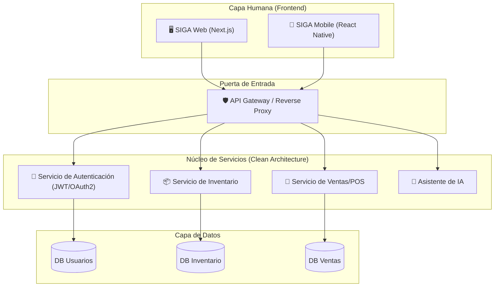

# Diagrama de Arquitectura: SIGA 🏛️

Este diagrama representa la visión estructurada del sistema, comparando la opción de un microservicio de autenticación frente a un enfoque más simplificado.

## 📊 Arquitectura Propuesta (Microservicios)

## 🧠 El Debate: ¿Servicio de Autenticación Sí o No?

### Opción A: Microservicio de Autenticación Propio
- **Pros**: Control total de los datos de usuario, independencia de terceros, escalabilidad pura.
- **Contras**: Mayor complejidad de mantenimiento, Héctor tiene que programar la seguridad desde cero (mantenimiento de tokens, refresh, baneo, etc.).

### Opción B: Autenticación Delegada (Supabase / Auth0)
- **Pros**: **Simplicidad Radical** (Haiku). Te olvidas de la seguridad y te centras en el negocio. Menos código que mantener.
- **Contras**: Dependencia de un tercero (vendor lock-in).

### Opción C: Seguridad en el Gateway
- **Pros**: Un solo punto de control. Los microservicios internos "confían" en el Gateway.
- **Contras**: Si el Gateway cae, todo el sistema queda expuesto.

---
> Un Soñador con Poca RAM 👨🏻💻 & Misael
