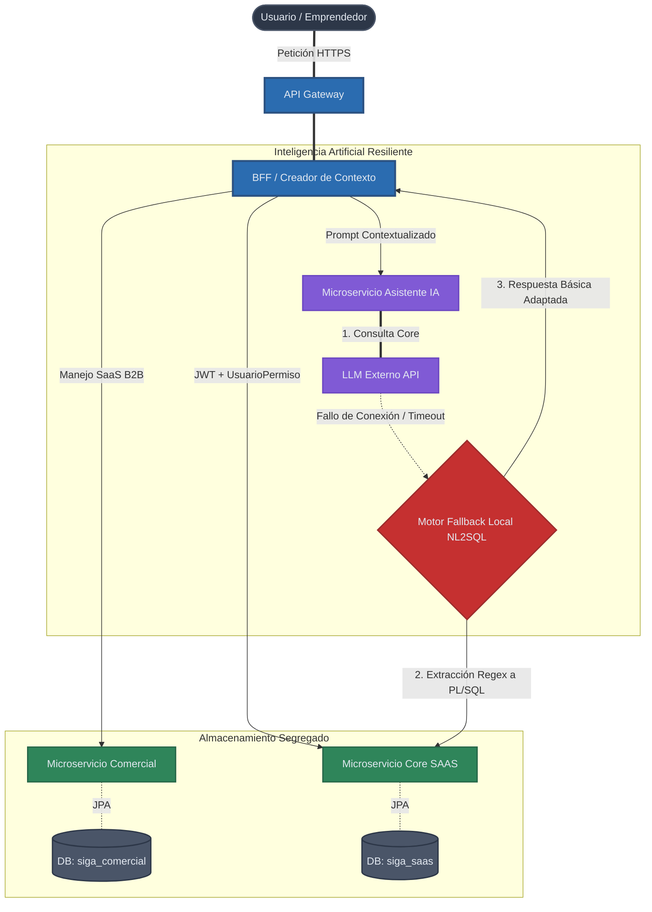

# Diagrama de Arquitectura de Microservicios SIGA

El siguiente diagrama refleja la arquitectura real y refinada de SIGA, basandose en las tablas de la base de datos divididas por contexto (`siga_comercial` y `siga_saas`) y el diseño de contingencia para la Inteligencia Artificial.

### Razonamiento Arquitectonico:
1. **Division Comercial vs Core**: Mantener las facturas del pago del SaaS (Comercial) alejadas de las lechugas y computadores del inventario (SAAS) garantiza que si un modulo cae, el otro sigue vivo.
2. **El Agente como Proxy Restringido**: La peticion al Agente (IA) viaja desde el BFF con los permisos cargados. Si el usuario es Chofer, la IA sabe por defecto que no puede inyectar SQL de borrado.
3. **Fallback PL/SQL**: Es imperativo en entornos de alta disponibilidad (inventarios en tiempo real) que la IA nunca paralice al operario. Si Gemini no responde, el modulo entra en modo "Consulta Directa" (Scripting) temporalmente.
