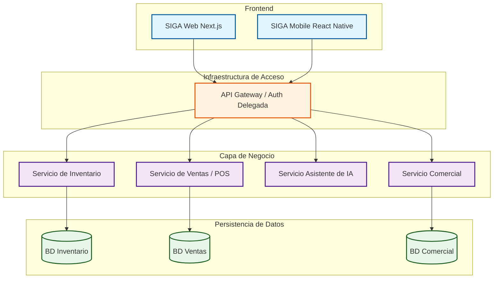

# Diagrama de Arquitectura de SIGA

Este diagrama representa la vision estructurada del sistema, consolidando la decision de utilizar un modelo de autenticacion delegada para maximizar la seguridad y eficiencia.

## Arquitectura de Servicios

## Analisis Tecnico: Autenticacion Delegada (Opcion B)

Tras el debate tecnico, se ha decidido implementar la **Opcion B**: Autenticacion Gestionada (ej. Supabase / Auth0).

### Justificacion
- **Seguridad Garantizada**: Delegamos la gestion de credenciales y encriptacion a proveedores con certificaciones internacionales.
- **Eficiencia (Haiku)**: Reducimos la carga de mantenimiento del equipo, permitiendo centrar los recursos en la logica de negocio real de SIGA.
- **Escalabilidad**: El sistema de sesion y manejo de tokens es gestionado externamente, facilitando el escalado de los servicios core de forma independiente.

---
> Un Soñador con Poca RAM & Misael
