# SIGA — Modelo Relacional de Base de Datos

**Base de Datos:** PostgreSQL 16
**Estrategia:** Una sola instancia, un schema por servicio (Database-per-Service via schemas)
**Total de Tablas:** 23

---

## Arquitectura de Schemas

SIGA utiliza **5 schemas** dentro de una sola base de datos PostgreSQL. Cada schema es propiedad exclusiva de un microservicio. Si un servicio necesita datos de otro schema, los solicita via API REST/Feign, nunca accede directamente a tablas ajenas.

| Schema | Servicio Dueño | Tablas | Proposito |
|--------|:--------------:|:------:|-----------|
| `siga_auth` | auth (:8081) | 5 | Usuarios operativos, permisos y asignacion de locales |
| `siga_inventario` | inventario (:8082) | 6 | Productos, categorias, stock, movimientos (Kardex) y alertas |
| `siga_ventas` | ventas (:8083) | 6 | POS, ventas, turnos de caja, transacciones y carrito temporal |
| `siga_comercial` | backend (:8084) | 6 | Portal comercial: planes, suscripciones, pagos y facturacion |
| `siga_agente` | agente (:8000) | - | Vector store (PGVector) y contextos de conversacion IA |

---

## 1. Schema `siga_auth` — Autenticacion y Permisos

**Servicio:** `auth` (Kotlin/Spring Boot, puerto 8081)
**Responsabilidad:** Gestion de identidad, roles (ADMINISTRADOR, OPERADOR, CAJERO), permisos granulares y asignacion de usuarios a locales.

### Tablas

| Tabla | Descripcion | Relaciones |
|-------|-------------|------------|
| `usuarios` | Usuarios operativos del sistema SaaS | `usuario_comercial_id` referencia logica a `siga_comercial.usuarios` |
| `permisos` | Catalogo de operaciones (ej: `PRODUCTOS_CREAR`) | Agrupados por `categoria` |
| `roles_permisos` | Plantilla base de permisos por rol | PK compuesta: (`rol`, `permiso_id`) |
| `usuarios_permisos` | Permisos adicionales por usuario | PK compuesta: (`usuario_id`, `permiso_id`) |
| `usuarios_locales` | Asignacion M:N de usuarios a locales | PK compuesta: (`usuario_id`, `local_id`) |

### Reglas de Negocio
- Un cajero puede estar asignado a multiples locales (flexibilidad operativa para PYMEs)
- Los permisos base se heredan del rol; los adicionales se asignan individualmente
- `usuario_comercial_id` vincula al inquilino (tenant) para aislamiento multi-empresa

---

## 2. Schema `siga_inventario` — Gestion de Inventario

**Servicio:** `inventario` (Kotlin/Spring Boot, puerto 8082)
**Responsabilidad:** Productos, categorias, stock por local, movimientos (Kardex) y alertas de stock.

### Tablas

| Tabla | Descripcion | Relaciones |
|-------|-------------|------------|
| `locales` | Sucursales/bodegas de la empresa | Filtrado por `usuario_comercial_id` |
| `categorias` | Agrupacion de productos | `nombre` unico por empresa |
| `productos` | Catalogo maestro de productos | FK a `categorias`, `codigo_barras` unico |
| `stock` | Cantidad actual por producto/local | UNIQUE(`producto_id`, `local_id`), CHECK `cantidad >= 0` |
| `movimientos` | Kardex: historial completo de entradas/salidas | Tipos: ENTRADA, SALIDA, VENTA, AJUSTE, TRASLADO. Registra `cantidad_anterior` y `cantidad_nueva` |
| `alertas` | Notificaciones automaticas | Tipos: STOCK_BAJO, STOCK_AGOTADO, VENTA_ALTA, MOVIMIENTO_SOSPECHOSO |

### Reglas de Negocio
- Cada movimiento registra quien lo hizo (`usuario_id`), cuando y por que (`observaciones`)
- El stock nunca puede ser negativo (constraint en DB)
- `cantidad_minima` en stock define el umbral para alertas de STOCK_BAJO
- Los productos pueden activarse/desactivarse sin eliminarse (`activo` toggle)

---

## 3. Schema `siga_ventas` — Punto de Venta (POS)

**Servicio:** `ventas` (Kotlin/Spring Boot, puerto 8083)
**Responsabilidad:** Gestion de ventas, turnos de caja con apertura/cierre, transacciones POS y carrito temporal.

### Tablas

| Tabla | Descripcion | Relaciones |
|-------|-------------|------------|
| `metodos_pago` | Catalogo: EFECTIVO, TARJETA_DEBITO, TARJETA_CREDITO, TRANSFERENCIA | `nombre` unico |
| `turnos_caja` | Apertura y cierre de caja por cajero/local | Incluye `monto_contado` para reconciliacion |
| `ventas` | Registro de ventas completadas/canceladas | Vinculada a local y usuario |
| `detalles_venta` | Lineas de productos por venta | FK a `ventas`, referencia logica a productos |
| `transacciones_pos` | Detalle de pago por transaccion | Vincula venta + turno + metodo de pago |
| `carrito_pos` | Carrito temporal durante la venta | Se limpia al completar o cancelar la venta |

### Reglas de Negocio
- Un cajero debe **abrir caja** (con `monto_inicial` y timestamp) antes de registrar ventas
- Al **cerrar caja**, se registra `monto_final` (calculado por sistema) y `monto_contado` (conteo fisico del cajero)
- La diferencia entre `monto_final` y `monto_contado` permite detectar descuadres automaticamente
- Una venta puede pagarse con multiples metodos (ej: parte efectivo, parte tarjeta) via `transacciones_pos`
- Estados de venta: COMPLETADA (stock descontado), CANCELADA (stock devuelto), PENDIENTE

---

## 4. Schema `siga_comercial` — Portal Comercial y Facturacion

**Servicio:** `backend` (Kotlin/Spring Boot, puerto 8084) — futuro servicio `billing`
**Responsabilidad:** Gestion de clientes comerciales (duenos de empresa), planes de suscripcion, pagos y facturacion.

### Tablas

| Tabla | Descripcion | Relaciones |
|-------|-------------|------------|
| `usuarios` | Clientes del portal (duenos de empresa) | Roles: `admin`, `cliente`. Incluye datos de trial |
| `planes` | Catalogo de planes SaaS | Con limites de bodegas, usuarios y productos |
| `suscripciones` | Contratos activos | Estados: ACTIVA, SUSPENDIDA, CANCELADA, VENCIDA |
| `pagos` | Registro de cobros | Estados: PENDIENTE, COMPLETADO, FALLIDO, REEMBOLSADO |
| `facturas` | Documentos fiscales | Precios en UF y CLP, con IVA |
| `carritos` | Carrito de compra de planes | Un carrito por usuario |

### Reglas de Negocio
- Cada plan define limites operativos (bodegas, usuarios, productos)
- Las suscripciones pueden ser MENSUAL o ANUAL
- Trial gratuito de 14 dias controlado por `en_trial`, `fecha_inicio_trial`, `fecha_fin_trial`
- Los `usuarios` de este schema son los **duenos de empresa**, NO los operadores del sistema

---

## 5. Comunicacion entre Servicios

Los microservicios se comunican via API REST a traves del Gateway. Ningun servicio accede directamente a tablas de otro schema.

### Flujos Principales

| Flujo | Origen | Destino | Mecanismo |
|-------|--------|---------|-----------|
| Validar stock antes de venta | ventas | inventario | Feign Client |
| Obtener datos del cajero | ventas | auth | Feign Client |
| Descontar stock tras venta | ventas | inventario | Feign Client |
| Consultar inventario completo | agente | inventario | REST API |
| Consultar ventas del dia | agente | ventas | REST API |
| Consultar turno actual | agente | ventas | REST API |

---

## 6. Referencias Logicas entre Schemas

En lugar de Foreign Keys fisicas entre schemas (que acoplan servicios), se usan **referencias logicas**: se almacena el ID de la entidad remota, pero la integridad se garantiza por API.

### Mapa de Referencias

| Campo | Tabla Origen | Schema Origen | Referencia a | Schema Destino |
|-------|-------------|:-------------:|--------------|:--------------:|
| `usuario_comercial_id` | usuarios, locales, productos, ventas, categorias | saas/inventario/ventas | `usuarios.id` | `siga_comercial` |
| `usuario_id` | movimientos, turnos_caja, ventas, carrito_pos | inventario/ventas | `usuarios.id` | `siga_auth` |
| `local_id` | turnos_caja, ventas, carrito_pos, usuarios_locales | ventas/auth | `locales.id` | `siga_inventario` |
| `producto_id` | detalles_venta, carrito_pos | ventas | `productos.id` | `siga_inventario` |
| `venta_id` | movimientos | inventario | `ventas.id` | `siga_ventas` |

---

## Nota: Estrategia de Migracion Incremental

Actualmente la base de datos tiene 2 schemas (`siga_saas` y `siga_comercial`). La migracion a 5 schemas se hara en 2 fases:

1. **Fase 1 (actual):** Crear las entidades Kotlin faltantes usando los schemas existentes
2. **Fase 2 (posterior):** Renombrar `siga_saas` y redistribuir tablas en `siga_auth`, `siga_inventario` y `siga_ventas` via `ALTER TABLE SET SCHEMA`

---

*Generado automaticamente. Archivos fuente en `docs/database/diagrams/*.mmd`*
*SVGs renderizados con Mermaid CLI v11.12.0*
