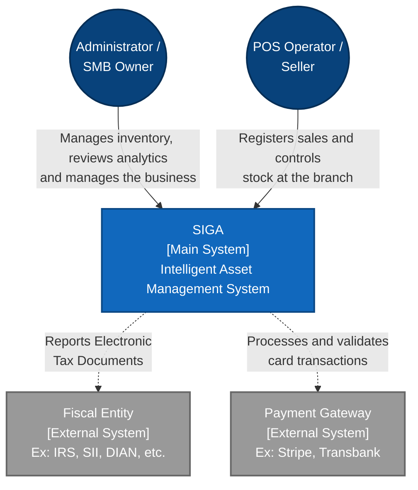

# C4 Architecture Model - SIGA

*Leer en otros idiomas: [](../../es/arquitectura/MODELO_C4.md)*

This document describes the architecture of the **Intelligent Asset Management System (SIGA)** using the **C4 Model** standard. We focus on the strategic levels (Context and Containers) to provide a clear vision for both business and engineering stakeholders.

---

## What is the C4 Model?
The C4 Model is a structured approach to visualizing software architecture at different levels of abstraction:
1.  **Level 1 (System Context)**: Shows how the system interacts with users and other external systems.
2.  **Level 2 (Containers)**: Shows the high-level technical architecture and how responsibilities are distributed (Microservices, Databases, Frontends).
3.  **Level 3 (Components)**: Internal structure of a specific container (e.g., Controllers, Services, Repositories inside the Inventory service).
4.  **Level 4 (Code)**: UML class diagrams or pure code structure.

*Note: For agile and microservices-oriented architectures like SIGA, we explicitly document Levels 1 and 2. Levels 3 and 4 are considered implicit in the codebase and Hexagonal Architecture.*

---

## Level 1: System Context Diagram

This diagram illustrates the big picture of SIGA. It shows the users interacting with the system and the external dependencies (fiscal and financial systems) that enable full commercial operability.



---

## Level 2: Container Diagram

This diagram "zooms in" inside the main SIGA block. It shows the technical architecture based on **Microservices** deployed by the system, highlighting the API Gateway pattern, Service Registry, and the *Database-per-service* model (implemented logically via schemas).

```mermaid
flowchart TB
    %% Styles
    classDef actor fill:#08427b,color:#fff
    classDef container fill:#438dd5,stroke:#2e6295,color:#fff
    classDef db fill:#2e6295,stroke:#1b3a58,color:#fff
    classDef infrastructure fill:#d3d3d3,stroke:#999999,color:#000

    User(["Users - Admin/POS"]):::actor
    
    subgraph SIGA_System [SIGA Ecosystem]
        direction TB
        
        %% Client Applications
        WebApp["WebApp V2<br>[Container: SvelteKit]<br>Admin Console UI"]:::container
        MobileApp["Mobile App<br>[Container: Android/Kotlin]<br>App for field operators"]:::container
        
        %% Entry point
        Gateway["API Gateway<br>[Container: Spring Cloud]<br>Single Router (Port 8080)"]:::container
        
        %% Orchestration & Messaging
        Eureka(("Service Registry<br>[Infra: Netflix Eureka]<br>Service Discovery"))
        Kafka(("Event Broker<br>[Infra: Apache Kafka]<br>SAGA Choreography & Events")):::infrastructure:::infrastructure
        
        %% Microservices (Hexagonal Architecture)
        subgraph Microservices [Core Backend - Hexagonal]
            Auth["siga-auth<br>[Spring Boot]"]
            Inv["siga-inventory<br>[Spring Boot<br>🔺 Hexagonal]"]
            Sales["siga-sales<br>[Spring Boot<br>🔺 Hexagonal]"]
            Bill["siga-billing<br>[Spring Boot<br>🔺 Hexagonal]"]
            Agent["siga-agent<br>[Kotlin/Spring Boot<br>🔺 A2UI v0.9]"]
        end
        
        %% Ops & Observability
        Ops["siga-ops<br>[ContainerFlow]<br>Docker Visualizer"]:::container
        
        %% Database
        DB[(PostgreSQL Multi-tenant)]:::db
    end
    
    %% User Interactions
    User -->|Visits HTTPS| WebApp
    User -->|Uses App| MobileApp
    
    %% To Backend
    WebApp -->|REST/JSON| Gateway
    MobileApp -->|REST/JSON| Gateway
    
    %% Routing
    Gateway -->|Routes requests| Auth
    Gateway -->|Routes requests| Inv
    Gateway -->|Routes requests| Sales
    Gateway -->|Routes requests| Bill
    Gateway -->|Routes requests| Agent
    
    %% Discovery
    Auth -.->|Registers| Eureka
    Inv -.->|Registers| Eureka
    Sales -.->|Registers| Eureka
    Bill -.->|Registers| Eureka
    Agent -.->|Registers| Eureka
    Gateway -.->|Queries locations| Eureka
    
    %% Async Communication (SAGA)
    Sales -- "Publishes SALE_INITIATED<br>(Topic: sale-events)" --> Kafka
    Kafka -- "Delivers event" --> Inv
    Inv -- "Publishes STOCK_RESERVED<br>(Topic: stock-events)" --> Kafka
    Kafka -- "Delivers response" --> Sales
    Sales -- "Publishes SALE_COMPLETED<br>(Topic: sale-completed)" --> Kafka
    Kafka -- "Delivers event" --> Bill

    %% Persistence
    Auth -->|Reads/Writes schema: auth| DB
    Inv -->|Reads/Writes schema: inventory| DB
    Sales -->|Reads/Writes schema: sales| DB
    Bill -->|Reads/Writes schema: billing| DB
    Agent -->|Vector Search schema: agent| DB
    
    %% Ops
    Ops -.->|Monitors (/var/run/docker.sock)| Gateway
    Ops -.->|Monitors| Microservices
```

### Key Technical Decisions (L2)
- **API Gateway**: Keeps internal microservices hidden from the public internet. Centralizes CORS and routing.
- **Service Registry (Eureka)**: Allows horizontal scaling of microservices without the need for physical load balancers.
- **Messaging (Kafka)**: Implements the **SAGA (Choreography)** pattern for distributed transactions. Sales orchestrates stock reservation with Inventory and, once confirmed, publishes an event for Billing to generate the sales invoice (`SaleInvoice`).
- **Data Isolation**: Each microservice connects to a single PostgreSQL server but has its own restricted `schema`, ensuring that one service cannot directly corrupt another's data.
- **Local Observability (Ops)**: ContainerFlow (`siga-ops`) directly reads the Docker socket to chart interactive topology and unify logs in real-time, operating independently from the Spring network.

---
> A Dreamer with little RAM 🧑‍💻
