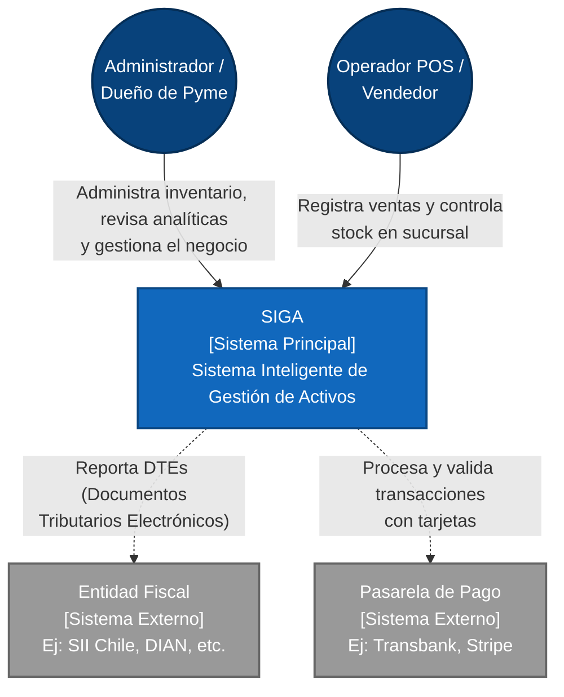
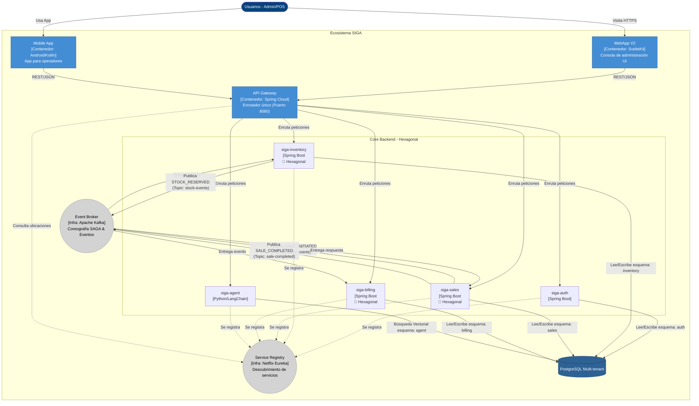

# Modelo de Arquitectura C4 - SIGA

*Read this in other languages: *

Este documento describe la arquitectura del **Sistema Inteligente de Gestión de Activos (SIGA)** utilizando el estándar del **Modelo C4**. El enfoque se centra en los niveles estratégicos (Contexto y Contenedores) para proporcionar una visión clara tanto para el negocio como para la ingeniería.

---

## ¿Qué es el Modelo C4?
El Modelo C4 es un enfoque estructurado para visualizar la arquitectura de software en diferentes niveles de abstracción:
1.  **Nivel 1 (Contexto)**: Muestra cómo el sistema interactúa con los usuarios y otros sistemas externos.
2.  **Nivel 2 (Contenedores)**: Muestra la arquitectura técnica de alto nivel y cómo se distribuyen las responsabilidades (Microservicios, Bases de Datos, Frontends).
3.  **Nivel 3 (Componentes)**: Estructura interna de un contenedor específico (Ej: Controladores, Servicios, Repositorios dentro del servicio de Inventario).
4.  **Nivel 4 (Código)**: Diagramas de clases UML o estructura de código puro.

*Nota: Para arquitecturas ágiles y orientadas a microservicios como SIGA, documentamos explícitamente los Niveles 1 y 2. Los niveles 3 y 4 se consideran implícitos en el código base y la Arquitectura Hexagonal.*

---

## Nivel 1: Diagrama de Contexto (System Context)

Este diagrama ilustra el panorama general de SIGA. Muestra a los usuarios que interactúan con el sistema y las dependencias externas (sistemas fiscales y financieros) que permiten la operatividad comercial completa.

---

## Nivel 2: Diagrama de Contenedores (Containers)

Este diagrama hace un "zoom" dentro del bloque principal de SIGA. Muestra la arquitectura técnica basada en **Microservicios** que despliega el sistema, evidenciando el patrón de API Gateway, Service Registry y el modelo de *Database-per-service* (implementado lógicamente vía esquemas).

### Decisiones Técnicas Clave (L2)
- **API Gateway**: Mantiene los microservicios internos ocultos del internet público. Centraliza CORS y enrutamiento.
- **Service Registry (Eureka)**: Permite escalar microservicios horizontalmente sin necesidad de balanceadores de carga físicos.
- **Mensajería (Kafka)**: Implementa el patrón **SAGA (Coreografía)** para transacciones distribuidas. Sales orquesta la reserva de stock con Inventory y, al confirmarse, publica un evento para que Billing genere la factura de venta (`SaleInvoice`).
- **Aislamiento de Datos**: Cada microservicio se conecta a un único servidor PostgreSQL, pero tiene su propio `esquema` restringido, garantizando que un servicio no pueda corromper los datos de otro de forma directa.

---
`> Un Soñador con poca RAM 🧑‍💻
