# Infraestructura Cloud — SIGA en AWS EKS

> Diagrama de la arquitectura desplegada en AWS EKS (producción académica).
> Versión: Junio 2026 — Basado en el despliegue real.

```mermaid
graph TB
    subgraph INTERNET["🌐 Internet"]
        USER["👤 Usuario<br/>Browser / Cliente"]
    end

    subgraph AWS["☁️ AWS Cloud — us-east-1"]

        subgraph VPC["VPC — 10.0.0.0/16"]
            
            subgraph PUBLIC_SN["🌍 Acceso Público"]
                ELB_GW["🚪 Classic ELB — Gateway<br/>Puerto: 80 → 8080"]
                ELB_DASH["📊 Classic ELB — Dashboard<br/>Puerto: 80 → 3000"]
                ELB_GRAF["📈 Classic ELB — Grafana<br/>Puerto: 3000"]
                ELB_OPS["🛡️ Classic ELB — siga-ops<br/>Puerto: 80 → 80"]
            end

            subgraph EKS["☸️ Amazon EKS<br/>Kubernetes 1.30"]
                
                subgraph NODES["🖥️ 3 × t3.medium<br/>2 vCPU · 4GB RAM c/u"]
                    NODE_A["Node 1<br/>AZ-a<br/>ip-10-0-3-218"]
                    NODE_B["Node 2<br/>AZ-b<br/>ip-10-0-4-151"]
                    NODE_C["Node 3<br/>AZ-b<br/>ip-10-0-4-217"]
                end

                subgraph PODS["12 Pods · 1 Réplica c/u"]
                    direction TB
                    
                    REG["REGISTRY<br/>Eureka Server<br/>8761"]
                    GW_POD["GATEWAY<br/>Spring Cloud Gateway<br/>8080"]
                    AUTH_POD["AUTH<br/>JWT · Roles · BCrypt<br/>8081"]
                    INV_POD["INVENTORY<br/>Stock · Productos<br/>8082"]
                    SALES_POD["SALES<br/>POS · Ventas<br/>8083"]
                    BILL_POD["BILLING<br/>Suscripciones<br/>8084"]
                    NOTIF_POD["NOTIFICATION<br/>Alertas · Email<br/>8085→8086"]
                    AGENT_POD["AGENT<br/>IA · Gemini A2UI<br/>8000"]
                    DASH_POD["DASHBOARD<br/>SvelteKit 5 · SSR<br/>3000"]
                    KAFKA_POD["KAFKA<br/>Event Bus · KRaft<br/>9092"]
                    PROM_POD["PROMETHEUS<br/>Métricas<br/>9090"]
                    GRAF_POD["GRAFANA<br/>Dashboards<br/>3000"]
                end
                
                subgraph OPS["🛡️ siga-ops<br/>God Admin Panel<br/>Nginx + Swagger Proxy"]
                    OPS_POD["Panel HTML<br/>Proxy: /auth-swagger/<br/>Proxy: /inventory-swagger/<br/>Proxy: /sales-swagger/<br/>Proxy: /billing-swagger/<br/>Proxy: /notification-swagger/"]
                end
            end

            subgraph DATA["🗄️ Almacenamiento Persistente"]
                direction LR
                RDS[("RDS PostgreSQL 16<br/>db.t3.small — 20GB<br/>5 bases de datos:<br/>• siga_auth<br/>• siga_inventory<br/>• siga_sales<br/>• siga_billing<br/>• siga_notification<br/>SSL Required")]
                REDIS[("ElastiCache Redis 7<br/>cache.t3.micro<br/>Stock consolidado<br/>TTL: 60s")]
            end
        end

        subgraph ECR["📦 Amazon ECR<br/>9 Repositorios"]
            R1["gateway"]
            R2["auth"]
            R3["inventory"]
            R4["sales"]
            R5["billing"]
            R6["notification"]
            R7["agent"]
            R8["registry"]
            R9["dashboard"]
        end

        subgraph CI_CD["⚙️ GitHub Actions"]
            WF_BUILD["Build & Push<br/>9 imágenes Docker → ECR"]
            WF_DEPLOY["Deploy to EKS<br/>kubectl apply -k k8s/<br/>kubectl rollout restart"]
            WF_SEC["Security Pipeline<br/>Gitleaks + Trivy + Semgrep"]
            GH_SEC["Secrets:<br/>AWS_ACCESS_KEY_ID<br/>AWS_SECRET_ACCESS_KEY<br/>AWS_SESSION_TOKEN"]
        end
    end

    subgraph GIT["📂 GitHub"]
        REPO["HecAguilaV/SIGA<br/>Monorepo<br/>— services/*<br/>— apps/dashboard<br/>— k8s/<br/>— terraform/<br/>— .github/workflows/"]
    end

    %% Conexiones externas
    USER -->|"HTTP :80"| ELB_GW
    USER -->|"HTTP :80"| ELB_DASH
    USER -->|"HTTP :3000"| ELB_GRAF
    USER -->|"HTTP :80"| ELB_OPS

    %% ELB → Pods
    ELB_GW --> GW_POD
    ELB_DASH --> DASH_POD
    ELB_GRAF --> GRAF_POD
    ELB_OPS --> OPS_POD

    %% Gateway → Microservicios
    GW_POD --> REG
    GW_POD --> AUTH_POD
    GW_POD --> INV_POD
    GW_POD --> SALES_POD
    GW_POD --> BILL_POD
    GW_POD --> NOTIF_POD
    GW_POD --> AGENT_POD

    %% OPS → Swagger Proxies
    OPS_POD -.->|"/auth-swagger/"| AUTH_POD
    OPS_POD -.->|"/inventory-swagger/"| INV_POD
    OPS_POD -.->|"/sales-swagger/"| SALES_POD
    OPS_POD -.->|"/billing-swagger/"| BILL_POD
    OPS_POD -.->|"/notification-swagger/"| NOTIF_POD

    %% Base de datos
    AUTH_POD -->|"JDBC SSL :5432"| RDS
    INV_POD -->|"JDBC SSL :5432"| RDS
    SALES_POD -->|"JDBC SSL :5432"| RDS
    BILL_POD -->|"JDBC SSL :5432"| RDS
    NOTIF_POD -->|"JDBC SSL :5432"| RDS
    AGENT_POD -->|"JDBC SSL :5432"| RDS

    %% Redis
    INV_POD -->|"Redis :6379"| REDIS

    %% Kafka Event Bus (SAGA Coreografía)
    SALES_POD -->|"Publica: sale-completed"| KAFKA_POD
    INV_POD -->|"Consume: sale-completed"| KAFKA_POD
    BILL_POD -->|"Consume: sale-completed"| KAFKA_POD
    NOTIF_POD -->|"Consume: sale-completed"| KAFKA_POD

    %% Monitoreo
    PROM_POD -->|"Scrape :8080/metrics"| GW_POD
    PROM_POD -->|"Scrape :8081/metrics"| AUTH_POD
    PROM_POD -->|"Scrape :8082/metrics"| INV_POD
    PROM_POD -->|"Scrape :8083/metrics"| SALES_POD
    PROM_POD -->|"Scrape :8084/metrics"| BILL_POD
    PROM_POD -->|"Scrape :8085/metrics"| NOTIF_POD
    PROM_POD -->|"Scrape :8000/metrics"| AGENT_POD
    GRAF_POD -->|"PromQL"| PROM_POD

    %% CI/CD
    REPO -->|"git push"| CI_CD
    WF_BUILD -->|"docker push"| ECR
    WF_DEPLOY -->|"kubectl apply"| EKS

    %% Eureka
    REG -.->|"Service Discovery"| GW_POD
    REG -.->|"Service Discovery"| AUTH_POD
    REG -.->|"Service Discovery"| INV_POD
    REG -.->|"Service Discovery"| SALES_POD
    REG -.->|"Service Discovery"| BILL_POD
    REG -.->|"Service Discovery"| NOTIF_POD
    REG -.->|"Service Discovery"| AGENT_POD

    %% Estilos
    style INTERNET fill:#1a1a2e,color:#e0e0ff,stroke:#326ce5
    style AWS fill:#1a1a2e,color:#ff9900,stroke:#ff9900
    style VPC fill:#16213e,color:#c0d0ff,stroke:#0f3460
    style PUBLIC_SN fill:#1a3a1a,color:#90ee90,stroke:#2ecc71
    style EKS fill:#1a2a3a,color:#90c0ff,stroke:#326ce5
    style NODES fill:#1a2a2a,color:#a0e0a0,stroke:#27ae60
    style PODS fill:#16213e,color:#c0d0ff
    style OPS fill:#2a1a2e,color:#ffc0ff,stroke:#9b59b6
    style DATA fill:#2a1a1a,color:#ff9080,stroke:#c0392b
    style ECR fill:#2a2a1a,color:#ffd080,stroke:#d35400
    style CI_CD fill:#1a2a2a,color:#90ffd0,stroke:#1abc9c
    style GIT fill:#1a1a2e,color:#c0c0ff,stroke:#667eea
    style REG fill:#2a1a3a,color:#d090ff,stroke:#9b59b6
    style KAFKA_POD fill:#3a2a1a,color:#ffd090,stroke:#f39c12
    style AGENT_POD fill:#1a2a2a,color:#90ffd0,stroke:#1abc9c
    style OPS_POD fill:#2a1a3a,color:#e0a0ff,stroke:#8e44ad
    style GW_POD fill:#1a3a4a,color:#90e0ff,stroke:#3498db
    style PROM_POD fill:#2a1a1a,color:#ff9090,stroke:#e74c3c
    style GRAF_POD fill:#1a2a1a,color:#90ff90,stroke:#2ecc71
    style ELB_GW fill:#1a3a4a,color:#90e0ff,stroke:#3498db
    style ELB_DASH fill:#1a3a2a,color:#90ff90,stroke:#2ecc71
    style ELB_GRAF fill:#1a2a1a,color:#90ff90,stroke:#27ae60
    style ELB_OPS fill:#2a1a3a,color:#e0a0ff,stroke:#8e44ad
```



---

## URLs de Acceso Público

| Servicio | URL |
|:---------|:----|
| **Dashboard SIGA** | http://ac525400245dd4a23afc516bffa803bf-76912376.us-east-1.elb.amazonaws.com |
| **Gateway API** | http://ad5e1571bfc47464e81e515fe1a103a3-46653806.us-east-1.elb.amazonaws.com |
| **Grafana** | http://a463c8492a4b04739a8d006344354b31-762123166.us-east-1.elb.amazonaws.com |
| **siga-ops (God Admin Panel)** | http://aab3fcade474c400094f30750552d213-167633679.us-east-1.elb.amazonaws.com |

---

## Componentes del Stack Cloud

| Componente | Especificación | Cantidad |
|:-----------|:---------------|:---------|
| **EKS Cluster** | Kubernetes 1.30 | 1 |
| **Node Group** | t3.medium (2 vCPU, 4GB RAM) | 3 nodos |
| **Classic ELB** | HTTP:80 / 3000 | 4 (gateway, dashboard, grafana, ops) |
| **RDS PostgreSQL** | db.t3.small, 20GB, SSL required | 1 instancia, 5 bases de datos |
| **ElastiCache Redis** | cache.t3.micro | 1 |
| **ECR** | Repositorios Docker | 9 |
| **Pods** | 12/12 Running | 12 |
| **Servicios Eureka** | Registrados UP | 7/7 |

---

## Estado del Cluster (12/12 Pods Running)

```
grafana           1/1 Running
prometheus        1/1 Running
siga-agent        1/1 Running
siga-auth         1/1 Running
siga-billing      1/1 Running
siga-dashboard    1/1 Running
siga-gateway      1/1 Running
siga-inventory    1/1 Running
siga-kafka        1/1 Running
siga-notification 1/1 Running
siga-registry     1/1 Running
siga-sales        1/1 Running
```

---

## Servicios Registrados en Eureka (7/7 UP)

```
SIGA-AUTH        UP
SIGA-AGENT       UP
SIGA-INVENTORY   UP
SIGA-SALES       UP
SIGA-BILLING     UP
SIGA-NOTIFICATION UP
SIGA-GATEWAY     UP
```

---

## CI/CD Pipeline

```
Evento: git push a main
    ↓
┌─────────────────────────────────────┐
│  Build & Push (paralelo × 9)         │
│  → Docker build → ECR push           │
│  → Cache de capas con GitHub Actions │
└─────────────────────────────────────┘
    ↓
┌─────────────────────────────────────┐
│  Deploy to EKS                       │
│  → kubectl apply -k k8s/             │
│  → kubectl rollout restart -n siga   │
│  → kubectl rollout status            │
└─────────────────────────────────────┘
    ↓
┌─────────────────────────────────────┐
│  Verify                              │
│  → kubectl wait --for=condition=ready │
└─────────────────────────────────────┘
```

**GitHub Secrets:** `AWS_ACCESS_KEY_ID`, `AWS_SECRET_ACCESS_KEY`, `AWS_SESSION_TOKEN`

---

## Limitaciones del Lab AWS Academy

| Limitación | Impacto | Solución Aplicada |
|:-----------|:--------|:-------------------|
| OIDC provider bloqueado | ALB Ingress no funciona | Classic ELB (type: LoadBalancer) |
| `iam:AttachRolePolicy` bloqueado | EBS CSI driver sin permisos | Kafka con emptyDir |
| `elasticloadbalancing:Describe` bloqueado | No se pueden debuggear ELBs | Verificación desde dentro del cluster |
| Credenciales temporales (4h) | Secrets de GitHub expiran | Script `reconectar-lab.sh` |

---

## Seed Data — Lito Librería y Bazar

| Entidad | Cantidad |
|:--------|:---------|
| Empresas (Customers) | 2 (God Admin + Yasna/Lito) |
| Tiendas | 2 (Centro + Norte) |
| Categorías | 6 (Libros, Cuadernos, Escritura, Escolar, Bazar, Oficina) |
| Productos | 20 |
| Stock Total | 742 unidades (Centro: 493, Norte: 249) |
| Usuarios | 4 (God Admin, Yasna, Carlos, María) |
