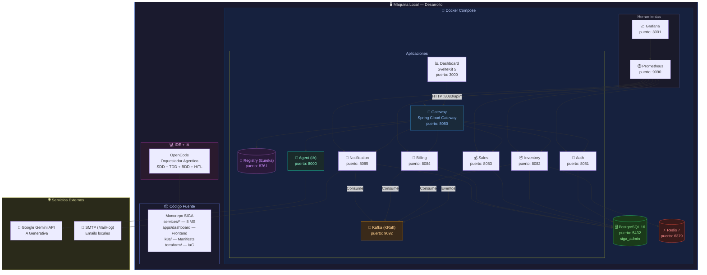

# Infraestructura Local — Desarrollo SIGA

> Diagrama de la arquitectura local para desarrollo con Docker Compose.
> Versión: Junio 2026

---

## Puertos y Servicios — Resumen Local

| Servicio | Puerto Local | Tecnología | Depende de |
|:---------|:-------------|:-----------|:-----------|
| **siga-registry** (Eureka) | 8761 | Spring Cloud Netflix | — |
| **siga-gateway** | 8080 | Spring Cloud Gateway | registry |
| **siga-auth** | 8081 | Spring Boot + JWT | postgres, registry |
| **siga-inventory** | 8082 | Spring Boot + JPA | postgres, redis, registry |
| **siga-sales** | 8083 | Spring Boot + JPA | postgres, kafka, registry |
| **siga-billing** | 8084 | Spring Boot + JPA | postgres, kafka, registry |
| **siga-notification** | 8085 | Spring Boot + Mail | postgres, kafka, registry |
| **siga-agent** | 8000 | Spring Boot + Gemini | registry |
| **siga-dashboard** | 3000 | SvelteKit 5 | gateway |
| **siga-kafka** | 9092 | Apache Kafka (KRaft) | — |
| **PostgreSQL** | 5432 | PostgreSQL 16 | — |
| **Redis** | 6379 | Redis 7 | — |
| **Prometheus** | 9090 | Prometheus | todos los MS |
| **Grafana** | 3001 | Grafana | prometheus |

---

## Stack de Desarrollo

| Herramienta | Versión | Propósito |
|:------------|:--------|:----------|
| Java / Kotlin | 21 / 1.9 | Lenguaje backend |
| Spring Boot | 4.0.6 | Framework backend |
| SvelteKit | 5 | Framework frontend |
| Gradle | 8.x | Build tool |
| Docker Compose | 3.8 | Orquestación local |
| OpenCode | — | IDE agentico (SDD + TDD + BDD) |
| Kotest | 5.x | Testing (BehaviorSpec) |
| MockK | 1.13 | Mocking Kotlin |
| JaCoCo | 0.8.11 | Cobertura de código |
| Testcontainers | 1.19 | Tests de integración |
