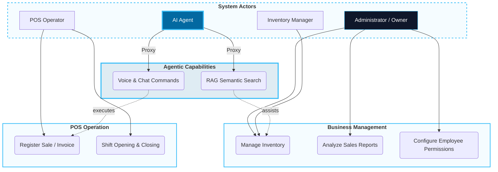

# 01. Scenarios View (The "+1" View)

This view defines the critical use cases that validate SIGA's technical architecture. It is the value contract between business and technology.

[🇪🇸 Ver versión en Español](../es/01-SCENARIOS.mdx)

## Use Case Diagram (SIGA Core)

---

## 🛡️ Architect's Defense (Capstone Tips)

> **Why is the AI Agent a separate actor?**
> "While technically a service, in the 4+1 model it is treated as an actor because it introduces a new form of interaction (A2UI - Agent-to-UI). However, its security is delegated: the AI acts as a **Proxy** for the human user, inheriting their granular permissions."

---
> **Un Soñador con poca RAM 🧑~💻**
