# 01. Scenarios View (The "+1" View)

This view is the starting point of the 4+1 Model. Here we define the use cases that justify the existence of the entire technical architecture. It serves as the bridge between the business world and the code.

[🇪🇸 Ver versión en Español](../es/01-SCENARIOS.mdx)

## Use Case Diagram (SIGA Core)

```mermaid
graph TD
    subgraph Actors
        Admin[Administrator / Owner]
        Op[POS Operator]
        AI[AI Agent]
    end

    subgraph "Use Cases"
        UC1(Manage Inventory)
        UC2(Analyze Reports)
        UC3(Configure Permissions)
        UC4(Register Sale)
        UC5(Shift Opening/Closing)
        AI1(Voice/Chat Commands)
        AI2(Semantic Search)
    end

    Admin --> UC1
    Admin --> UC2
    Admin --> UC3
    
    Op --> UC4
    Op --> UC5
    
    AI --> AI1
    AI --> AI2
    AI -.-> UC1
    AI -.-> UC4

    style AI fill:#38bdf8,stroke:#fff,color:#000
    style AI1 fill:#1e293b,stroke:#38bdf8
    style AI2 fill:#1e293b,stroke:#38bdf8
```

---

## 🛡️ Architect's Defense (Capstone Tips)

> **Why do we use this view?**
> In a complex microservices system, it's easy to get lost in ports and databases. The Scenarios View forces us to remember WHO we are building for. If a microservice doesn't help fulfill any of these use cases, it's redundant.
>
> **Key Point**: Note how the **AI Agent** is not just a decorative chat; it's connected to Inventory and Sales use cases. This demonstrates that the AI is OPERATIONAL, not just informative.

---
> **Un Soñador con poca RAM 🧑~💻**
