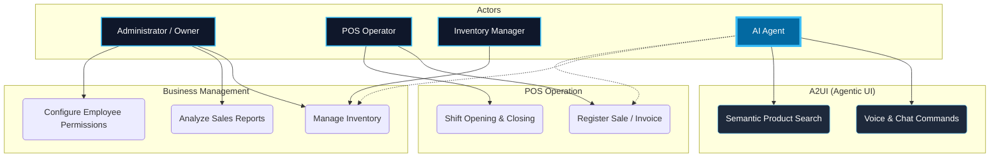

# 01. Scenarios View (The "+1" View)

This view defines the critical use cases that validate SIGA's technical architecture. It serves as the bridge between business requirements and technology.

[🇪🇸 Ver versión en Español](../es/01-SCENARIOS.mdx)

## Use Case Diagram (SIGA Core)

---

## 🛡️ Architect's Defense (Capstone Tips)

> **Why a new actor for Inventory?**
> "In an enterprise-grade system, Separation of Duties (SoD) is vital. While the Administrator has a strategic and permission-based focus, the Inventory Manager has granular and operational access to the supply chain, reducing the risk of fraud or administrative errors."
>
> **How does the AI handle permissions?**
> "It is essential to understand that the **AI Agent is not an autonomous actor with infinite permissions**. It functions under a **Proxy/Impersonation** pattern: the AI inherits the exact same permissions (Scopes) of the user who invokes it. If the POS Operator cannot delete a sale, the AI will not be able to do so either, ensuring the integrity of business rules."

---
> **Un Soñador con poca RAM 🧑‍💻**
