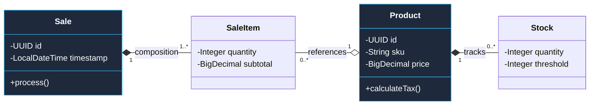
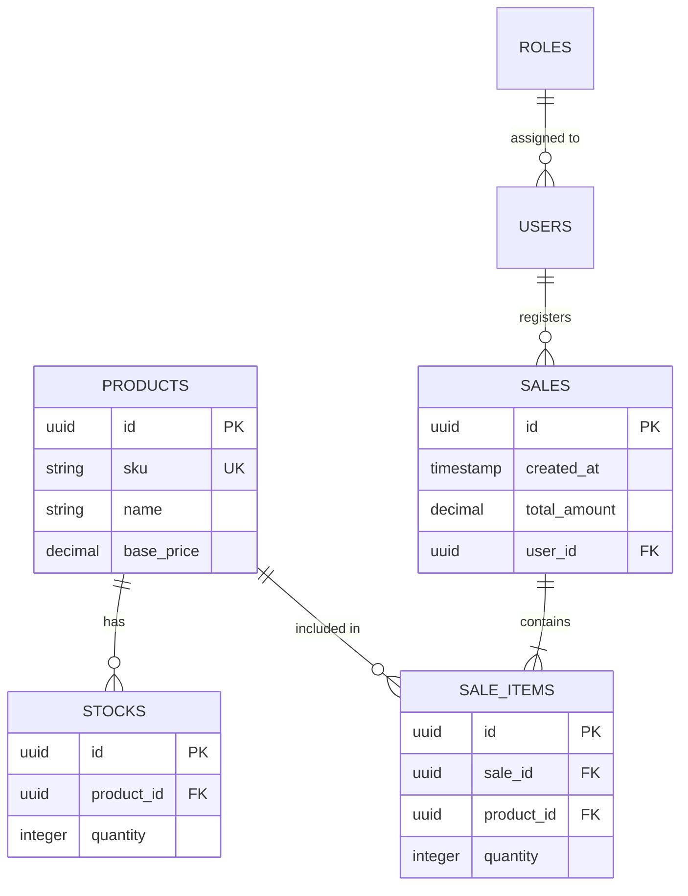

# 02. Logical View (Design & Data)

The Logical View describes the technical organization of the system, focusing on decoupling and data integrity.

[🇪🇸 Ver versión en Español](../es/02-LOGICAL-VIEW.mdx)

## 1. Hexagonal Architecture (Ports and Adapters)

This pattern ensures that the core of SIGA remains independent of databases or frameworks.

```mermaid
graph TD
    subgraph Inbound [<b>Inbound Adapters</b>]
        Rest[REST Controller]
        Kafka[Kafka Consumer]
    end

    subgraph Core [<b>Domain (Business Rules)</b>]
        Service[Application Service]
        Entity[Business Entities]
    end

    subgraph Outbound [<b>Outbound Adapters</b>]
        Jpa[JPA Persistence Adapter]
        Feign[Feign Microservices Client]
    end

    Rest & Kafka --> Service
    Service --> Entity
    Entity --> Jpa & Feign

    style Core fill:#0369a120,stroke:#38bdf8,stroke-width:3px
    style Inbound fill:#0ea5e90a,stroke:#38bdf8
    style Outbound fill:#0ea5e90a,stroke:#38bdf8
```

## 2. Domain Class Diagram (UML)

Representation of business objects and their structural relationships.



## 3. Entity-Relationship Diagram (Persistence)

Physical data mapping in the PostgreSQL database.



---

## 🛡️ Architect's Defense (Capstone Tips)

> **Why separate Class from Entity (ER)?**
> "The class diagram represents **Behavior** (Domain). The ER diagram represents **State** (Persistence). In SIGA, this ensures that a change in a SQL table doesn't necessarily break price calculation logic in Java."

---
> **Un Soñador con poca RAM 🧑~💻**
