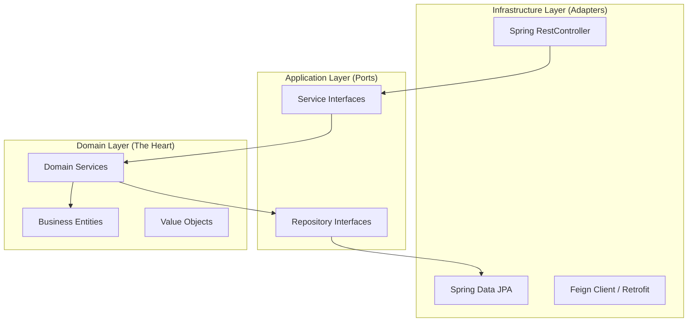
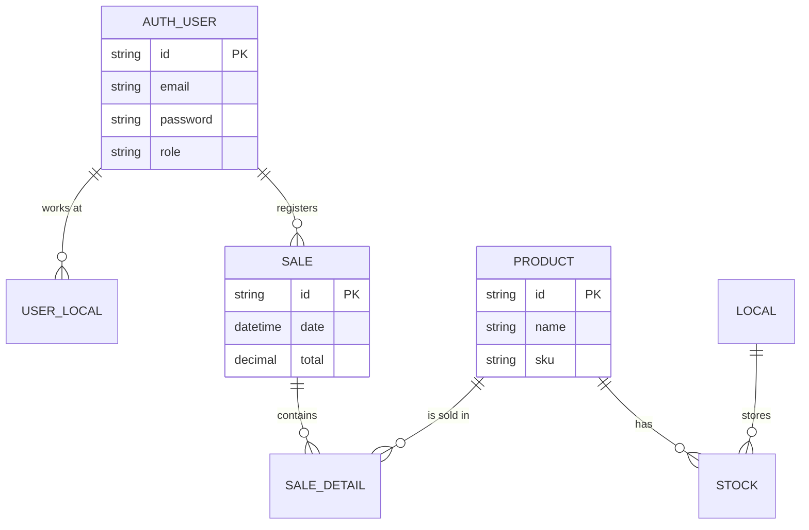

# 02. Logical View (Hexagonal & Data)

The Logical View focuses on the functional structure of the system: how classes are organized and how data relates to each other. In SIGA, we apply **Hexagonal Architecture (Ports and Adapters)** to shield the business logic from technology changes.

[🇪🇸 Ver versión en Español](../es/02-LOGICAL-VIEW.mdx)

## 1. Hexagonal Architecture (Clean Architecture)

## 2. Consolidated Entity-Relationship (ER) Model

SIGA uses a **Multi-tenancy by Schemas** approach. Here is the logical relationship between the 5 main schemas.

---

## 🛡️ Architect's Defense (Capstone Tips)

> **Why Hexagonal Architecture?**
> Tell your professors this: "Hexagonal architecture allows our DOMAIN (the business rules) to be agnostic to the database or framework. If we decide to swap PostgreSQL for MongoDB tomorrow, we only change the Adapter; the heart of SIGA remains untouched."
>
> **Why Multi-tenant Schemas?**
> "We implemented data isolation at the schema level to ensure Company A can never see Company B's data, complying with privacy laws (like Chile's Law 21.719) from the system's design phase."

---
> **Un Soñador con poca RAM 🧑‍💻**
