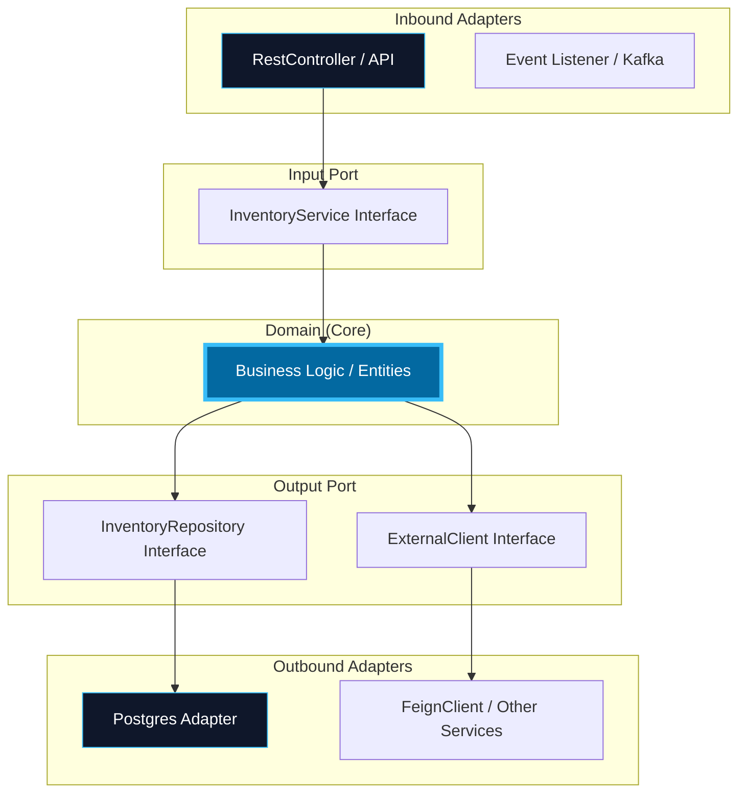
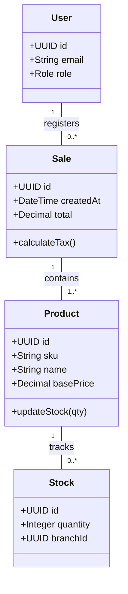

# 02. Logical View (Hexagonal & Data)

The Logical View focuses on the system's functional structure. In SIGA, we apply **Hexagonal Architecture (Ports and Adapters)** to decouple business rules from technical details.

[🇪🇸 Ver versión en Español](../es/02-LOGICAL-VIEW.mdx)

## 1. Detailed Hexagonal Architecture

## 2. Domain Class Diagram (Moderate Level)

This diagram shows the key relationships between the system's main entities.

---

## 🛡️ Architect's Defense (Capstone Tips)

> **RestController vs FeignClient?**
> "They should not be confused. The **RestController** is an **INBOUND** adapter; it is the door we open for the world to speak to us. The **FeignClient** is an **OUTBOUND** adapter; it is the telephone we use to speak to other microservices."
>
> **Why Domain Class Diagram?**
> "Because the Domain is the only thing that should be stable over time. Databases change, frameworks die, but the relationship between a 'Sale' and a 'Product' is a business rule that remains, and that is what we capture in this diagram."

---
> **Un Soñador con poca RAM 🧑~💻**
