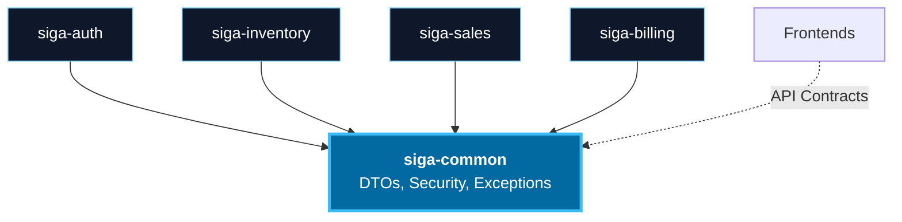

# 03. Development View (Monorepo & Components)

Describes system organization from a build perspective, reflecting the real functional hierarchy of the modules.

[🇪🇸 Ver versión en Español](../es/03-DEVELOPMENT-VIEW.md)

## 1. Semantic Monorepo Structure (Gradle)

Unlike a simple folder listing, this diagram shows the logical relationship between backends and their respective interfaces.

```mermaid
graph LR
    Root((SIGA Project)) --> Services[services/]
    Root --> Apps[apps/]
    Root --> Packages[packages/]
    
    subgraph Infra [<b>Infrastructure</b>]
        S_GT[gateway]
        S_REG[registry]
    end

    subgraph Core [<b>Business Services</b>]
        S_AUTH[auth]
        S_INV[inventory]
        S_SALES[sales]
        S_BILL[billing]
        S_AGENT[agent]
    end

    subgraph UI [<b>Client Applications</b>]
        W_DASH[dashboard - Operations Center]
        W_CUST[customer-portal - SaaS]
        W_ADMIN[admin-portal - Administration]
        W_LAND[landing - Public]
        W_POS[pos - Point of Sale]
        W_MOB[mobile - Field]:::future
    end

    subgraph Pkgs [<b>Shared Packages</b>]
        P_SHARED[@siga/shared - Types & Utilities]
        P_UIKIT[@siga/ui-kit - Design System]
    end

    subgraph Libs [<b>Backend Libraries</b>]
        L_COM[common]
    end

    Services --> Infra & Core
    Apps --> UI
    Packages --> Pkgs
    Services --> Libs
    UI -.->|consumes| Pkgs

    %% Glass-Tech Styles
    style Services fill:#0ea5e90a,stroke:#38bdf8,stroke-width:2px
    style Apps fill:#0ea5e90a,stroke:#38bdf8,stroke-width:2px
    style Packages fill:#0ea5e90a,stroke:#38bdf8,stroke-width:2px
    style Libs fill:#0369a120,stroke:#38bdf8,stroke-width:2px,stroke-dasharray: 5 5
    classDef future fill:#1e293b,stroke:#94a3b8,stroke-dasharray: 5 5,color:#94a3b8
```

## 2. Component Diagram (Internal Dependencies)

Shows how cross-cutting logic is reused through the `common` module.



---

## 🛡️ Architect's Defense (Capstone Tips)

> **Why group 'commercial' with 'billing'?**
> "Although they are separate folders in the monorepo, functionally they form a unit. `commercial` is the specific interface for tax and financial management exposed by the `billing` microservice. This functional cohesion allows the billing system to be scalable and independent from the rest of the POS."

---
> **Un Soñador con poca RAM 🧑~💻**
