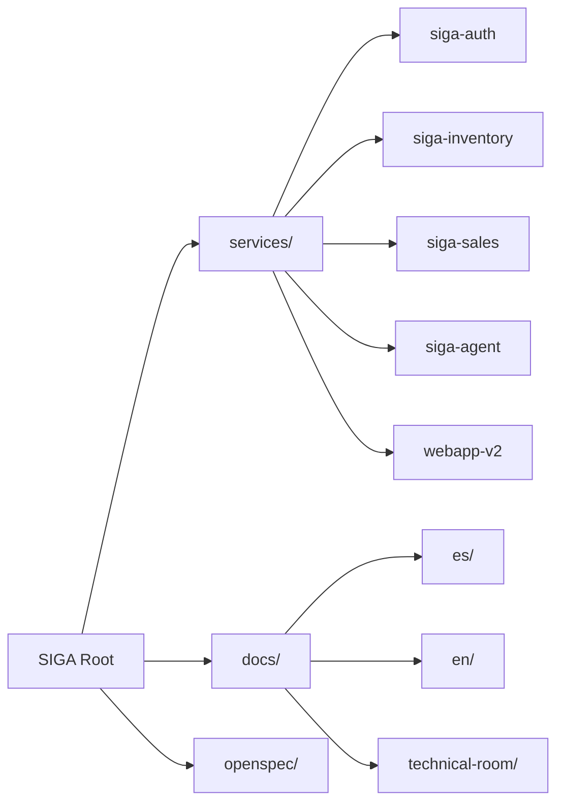
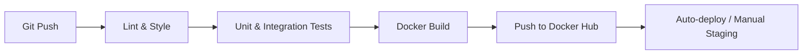

# 03. Development View (Monorepo & Components)

The Development View describes how the source code is organized and the components that integrate it. SIGA uses a **Monorepo** to facilitate the management of shared dependencies and coordination between teams.

[🇪🇸 Ver versión en Español](../es/03-DEVELOPMENT-VIEW.mdx)

## 1. Monorepo Structure

## 2. Technical Components (The Stack)

| Component | Responsibility | Technology |
| :--- | :--- | :--- |
| **Backend Core** | Business rules and persistence. | Kotlin / Spring Boot |
| **AI Agent** | Cognitive orchestrator and RAG. | Python / FastAPI / LangChain |
| **API Gateway** | Entry point and perimeter security. | Spring Cloud Gateway |
| **Frontend** | Premium user interface. | SvelteKit / Tailwind CSS |

## 3. Continuous Integration Workflow (CI/CD)

---

## 🛡️ Architect's Defense (Capstone Tips)

> **Why a Monorepo?**
> "The monorepo allows us to have a 'Single Source of Truth'. If I change a contract in `siga-common`, I can immediately see how it affects all microservices without having to manage complex external library versioning."
>
> **Why Polyglot Microservices?**
> "We use the right tool for the right job: **Kotlin** for the transactional robustness of the backend and **Python** for its unmatched ecosystem in Artificial Intelligence. This is possible because we communicate via standardized REST/JSON."

---
> **Un Soñador con poca RAM 🧑‍💻**
