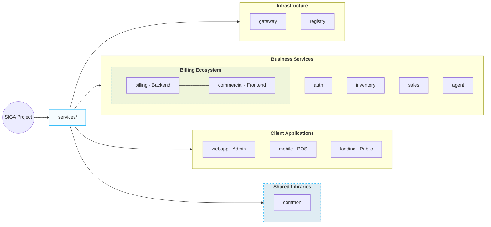
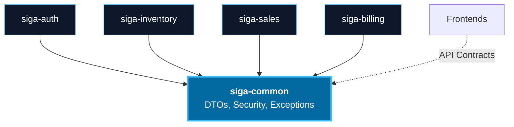

# 03. Development View (Monorepo & Components)

Describes system organization from a build perspective, reflecting the real functional hierarchy of the modules.

[🇪🇸 Ver versión en Español](../es/03-DEVELOPMENT-VIEW.mdx)

## 1. Semantic Monorepo Structure (Gradle)

Unlike a simple folder listing, this diagram shows the logical relationship between backends and their respective interfaces.

## 2. Component Diagram (Internal Dependencies)

Shows how cross-cutting logic is reused through the `common` module.

---

## 🛡️ Architect's Defense (Capstone Tips)

> **Why group 'commercial' with 'billing'?**
> "Although they are separate folders in the monorepo, functionally they form a unit. `commercial` is the specific interface for tax and financial management exposed by the `billing` microservice. This functional cohesion allows the billing system to be scalable and independent from the rest of the POS."

---
> **Un Soñador con poca RAM 🧑~💻**
