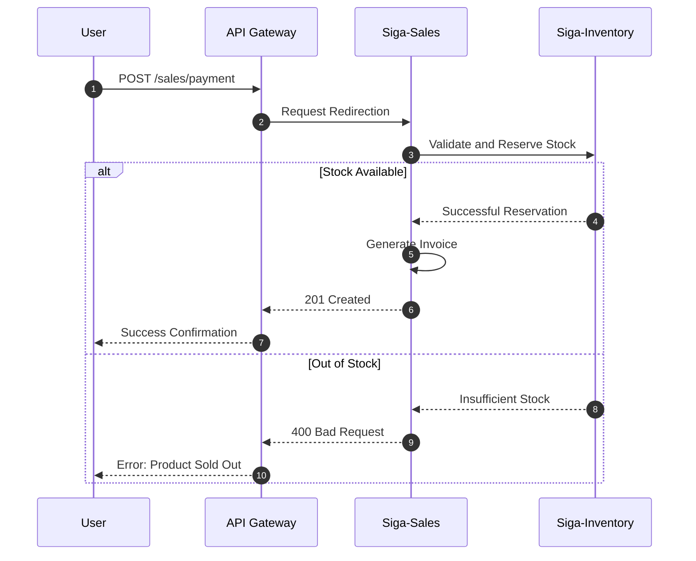
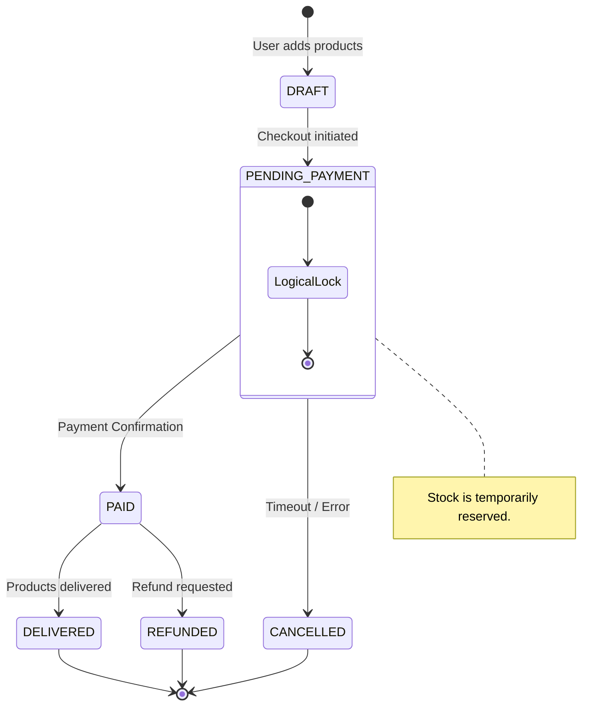

# 04. Process View (Flow & States)

Describes system dynamics: how services interact and how entities change state.

[🇪🇸 Ver versión en Español](../es/04-PROCESS-VIEW.mdx)

## 1. Sequence Diagram: Sale Registration

## 2. State Diagram: Sale Lifecycle

This diagram details the system's state transition logic.

---

## 🛡️ Architect's Defense (Capstone Tips)

> **Why use a State Diagram?**
> "Transactional integrity doesn't just depend on the database, but on object state coherence. By defining clear states like 'PENDING_PAYMENT', we allow the system to perform a **Logical Lock (Soft-lock)** on stock, preventing duplicate sales of the same item."

---
> **Un Soñador con poca RAM 🧑~💻**
