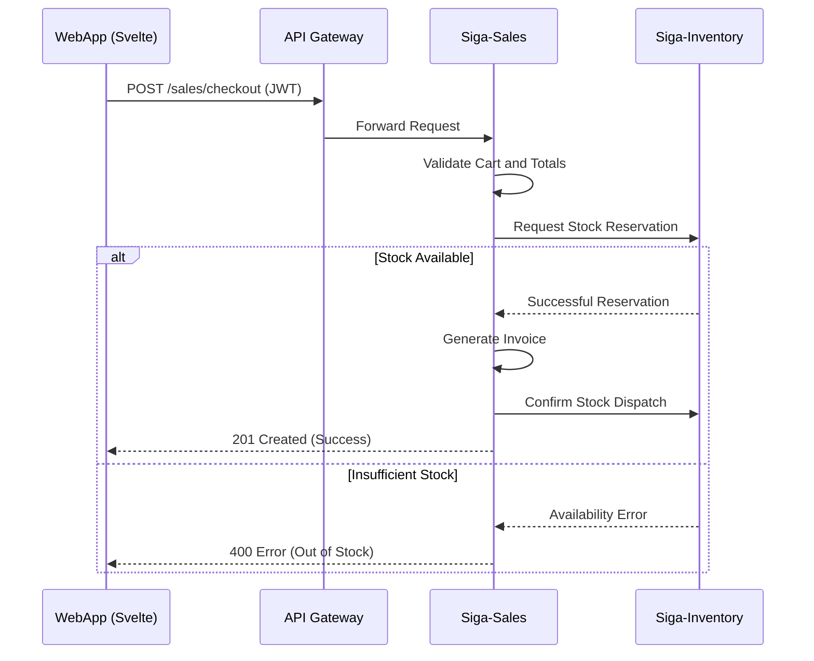
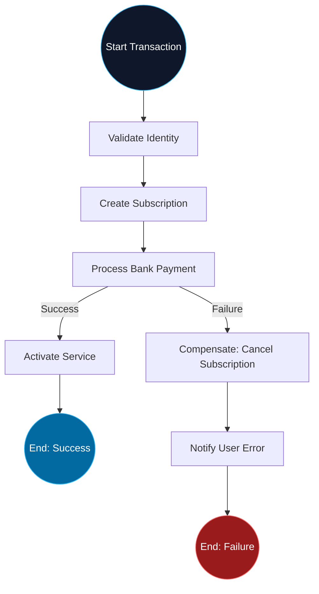

# 04. Process View (Flow & Transactions)

The Process View describes how information flows between microservices to complete a business transaction.

[🇪🇸 Ver versión en Español](../es/04-PROCESS-VIEW.mdx)

## 1. Sales Flow and Inventory Synchronization

This diagram details the interaction from the moment the customer confirms the purchase until the stock is safely updated.

## 2. Distributed Consistency (SAGA Pattern)

SIGA uses an **Orchestration-based SAGA** for complex processes that span multiple services.

---

## 🛡️ Architect's Defense (Capstone Tips)

> **Why do we avoid Spanglish in diagrams?**
> "High-level technical documentation must be consistent. Using terms in a single language (except for industrial standards like 'Gateway' or 'SAGA') facilitates understanding for international teams and demonstrates an editorial discipline that is fundamental in large-scale projects."
>
> **Why Orchestration in the SAGA?**
> "We chose orchestration (a central conductor) over choreography (loose events) because in an ERP, traceability is paramount. We need to know exactly at what point a charge failed and ensure that the compensating action was executed correctly."

---
> **Un Soñador con poca RAM 🧑‍💻**
