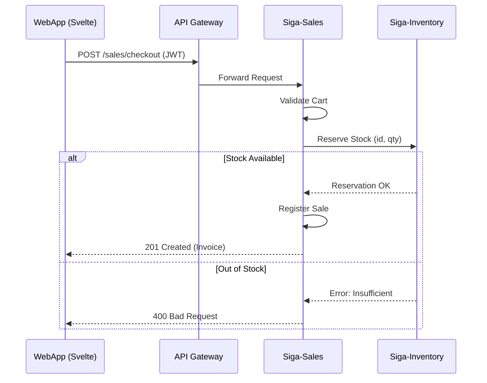
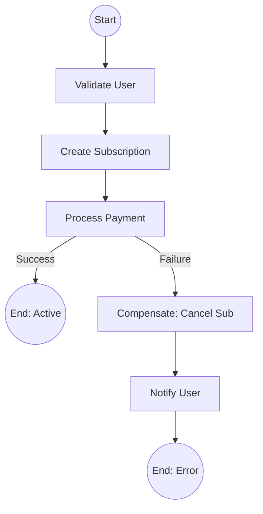

# 04. Process View (Flow & Transactions)

The Process View focuses on the dynamic behavior of the system. Here we explain how microservices interact in real-time to complete a transaction and how we ensure data consistency.

[🇪🇸 Ver versión en Español](../es/04-PROCESS-VIEW.mdx)

## 1. Sales Flow and Stock Deduction

This sequence diagram shows the interaction between the Frontend, the Gateway, and the Sales and Inventory services.

## 2. Distributed Consistency (SAGA Pattern)

For complex operations involving multiple services (such as a commercial subscription), we use an **Orchestration-based SAGA** to handle failures and perform compensations.

---

## 🛡️ Architect's Defense (Capstone Tips)

> **Why do we use the SAGA Pattern?**
> "In a microservices architecture, we cannot use traditional ACID database transactions across different services. The SAGA pattern allows us to guarantee 'eventual consistency': if one step in the chain fails, we execute compensating actions to leave the system in a consistent state."
>
> **Why Orchestration over Choreography?**
> "We chose orchestration to have centralized control over the business flow. It's easier to debug and visualize than purely event-based choreography, which is vital for SIGA's financial traceability."

---
> **Un Soñador con poca RAM 🧑‍💻**
