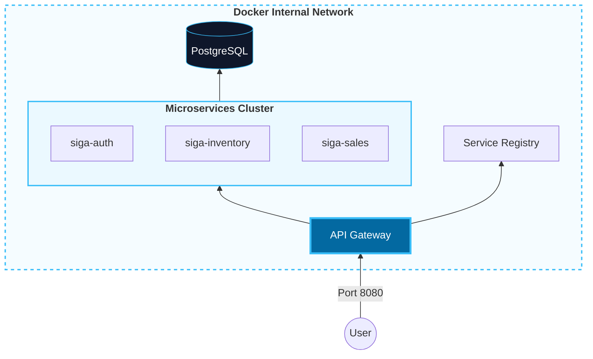
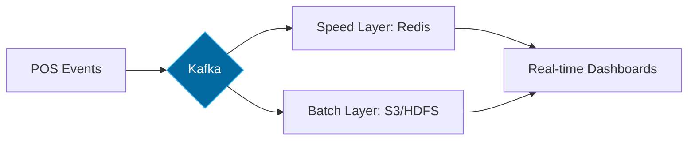

# 05. Physical View (Deployment & Scaling)

Mapping of software components to server and network infrastructure.

[🇪🇸 Ver versión en Español](../es/05-PHYSICAL-VIEW.mdx)

## 1. Docker Network Topology (Internal Nodes)

## 2. Scaling Vision: Lambda Architecture

Structure for massive data processing (Big Data).

---

## 🛡️ Architect's Defense (Capstone Tips)

> **What is Lambda Architecture?**
> "It is the standard for handling massive data volumes. The **Speed Layer** gives us immediate business visibility, while the **Batch Layer** ensures historical reports are 100% accurate through background data cleansing processes."

---
> **Un Soñador con poca RAM 🧑~💻**
