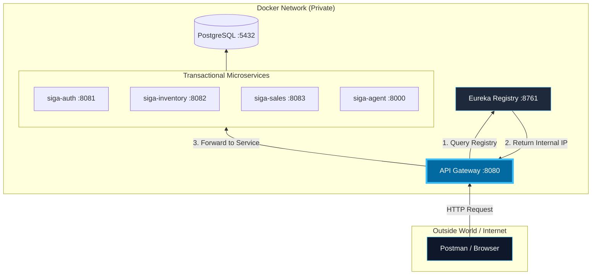
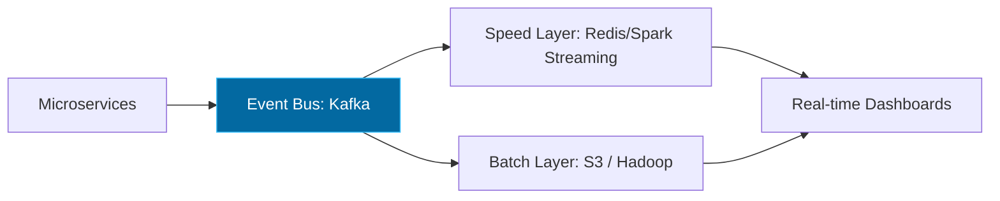

# 05. Physical View (Deployment & Scaling)

The Physical View details how components are deployed and how traffic flows from the outside world into our private microservices network.

[🇪🇸 Ver versión en Español](../es/05-PHYSICAL-VIEW.mdx)

## 1. Network Topology and Request Flow

This diagram shows how a client (Postman or Browser) interacts with the system through the API Gateway.

## 2. Scaling Towards Big Data (Lambda Architecture)

SIGA is designed to scale from a pure transactional system to a massive analytics engine.

---

## 🛡️ Architect's Defense (Capstone Tips)

> **Why is the Gateway the only entry point?**
> "For security and simplicity. The **API Gateway** acts as a 'Bouncer': it centralizes JWT authentication and hides the complexity of the internal network. Postman never talks to the Inventory microservice directly; it always goes through the Gateway's port 8080."
>
> **What is the real role of Eureka?**
> "Eureka is not an orchestrator; it's a **Directory**. When we scale a service (e.g., we have 3 instances of `siga-sales`), Eureka knows the IPs of all three. The Gateway queries Eureka to know where to send the traffic, allowing the system to grow without manual IP configuration."

---
> **Un Soñador con poca RAM 🧑‍💻**
