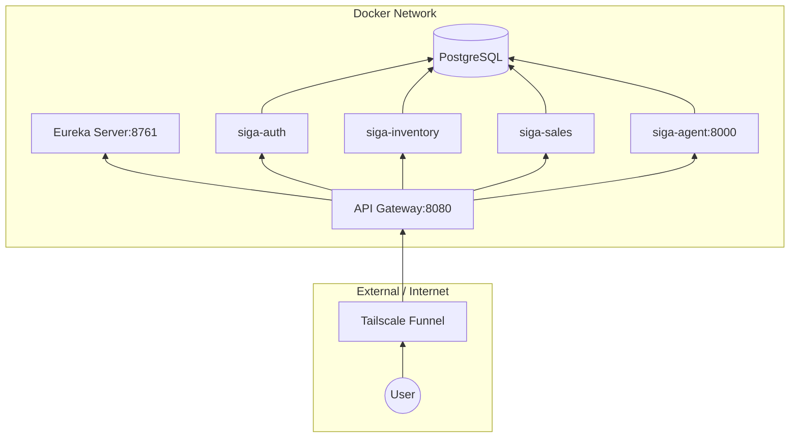
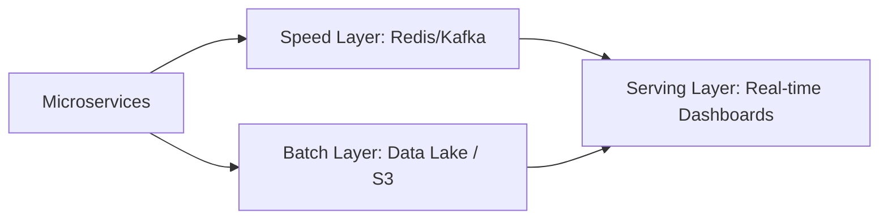

# 05. Physical View (Deployment & Scaling)

The Physical View describes the system's deployment topology: where the code runs, how containers communicate, and how we plan to scale to support **Big Data**.

[🇪🇸 Ver versión en Español](../es/05-PHYSICAL-VIEW.mdx)

## 1. Deployment Topology (Docker & Network)

SIGA operates in a virtualized network where services are discovered dynamically.

## 2. Scaling to Big Data (Lambda Architecture)

To process large volumes of historical data (advanced analytics), SIGA is prepared to implement a Lambda architecture.

---

## 🛡️ Architect's Defense (Capstone Tips)

> **Why Service Discovery with Eureka?**
> "In an elastic microservices architecture, container IPs change constantly. Eureka allows services to find each other by name (`siga-inventory`) instead of IP, making the system resilient and easy to scale horizontally."
>
> **How does SIGA scale to Big Data?**
> "We designed SIGA to be 'Data-Ready'. The current schema separation facilitates migration to a Data Lake. The Lambda architecture would allow us to provide immediate answers (Speed Layer) while processing deep historical trends (Batch Layer) without degrading POS performance."

---
> **Un Soñador con poca RAM 🧑‍💻**
