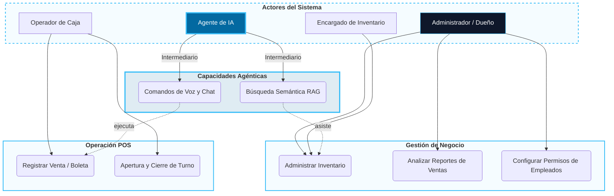

# 01. Vista de Escenarios (The "+1" View)

Esta vista define los casos de uso críticos que validan la arquitectura técnica de SIGA. Es el contrato de valor entre el negocio y la tecnología.

[🇺🇸 View English Version](../en/01-SCENARIOS.mdx)

## Diagrama de Casos de Uso (Core SIGA)

---

## 🛡️ Defensa del Arquitecto (Tips para tu Capstone)

> **¿Por qué el Agente de IA es un actor separado?**
> "Aunque técnicamente es un servicio, en el modelo 4+1 se trata como un actor porque introduce una nueva forma de interacción (A2UI - Interfaz de Agente a Usuario). Sin embargo, su seguridad es delegada: la IA actúa como un **Proxy** del usuario humano, heredando sus permisos granulares".

---
> **Un Soñador con poca RAM 🧑‍💻**
