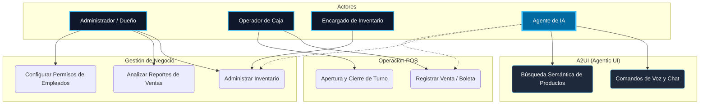

# 01. Vista de Escenarios (The "+1" View)

Esta vista define los casos de uso críticos que validan la arquitectura técnica de SIGA. Es el punto de unión entre el negocio y la tecnología.

[🇺🇸 View English Version](../en/01-SCENARIOS.mdx)

## Diagrama de Casos de Uso (Core SIGA)

---

## 🛡️ Defensa del Arquitecto (Tips para tu Capstone)

> **¿Por qué un nuevo actor para Inventario?**
> "En un sistema de grado empresarial, la separación de funciones (Separation of Duties) es vital. Mientras el Administrador tiene una visión estratégica y de permisos, el Encargado de Inventario tiene un acceso granular y operativo a la cadena de suministro, reduciendo el riesgo de fraude o errores administrativos".
>
> **¿Cómo maneja la IA los permisos?**
> "Es fundamental entender que el **Agente de IA no es un actor autónomo con permisos infinitos**. Funciona bajo un patrón de **Proxy/Impersonation**: la IA hereda exactamente los mismos permisos (Scopes) del usuario que la invoca. Si el Operador de Caja no puede borrar una venta, la IA tampoco podrá hacerlo, garantizando la integridad de las reglas de negocio".

---
> **Un Soñador con poca RAM 🧑‍💻**
