# 01. Vista de Escenarios (The "+1" View)

Esta vista es el punto de partida del Modelo 4+1. Aquí definimos los casos de uso que justifican la existencia de toda la arquitectura técnica. Es el puente entre el mundo del negocio y el código.

[🇺🇸 View English Version](../en/01-SCENARIOS.mdx)

## Diagrama de Casos de Uso (Core SIGA)

```mermaid
graph TD
    subgraph Actores
        Admin[Administrador / Dueño]
        Op[Operador de Caja]
        AI[Agente de IA]
    end

    subgraph "Casos de Uso"
        UC1(Administrar Inventario)
        UC2(Analizar Reportes)
        UC3(Configurar Permisos)
        UC4(Registrar Venta)
        UC5(Apertura/Cierre Turno)
        AI1(Comandos de Voz/Chat)
        AI2(Búsqueda Semántica)
    end

    Admin --> UC1
    Admin --> UC2
    Admin --> UC3
    
    Op --> UC4
    Op --> UC5
    
    AI --> AI1
    AI --> AI2
    AI -.-> UC1
    AI -.-> UC4

    style AI fill:#38bdf8,stroke:#fff,color:#000
    style AI1 fill:#1e293b,stroke:#38bdf8
    style AI2 fill:#1e293b,stroke:#38bdf8
```

---

## 🛡️ Defensa del Arquitecto (Tips para tu Capstone)

> **¿Por qué usamos esta vista?**
> En un sistema complejo de microservicios, es fácil perderse en los puertos y las bases de datos. La Vista de Escenarios nos obliga a recordar para QUIÉN construimos. Si un microservicio no ayuda a cumplir ninguno de estos casos de uso, sobra.
>
> **Punto Clave**: Nota cómo el **Agente de IA** no es solo un chat decorativo; está conectado a los casos de uso de Inventario y Ventas. Esto demuestra que la IA es OPERATIVA, no solo informativa.

---
> **Un Soñador con poca RAM 🧑‍💻**
