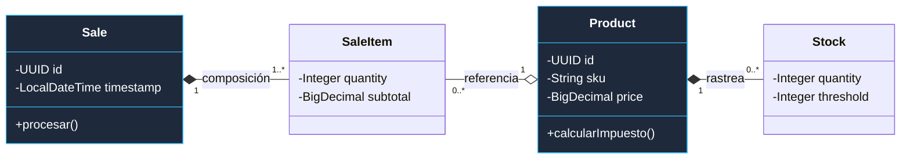
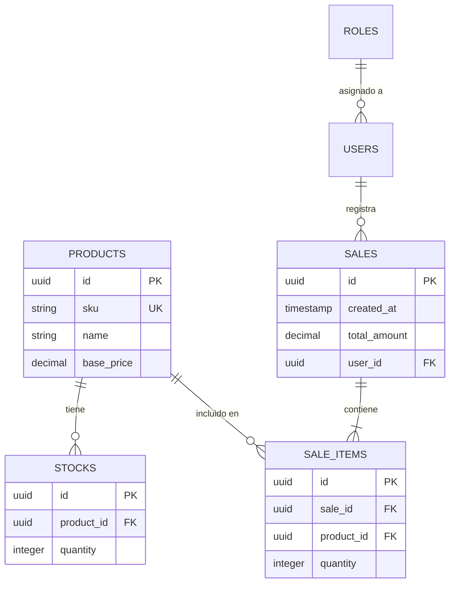

# 02. Vista Lógica (Diseño y Datos)

La Vista Lógica describe la organización técnica del sistema, centrándose en el desacoplamiento y la integridad de los datos.

[🇺🇸 View English Version](../en/02-LOGICAL-VIEW.mdx)

## 1. Arquitectura Hexagonal (Puertos y Adaptadores)

Este patrón garantiza que el núcleo de SIGA sea independiente de la base de datos o el framework.

```mermaid
graph TD
    subgraph Entrada [<b>Adaptadores de Entrada</b>]
        Rest[Controlador REST]
        Kafka[Consumidor Kafka]
    end

    subgraph Core [<b>Dominio (Reglas de Negocio)</b>]
        Service[Servicio de Aplicación]
        Entity[Entidades de Negocio]
    end

    subgraph Salida [<b>Adaptadores de Salida</b>]
        Jpa[Adaptador de Persistencia JPA]
        Feign[Cliente de Microservicios Feign]
    end

    Rest & Kafka --> Service
    Service --> Entity
    Entity --> Jpa & Feign

    style Core fill:#0369a120,stroke:#38bdf8,stroke-width:3px
    style Entrada fill:#0ea5e90a,stroke:#38bdf8
    style Salida fill:#0ea5e90a,stroke:#38bdf8
```

## 2. Diagrama de Clases del Dominio (UML)

Representación de los objetos de negocio y sus relaciones estructurales.



## 3. Diagrama Entidad-Relación (Persistencia)

Mapeo físico de los datos en la base de datos PostgreSQL.



---

## 🛡️ Defensa del Arquitecto (Tips para tu Capstone)

> **¿Por qué separar Clase de Entidad (ER)?**
> "El diagrama de clases representa el **Comportamiento** (Dominio). El diagrama ER representa el **Estado** (Persistencia). En SIGA, esto nos permite que un cambio en la tabla SQL no rompa necesariamente la lógica de cálculo de precios en Java".

---
> **Un Soñador con poca RAM 🧑~💻**
