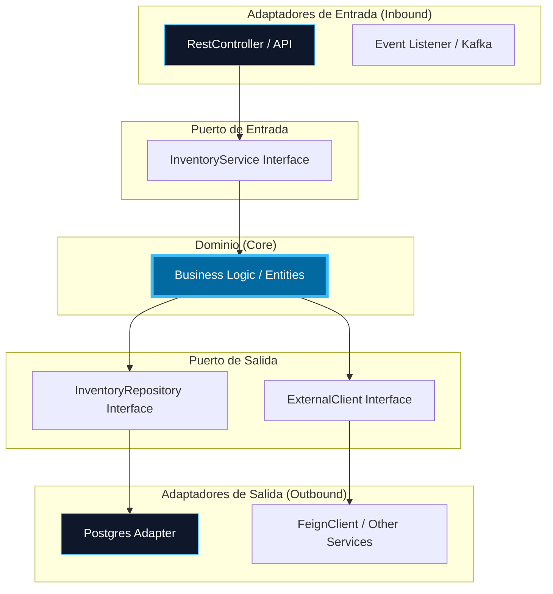
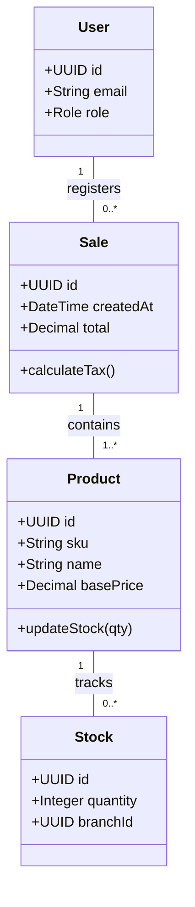

# 02. Vista Lógica (Hexagonal & Data)

La Vista Lógica se centra en la estructura funcional del sistema. En SIGA, aplicamos **Arquitectura Hexagonal (Puertos y Adaptadores)** para separar las reglas de negocio de los detalles técnicos.

[🇺🇸 View English Version](../en/02-LOGICAL-VIEW.mdx)

## 1. Arquitectura Hexagonal Detallada

## 2. Diagrama de Clases del Dominio (Nivel Moderado)

Este diagrama muestra las relaciones clave entre las entidades principales del sistema.

---

## 🛡️ Defensa del Arquitecto (Tips para tu Capstone)

> **¿RestController vs FeignClient?**
> "No se deben confundir. El **RestController** es un adaptador de **ENTRADA** (Inbound); es la puerta que nosotros abrimos para que el mundo nos hable. El **FeignClient** es un adaptador de **SALIDA** (Outbound); es el teléfono que nosotros usamos para hablar con otros microservicios".
>
> **¿Por qué Diagrama de Clases en el Dominio?**
> "Porque el Dominio es lo único que debería ser estable en el tiempo. Las bases de datos cambian, los frameworks mueren, pero la relación entre una 'Venta' y un 'Producto' es una regla de negocio que permanece, y eso es lo que capturamos en este diagrama".

---
> **Un Soñador con poca RAM 🧑‍💻**
