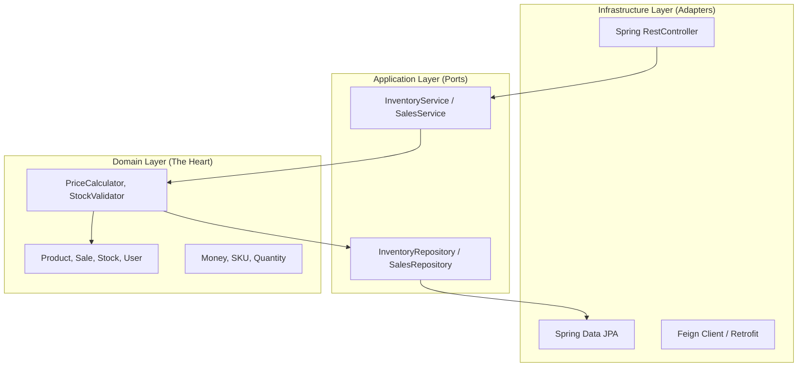
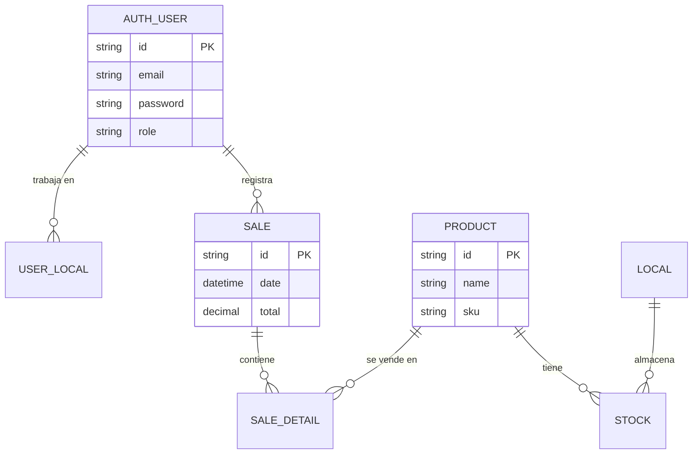

# 02. Vista Lógica (Hexagonal & Data)

La Vista Lógica se centra en la estructura funcional del sistema: cómo se organizan las clases y cómo se relacionan los datos entre sí. En SIGA, aplicamos **Arquitectura Hexagonal (Puertos y Adaptadores)** para blindar el negocio de la tecnología.

[🇺🇸 View English Version](../en/02-LOGICAL-VIEW.mdx)

## 1. Arquitectura Hexagonal (Clean Architecture)

## 2. Modelo Entidad-Relación (ER) Consolidado

SIGA utiliza un enfoque de **Multi-tenancy por Esquemas**. Aquí se muestra la relación lógica entre los 5 esquemas principales.

---

## 🛡️ Defensa del Arquitecto (Tips para tu Capstone)

> **¿Por qué Arquitectura Hexagonal?**
> Dile esto a tus profes: "La arquitectura hexagonal nos permite que el DOMINIO (las reglas de negocio) sea agnóstico a la base de datos o al framework. Si mañana decidimos cambiar PostgreSQL por MongoDB, solo cambiamos el Adaptador, el corazón de SIGA no se toca".
>
> **¿Por qué Schemas Multi-tenant?**
> "Implementamos aislamiento de datos a nivel de esquema para garantizar que la Empresa A nunca pueda ver los datos de la Empresa B, cumpliendo con leyes de privacidad (como la Ley 21.719 de Chile) desde el diseño mismo de la base de datos".

---
> **Un Soñador con poca RAM 🧑‍💻**
