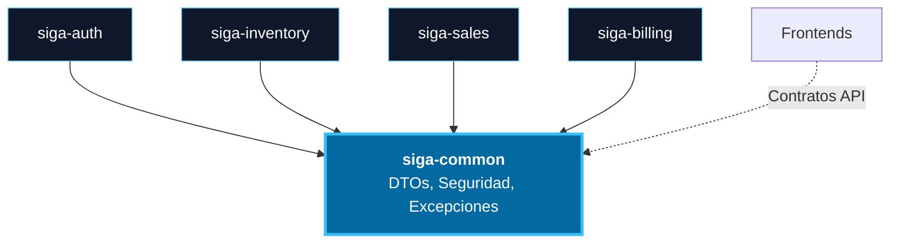

# 03. Vista de Desarrollo (Monorepo y Componentes)

Describe la organización del sistema desde la perspectiva de construcción, reflejando la jerarquía funcional real de los módulos.

[🇺🇸 View English Version](../en/03-DEVELOPMENT-VIEW.md)

## 1. Estructura Semántica del Monorepo (Gradle)

A diferencia de un simple listado de carpetas, este diagrama muestra la relación lógica entre backends y sus respectivas interfaces.

```mermaid
graph LR
    Root((SIGA Proyecto)) --> Services[services/]
    Root --> Apps[apps/]
    Root --> Packages[packages/]
    
    subgraph Infra [<b>Infraestructura</b>]
        S_GT[gateway]
        S_REG[registry]
    end

    subgraph Core [<b>Servicios de Negocio</b>]
        S_AUTH[auth]
        S_INV[inventory]
        S_SALES[sales]
        S_BILL[billing]
        S_AGENT[agent]
    end

    subgraph UI [<b>Aplicaciones Cliente</b>]
        W_DASH[dashboard - Centro Operativo]
        W_CUST[customer-portal - SaaS]
        W_ADMIN[admin-portal - Administración]
        W_LAND[landing - Público]
        W_POS[pos - Punto de Venta]
        W_MOB[mobile - Terreno]:::future
    end

    subgraph Pkgs [<b>Paquetes Compartidos</b>]
        P_SHARED[@siga/shared - Tipos y Utilidades]
        P_UIKIT[@siga/ui-kit - Design System]
    end

    subgraph Libs [<b>Librerías Backend</b>]
        L_COM[common]
    end

    Services --> Infra & Core
    Apps --> UI
    Packages --> Pkgs
    Services --> Libs
    UI -.->|consume| Pkgs

    %% Estilos Glass-Tech
    style Services fill:#0ea5e90a,stroke:#38bdf8,stroke-width:2px
    style Apps fill:#0ea5e90a,stroke:#38bdf8,stroke-width:2px
    style Packages fill:#0ea5e90a,stroke:#38bdf8,stroke-width:2px
    style Libs fill:#0369a120,stroke:#38bdf8,stroke-width:2px,stroke-dasharray: 5 5
    classDef future fill:#1e293b,stroke:#94a3b8,stroke-dasharray: 5 5,color:#94a3b8
```

## 2. Diagrama de Componentes (Dependencias Internas)

Este diagrama muestra cómo se reutiliza la lógica transversal mediante el módulo `common`.



---

## 🛡️ Defensa del Arquitecto (Tips para tu Capstone)

> **¿Por qué agrupar 'commercial' con 'billing'?**
> "Aunque en el monorepo son carpetas separadas, funcionalmente forman una unidad. `commercial` es la interfaz específica para la gestión tributaria y financiera que expone el microservicio de `billing`. Esta cohesión funcional es lo que permite que el sistema de facturación sea escalable e independiente del resto del POS".

---
> **Un Soñador con poca RAM 🧑~💻**
