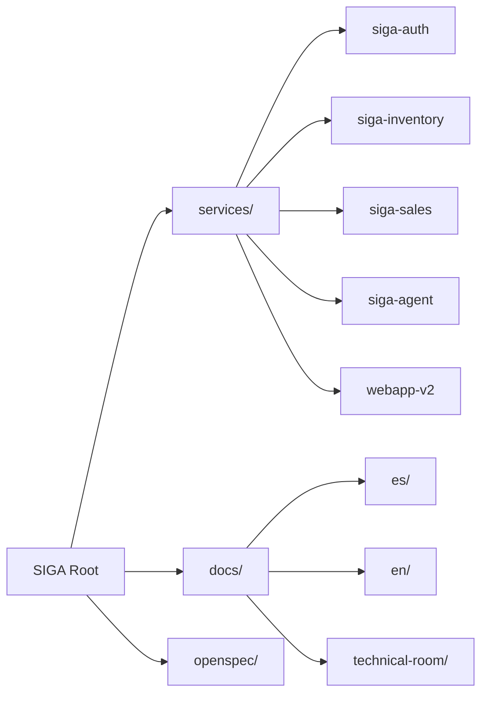
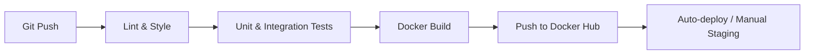

# 03. Vista de Desarrollo (Monorepo & Components)

La Vista de Desarrollo describe cómo se organiza el código fuente y los componentes que lo integran. SIGA utiliza un **Monorepo** para facilitar la gestión de dependencias compartidas y la coordinación entre equipos.

[🇺🇸 View English Version](../en/03-DEVELOPMENT-VIEW.mdx)

## 1. Estructura del Monorepo

## 2. Componentes Técnicos (The Stack)

| Componente | Responsabilidad | Tecnología |
| :--- | :--- | :--- |
| **Backend Core** | Reglas de negocio y persistencia. | Kotlin / Spring Boot |
| **AI Agent** | Orquestador cognitivo y RAG. | Python / FastAPI / LangChain |
| **API Gateway** | Punto de entrada y seguridad perimetral. | Spring Cloud Gateway |
| **Frontend** | Interfaz de usuario premium. | SvelteKit / Tailwind CSS |

## 3. Workflow de Integración Continua (CI/CD)

---

## 🛡️ Defensa del Arquitecto (Tips para tu Capstone)

> **¿Por qué un Monorepo?**
> "El monorepo nos permite tener una 'Single Source of Truth'. Si cambio un contrato en `siga-common`, puedo ver inmediatamente cómo afecta a todos los microservicios sin tener que gestionar versiones de librerías externas complejas".
>
> **¿Por qué Microservicios Políglotas?**
> "Usamos el lenguaje adecuado para cada tarea: **Kotlin** para la robustez transaccional del backend y **Python** por su ecosistema inigualable en Inteligencia Artificial. Esto es posible gracias a que nos comunicamos vía REST/JSON estandarizado".

---
> **Un Soñador con poca RAM 🧑‍💻**
