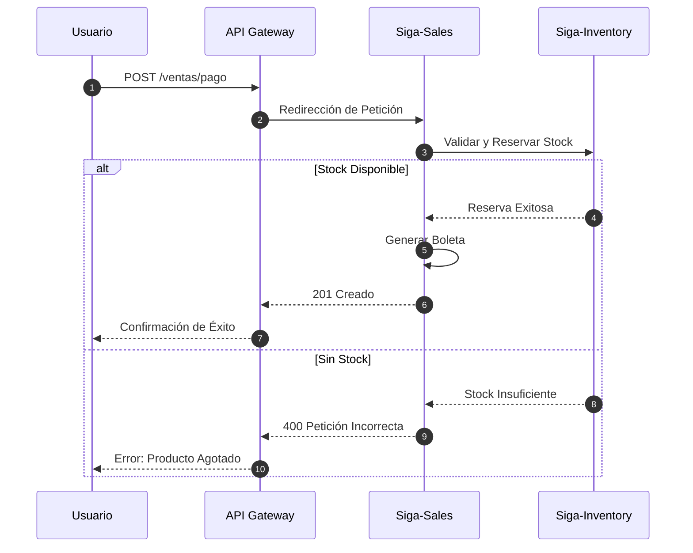
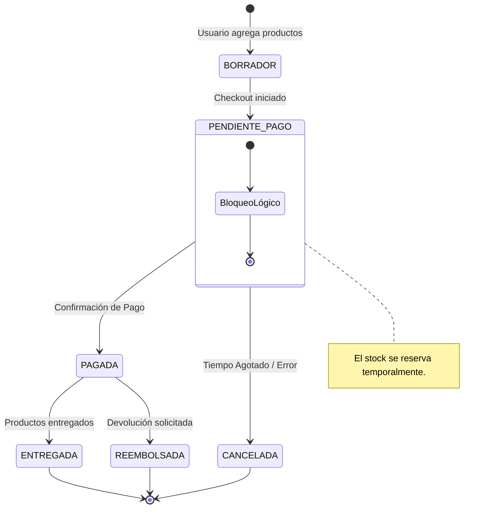

# 04. Vista de Proceso (Flujos y Estados)

Describe la dinámica del sistema: cómo interactúan los servicios y cómo cambian de estado las entidades.

[🇺🇸 View English Version](../en/04-PROCESS-VIEW.mdx)

## 1. Diagrama de Secuencia: Registro de Venta

## 2. Diagrama de Estados: Ciclo de Vida de una Venta

Este diagrama detalla la lógica de transición de estados del sistema.

---

## 🛡️ Defensa del Arquitecto (Tips para tu Capstone)

> **¿Por qué usar un Diagrama de Estados?**
> "La integridad transaccional no solo depende de la base de datos, sino de la coherencia del estado del objeto. Al definir estados claros como 'PENDIENTE_PAGO', permitimos que el sistema realice un **Bloqueo Lógico (Soft-lock)** del stock, evitando ventas duplicadas del mismo artículo".

---
> **Un Soñador con poca RAM 🧑~💻**
