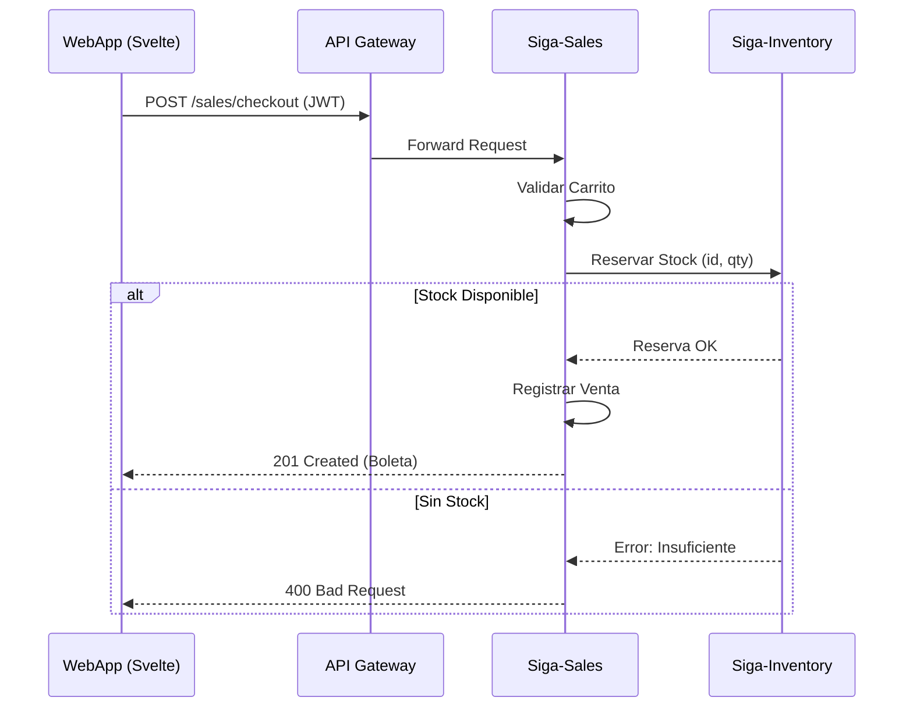
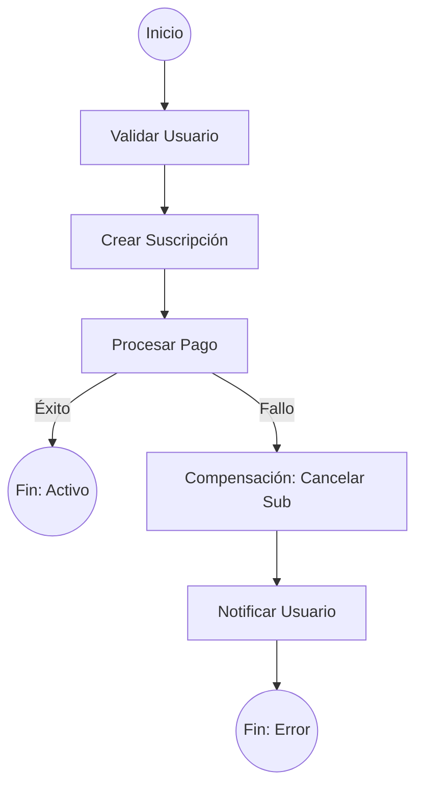

# 04. Vista de Proceso (Flow & Transactions)

La Vista de Proceso se enfoca en el comportamiento dinámico del sistema. Aquí explicamos cómo interactúan los microservicios en tiempo real para completar una transacción y cómo garantizamos la consistencia de los datos.

[🇺🇸 View English Version](../en/04-PROCESS-VIEW.mdx)

## 1. Flujo de Venta y Descuento de Stock

Este diagrama de secuencia muestra la interacción entre el Frontend, el Gateway y los servicios de Ventas e Inventario.

## 2. Consistencia Distribuida (Patrón SAGA)

Para operaciones complejas que involucran múltiples servicios (como una suscripción comercial), utilizamos una **SAGA basada en Orquestación** para manejar fallos y realizar compensaciones.

---

## 🛡️ Defensa del Arquitecto (Tips para tu Capstone)

> **¿Por qué usamos el Patrón SAGA?**
> "En una arquitectura de microservicios, no podemos usar transacciones ACID tradicionales de base de datos entre servicios distintos. El patrón SAGA nos permite garantizar la 'consistencia eventual': si un paso de la cadena falla, ejecutamos acciones de compensación para dejar el sistema en un estado consistente".
>
> **¿Por qué Orquestación sobre Coreografía?**
> "Elegimos orquestación para tener un control centralizado del flujo de negocio. Es más fácil de debuggear y visualizar que la coreografía basada puramente en eventos, lo cual es vital para la trazabilidad financiera de SIGA".

---
> **Un Soñador con poca RAM 🧑‍💻**
