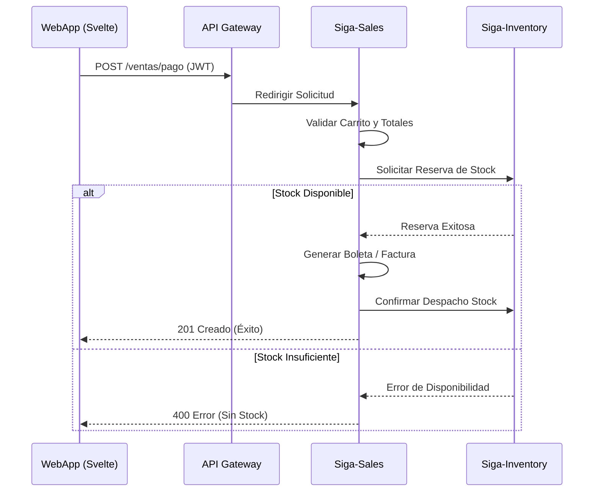
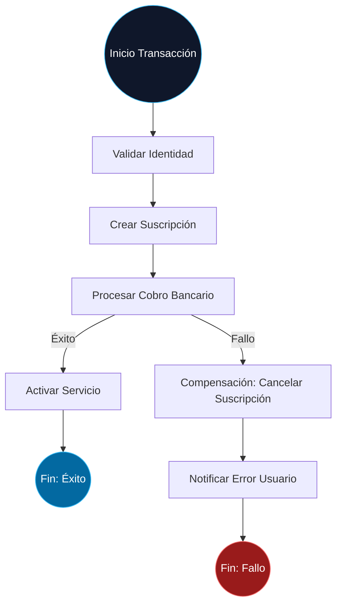

# 04. Vista de Proceso (Flow & Transactions)

La Vista de Proceso describe cómo fluye la información entre los microservicios para completar una transacción de negocio.

[🇺🇸 View English Version](../en/04-PROCESS-VIEW.mdx)

## 1. Flujo de Venta y Sincronización de Inventario

Este diagrama detalla la interacción desde que el cliente confirma la compra hasta que el stock se actualiza de forma segura.

## 2. Consistencia Distribuida (Patrón SAGA)

SIGA utiliza una **SAGA basada en Orquestación** para procesos complejos que abarcan varios servicios.

---

## 🛡️ Defensa del Arquitecto (Tips para tu Capstone)

> **¿Por qué evitamos el Spanglish en diagramas?**
> "La documentación técnica de alto nivel debe ser coherente. Usar términos en un solo idioma (exceptuando estándares industriales como 'Gateway' o 'SAGA') facilita la comprensión para equipos internacionales y demuestra una disciplina editorial que es fundamental en proyectos de gran escala".
>
> **¿Por qué Orquestación en la SAGA?**
> "Elegimos orquestación (un director central) en lugar de coreografía (eventos sueltos) porque en un ERP la trazabilidad es lo más importante. Necesitamos saber exactamente en qué punto falló un cobro y asegurarnos de que la acción de compensación se ejecutó correctamente".

---
> **Un Soñador con poca RAM 🧑~💻**
