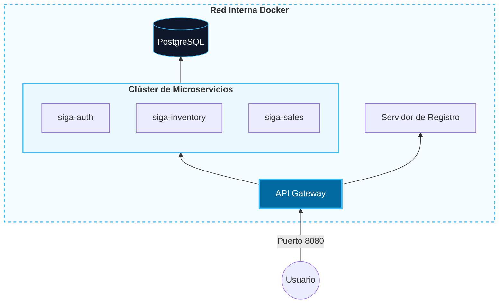
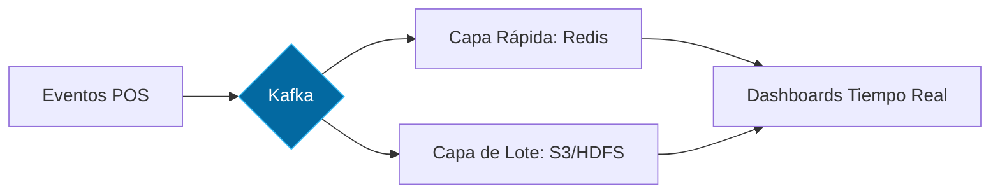

# 05. Vista Física (Despliegue y Escalabilidad)

Mapeo de los componentes de software a la infraestructura de servidores y red.

[🇺🇸 View English Version](../en/05-PHYSICAL-VIEW.mdx)

## 1. Topología de Red Docker (Nodos Internos)

## 2. Visión de Escalado: Arquitectura Lambda

Estructura para el procesamiento masivo de datos (Big Data).

---

## 🛡️ Defensa del Arquitecto (Tips para tu Capstone)

> **¿Qué es la Arquitectura Lambda?**
> "Es el estándar para manejar volúmenes masivos de datos. La **Capa Rápida** nos da visibilidad inmediata para el negocio, mientras la **Capa de Lote** asegura que los reportes históricos sean 100% precisos mediante procesos de limpieza de datos en segundo plano".

---
> **Un Soñador con poca RAM 🧑~💻**
