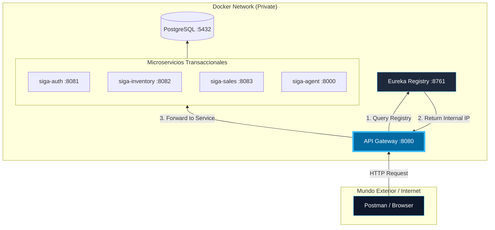
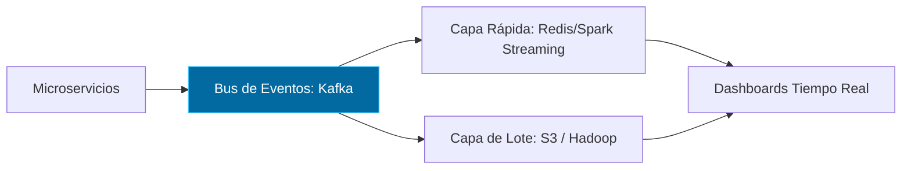

# 05. Vista Física (Deployment & Scaling)

La Vista Física detalla cómo se despliegan los componentes y cómo fluye el tráfico desde el mundo exterior hacia nuestra red privada de microservicios.

[🇺🇸 View English Version](../en/05-PHYSICAL-VIEW.mdx)

## 1. Topología de Red y Flujo de Peticiones

Este diagrama muestra cómo un cliente (Postman o Browser) interactúa con el sistema a través del API Gateway.

## 2. Escalamiento Hacia Big Data (Lambda Architecture)

SIGA está diseñado para escalar de un sistema transaccional puro a un motor de analítica masiva.

---

## 🛡️ Defensa del Arquitecto (Tips para tu Capstone)

> **¿Por qué el Gateway es el único punto de entrada?**
> "Por seguridad y simplicidad. El **API Gateway** actúa como un 'Bouncer' (portero): centraliza la autenticación JWT y oculta la complejidad de la red interna. Postman nunca habla con el microservicio de Inventario directamente; siempre pasa por el puerto 8080 del Gateway".
>
> **¿Cuál es el rol real de Eureka?**
> "Eureka no es un orquestador, es un **Directorio**. Cuando escalamos un servicio (ej. tenemos 3 instancias de `siga-sales`), Eureka sabe las IPs de las tres. El Gateway consulta a Eureka para saber a dónde enviar el tráfico, permitiendo que el sistema crezca sin necesidad de configurar IPs manuales".

---
> **Un Soñador con poca RAM 🧑‍💻**
