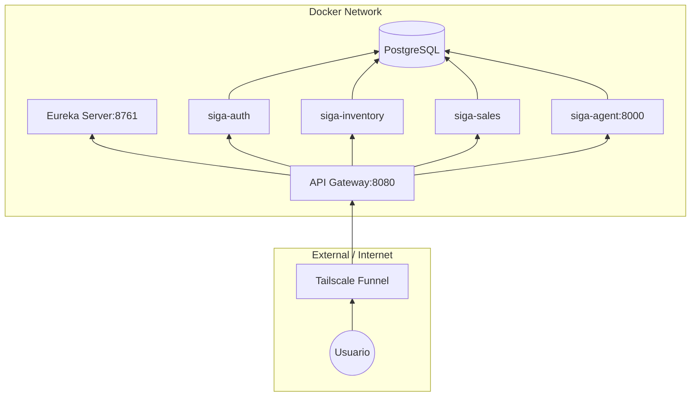
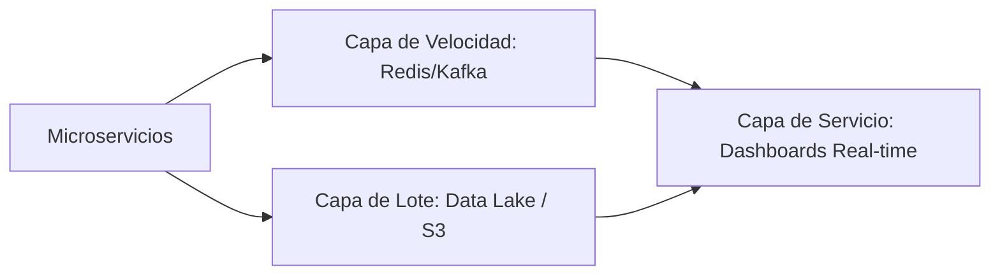

# 05. Vista Física (Deployment & Scaling)

La Vista Física describe la topología de despliegue del sistema: dónde corre el código, cómo se comunican los contenedores y cómo planeamos escalar para soportar **Big Data**.

[🇺🇸 View English Version](../en/05-PHYSICAL-VIEW.mdx)

## 1. Topología de Despliegue (Docker & Network)

SIGA opera en una red virtualizada donde los servicios se descubren dinámicamente.

## 2. Escalamiento a Big Data (Arquitectura Lambda)

Para procesar grandes volúmenes de datos históricos (analítica avanzada), SIGA está preparado para implementar una arquitectura Lambda.

---

## 🛡️ Defensa del Arquitecto (Tips para tu Capstone)

> **¿Por qué Service Discovery con Eureka?**
> "En una arquitectura de microservicios elástica, las IPs de los contenedores cambian constantemente. Eureka permite que los servicios se encuentren por nombre (`siga-inventory`) en lugar de por IP, haciendo que el sistema sea resiliente y fácil de escalar horizontalmente".
>
> **¿Cómo escala SIGA a Big Data?**
> "Diseñamos SIGA para ser 'Data-Ready'. La separación de esquemas actual facilita la migración a un Data Lake. La arquitectura Lambda nos permitiría dar respuestas inmediatas (Speed Layer) mientras procesamos tendencias históricas profundas (Batch Layer) sin degradar el rendimiento del POS".

---
> **Un Soñador con poca RAM 🧑‍💻**
