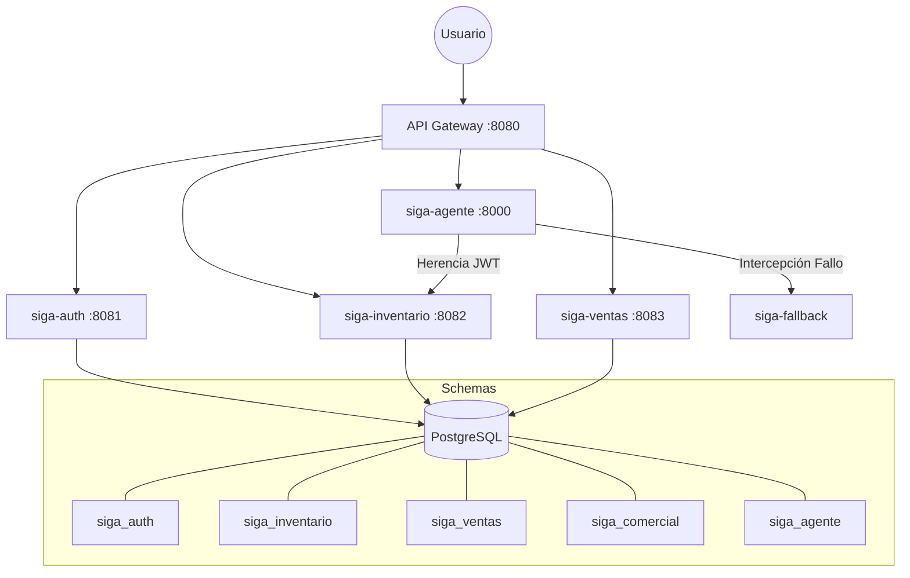

# Design: Arquitectura Definitiva de Microservicios SIGA v2.1

## Technical Approach
Monorepo multi-módulo con arquitectura poli-glota. El Core transaccional utiliza Kotlin + Spring Cloud, mientras que el motor de IA utiliza Python. Cada microservicio es independiente y utiliza aislamiento de datos por esquema en una base de datos PostgreSQL compartida.

## Architecture Decisions

### Decision: Catálogo de Microservicios Normalizado

| Servicio | Tipo | Esquema DB | Responsabilidad | Stack Tecnológico |
| :--- | :--- | :--- | :--- | :--- |
| `siga-eureka` | Infraestructura | — | Service Discovery | Kotlin / Spring Boot |
| `siga-gateway` | Infraestructura | — | Ruteo y Seguridad Perimetral | Kotlin / Spring Cloud |
| `siga-auth` | Negocio | `siga_auth` | Gestión de identidades y permisos heredables. | Kotlin / Spring Boot |
| `siga-inventario` | Negocio | `siga_inventario` | Gestión de activos y stock inteligente. | Kotlin / Spring Boot |
| `siga-ventas` | Negocio | `siga_ventas` | POS y descuento de stock en tiempo real. | Kotlin / Spring Boot |
| `siga-backend` | Legacy / Billing | `siga_comercial` | Portal comercial y suscripciones SaaS. | Kotlin / Spring Boot |
| `siga-agente` | Negocio | `siga_agente` | Orquestador de IA (Ejecución CRUD). | Python / FastAPI |
| `siga-fallback` | Soporte | — | Resiliencia SQL/PL-SQL para fallos de IA. | Kotlin o Node.js |

### Decision: Polyglot AI (SIGA-Agente)
El servicio de IA se implementa en **Python** para aprovechar el ecosistema de LLMs. Se comunica con los servicios Kotlin mediante REST y hereda el JWT del usuario para realizar acciones CRUD en su nombre, respetando los permisos granulares.

### Decision: Aislamiento de Datos (Multi-Tenant)
Se utiliza un único servidor PostgreSQL por eficiencia de costos, pero con **aislamiento estricto por esquemas**. Ningún microservicio accede directamente a las tablas de otro; la comunicación es vía API.

---

## Data Flow (Normalizado)

---

## Testing Strategy
- **Unitarios**: JUnit 5 para Kotlin, Pytest para Python.
- **Integración**: Testcontainers para validar el aislamiento de esquemas.
- **Resiliencia**: Chaos engineering para forzar el uso del servicio Fallback.
