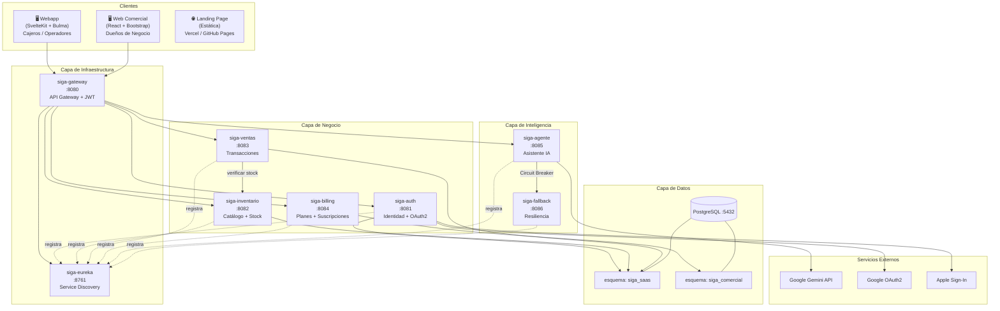
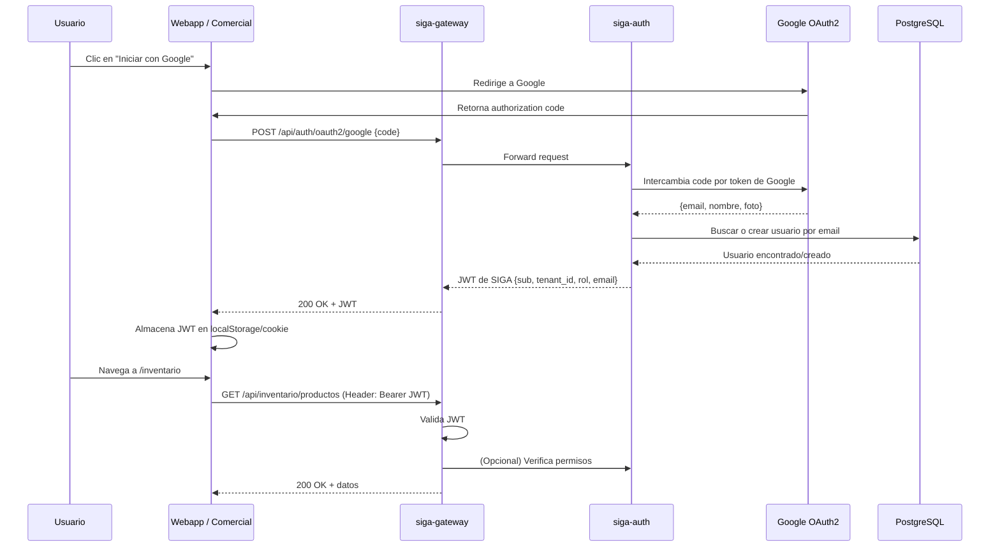
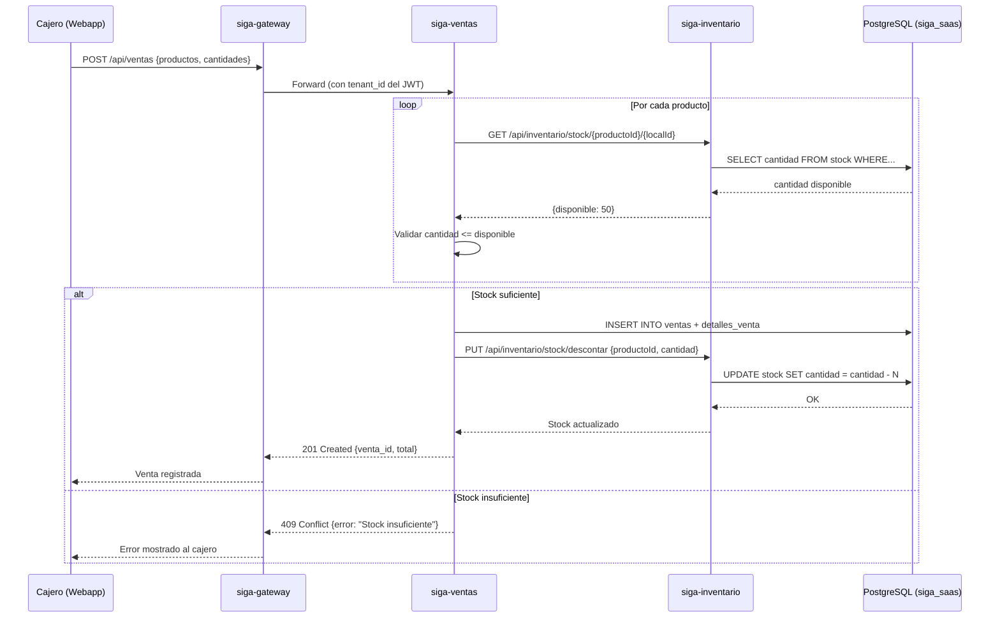
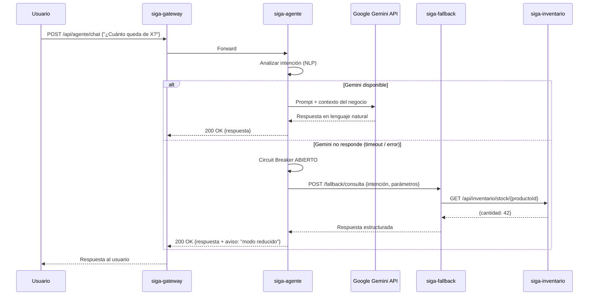
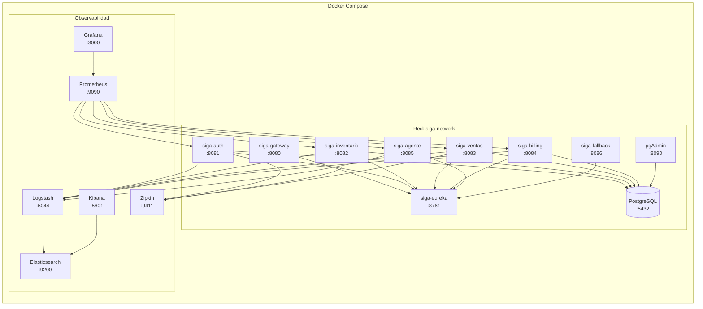
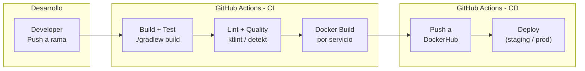
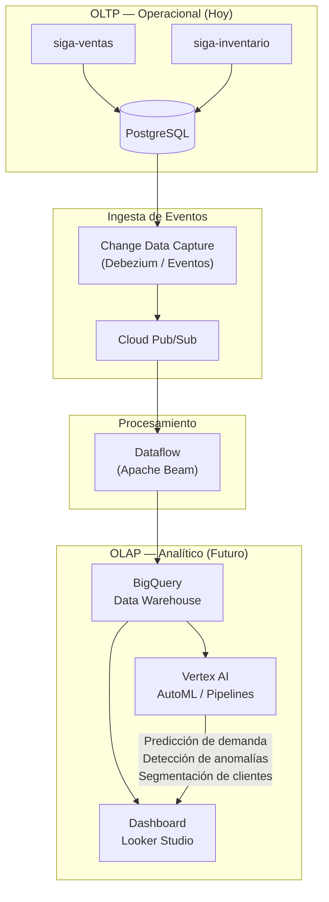

# Diagramas de Arquitectura — SIGA Microservicios

Diagramas técnicos del sistema SIGA en su arquitectura objetivo de microservicios.
Todos los diagramas utilizan la sintaxis Mermaid compatible con GitHub.

---

## 1. Vista General del Sistema

---

## 2. Flujo de Autenticación (OAuth2 + JWT)

---

## 3. Flujo de Venta Completo

---

## 4. Flujo del Asistente IA con Fallback

---

## 5. Infraestructura Docker Compose

---

## 6. Pipeline CI/CD (GitHub Actions)

---

## 7. Preparación Big Data (Pipeline Analítico)

